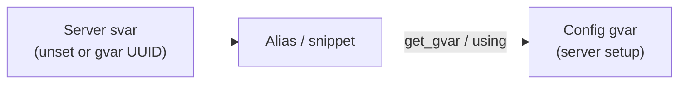

# Documentation

## What is westmarch-generic?

**westmarch-generic** is a configurable version of the [westmarch](../westmarch) Avrae ruleset. The original westmarch project encodes one server's areas, loot tables, encounters, and bespoke logic directly in the repository. This project separates:

- **Engine** — aliases, snippets, and shared libraries that implement game mechanics.
- **Configuration** — per-server data loaded at runtime from workshop gvars.

## Configuration via svars

Server owners configure their instance without forking the codebase.

### Flow

1. An **svar** on the Discord server holds either nothing (feature disabled / default) or a **gvar UUID**.
2. When a player runs a command, the alias reads the svar.
3. If set, the alias loads the **config gvar** and uses that server's areas, tables, toggles, and world data.

### Rules edition (2014 vs 2024)

**Not** stored only on Avrae — optional **`rules_version`** on the config gvar overrides server rules when set. The engine resolves edition from **`config.get_rules_edition()`** (config → Avrae → `"2014"`). Align catalogues with your chosen revision. Details: [westmarch-statement / solution](internal/projects/westmarch-statement/solution-statement.md#rules-edition-2014-vs-2024).

### Design principles

- **Unset svar** — safe default: help text, "not configured", or no-op.
- **Set svar** — load external config; no server-specific constants in engine code.
- **One gvar per server config** (or a small documented set) — keeps ownership clear for server admins.

## Repository areas

| Area | Role |
|------|------|
| `assets/` | TSV catalogues - **`utils/generate-*`** -> split shard gvars ([content-pipeline.md](internal/projects/westmarch-statement/content-pipeline.md)) |
| `editor/` | Planned React/Vite web config editor source |
| `public/` | Planned generated GitHub Pages static output |
| `src/aliases/` | MVP command aliases — [mvp-commands.md](internal/projects/westmarch-statement/mvp-commands.md) |
| `src/snippets/` | *(none in MVP — combat snippets deferred)* |
| `src/gvars/` | Engine workshop globals — see [src/gvars/README.md](../src/gvars/README.md) |
| `src/gvars/configs/` | Example server config presets — [configs.md](internal/projects/westmarch-statement/gvars/configs.md) |
| `src/gvars/utils/core/` | Vendored drac2-tools helpers — [core.md](internal/projects/westmarch-statement/gvars/core.md) |
| `docs/workshop/` | Avrae help docs deployed from sourcemap `docs_file` entries |

## Workshop scaffold

All MVP aliases and engine gvars are registered in **`utils/sourcemap.dev.json`** / **`sourcemap.prod.json`** with UUIDs from **`unused_gvars.md`**. Alias help docs are registered with `docs_file` and live under **`docs/workshop/`**. Placeholder bodies return “not implemented” embeds until each tier is ported. Regenerate env after sourcemap edits: **`make build`**.

The **`westmarch`** hub uses sub-aliases (`setup`, `check`, `show`) — same sourcemap nesting pattern as the old bootstrap `example` alias.

## Further reading

- [setup.md](setup.md) — server-owner adoption guide
- [README.md](../README.md) — project overview and outline
- [DEVELOPMENT.md](../DEVELOPMENT.md) — setup, tests, deploy
- [internal/](internal/) — developer-only docs (project framing, design notes)
- [westmarch](../westmarch) — reference implementation
- [drac2-tools](../drac2-tools) — Drac2 utilities and Avrae project conventions

## Planned documentation

- Svar naming convention and registry
- Config gvar schema (areas, encounters, economy, etc.) — see [westmarch-statement MVP](internal/projects/westmarch-statement/mvp-commands.md)
- Migration notes from monolithic westmarch
