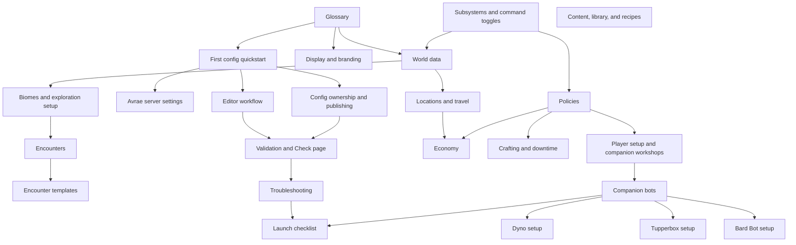

# Guide library investigation

Status: initial investigation for planned release `1.1.0`.

No implementation or guide-authoring pass was performed for this investigation. This document identifies which public guides are needed under `docs/guides/` beyond the initial list, and how they should be prioritized.

## Summary

The guide library should be organized around server configurator jobs, not around internal engine modules. The first public guide set should help a configurator answer:

1. What do these terms mean?
2. What should I configure first?
3. Which editor section owns this setting?
4. Which config choices affect player commands?
5. How do I safely publish and wire the result?
6. How do I diagnose common setup failures?

The user-proposed guides are the right core:

- Avrae `!servsettings`
- `westmarch_config` display
- policies
- encounters
- encounter templates
- glossary
- GitHub Pages exposure for `docs/guides/`

Additional guides are needed around config lifecycle, subsystem toggles, world data, subsystem-specific setup, publishing, troubleshooting, and launch checks.
The later request for Bard Bot, Dyno, Tupperbox, and similar support docs adds a companion-bot track: those guides should live under `docs/guides/` too, because they are part of first-server readiness even though they are not westmarch-generic config schema docs.

## Current public guide coverage

Existing public guides:

| Guide | Current role |
|-------|--------------|
| `docs/guides/server-setup.md` | Discord server, channels, roles, bots, Avrae workshop subscriptions, high-level westmarch-generic setup |
| `docs/guides/initial-channel-texts.md` | First Discord channel posts and player-facing server text |
| `docs/guides/glossary.md` | Initial term definitions |
| `docs/guides/README.md` | Guide index and planned guide list |
| `docs/setup.md` | Broad engine/config setup guide, but not currently scoped to the Pages guide surface |

Current gaps:

- No guide for the editor workflow as a whole.
- No guide for config ownership: owner gvar, extension gvars, svar, staging/backup, and publish/update.
- No guide for command toggles and subsystem dependencies.
- No guide for `world_data` as a mental model.
- No guide for common subsystem setup recipes: travel, economy, crafting, content, player setup.
- No guide for validation and troubleshooting.
- No guide for adapting shipped presets into server-owned config.
- No guide for migration from monolithic westmarch-style data.

## Audience groups

| Audience | Needs |
|----------|-------|
| Server owner | Understand the whole setup path and know when the server is ready for players |
| Server configurator | Build and maintain config gvars, use the editor, publish safely, and wire `westmarch_config` |
| Content author | Add locations, encounters, shops, recipes, books, and quests without touching engine aliases |
| Community moderator | Configure moderation logs, automod, proxy channels, ambience bots, and bot permissions around the Avrae command experience |
| Maintainer | Keep public guide wording aligned with editor validation and runtime behavior |
| Player-facing staff | Know which setup text and commands players should see first |

The guides should primarily address server configurators and content authors. Internal implementation detail should stay in `docs/internal/` unless it directly affects safe configuration choices.

## Recommended guide taxonomy

### 1. Start Here

These are the entry points for a new server or a new configurator.

| Guide | Priority | Why it exists |
|-------|----------|---------------|
| Glossary | `1.1.0` | Defines terms used everywhere else |
| First config quickstart | `1.1.0` | Shows the shortest path from starter preset to `!svar westmarch_config <gvar-id>` |
| Editor workflow | `1.1.0` | Explains load, paste, Check, export, publish, related gvars, and token safety |
| Avrae server settings | `1.1.0` | Explains `!servsettings`, rules edition, character import policy, and what should match config |
| Troubleshooting setup | `1.1.0` | Covers unset svar, invalid gvar, permissions, disabled commands, missing data, token/API failures |
| Launch checklist | `1.1.0` or later | Gives a pre-player checklist: Check page, `!westmarch show`, smoke commands, channel posts |

Recommended file names:

- `docs/guides/first-config.md`
- `docs/guides/editor-workflow.md`
- `docs/guides/avrae-server-settings.md`
- `docs/guides/troubleshooting.md`
- `docs/guides/launch-checklist.md`

### 2. Config Fundamentals

These explain cross-cutting config concepts used by multiple subsystems.

| Guide | Priority | Why it exists |
|-------|----------|---------------|
| Config ownership and publishing | `1.1.0` | Explains config gvar ownership, extension gvars, svar wiring, publish/export, backups, and handoff |
| Display and branding | `1.1.0` | Explains top-level `display`, subsystem display, command display, colours, footer policy, thumbnails |
| Subsystems and command toggles | `1.1.0` | Explains `subsystems.*.enabled`, `commands.*`, dependencies, and `command_config` |
| Policies | `1.1.0` | Explains table-wide enforcement choices and what remains manual |
| Validation and Check page | `1.1.0` | Explains errors vs warnings, how to fix issues, and why `!westmarch show` does not validate |
| Channel policy and permissions | Later unless needed | Explains channel restrictions, admin command access, Dragonspeaker, Server Aliaser, and aliasing roles |

Recommended file names:

- `docs/guides/config-ownership.md`
- `docs/guides/display.md`
- `docs/guides/subsystems.md`
- `docs/guides/policies.md`
- `docs/guides/validation.md`
- `docs/guides/permissions-and-channels.md`

### 3. World Building

These are for content authors building the actual server world.

| Guide | Priority | Why it exists |
|-------|----------|---------------|
| World data | `1.1.0` | Defines locations, paths, transport, calendars, weather, services, shops, and source gvars |
| Locations and travel | `1.1.0` | Gives a practical path for creating locations, paths, transport requirements, and travel smoke tests |
| Biomes and exploration setup | `1.1.0` | Explains biome registry, engine biome presets, custom biome gvars, and location-vs-argument mode |
| Encounters | `1.1.0` | Explains encounter pools, pool tags, kinds, outcomes, location pools, and safe authoring |
| Encounter templates | `1.1.0` | Explains built-in template ids, compact rows, args, previews, and custom template tradeoffs |
| Quests and quest hooks | Later unless starter quest needs it | Explains quest journal setup, `policies.quest.self_assign`, and quest outcomes |
| Presets and starter worlds | `1.1.0` or later | Explains choosing Forgotten Realms, Westmarch, or starter config and turning a preset into server-owned config |

Recommended file names:

- `docs/guides/world-data.md`
- `docs/guides/locations-and-travel.md`
- `docs/guides/biomes.md`
- `docs/guides/encounters.md`
- `docs/guides/encounter-templates.md`
- `docs/guides/quests.md`
- `docs/guides/presets.md`

### 4. Subsystem Setup Recipes

These guides should be recipe-style: "enable these commands, add this data, check with these smoke commands."

| Guide | Priority | Why it exists |
|-------|----------|---------------|
| Travel, time, and weather | `1.1.0` or later | Brings together locations, paths, calendars, weather, transport, arrival output |
| Economy | `1.1.0` or later | Explains currencies, wallet, shops, stock, buy/sell, jobs, location services |
| Crafting and downtime | Later | Explains craft/brew/enchant/scribe, recipe modes, resources, bags, tools, downtime tracking |
| Content, library, and recipes | Later | Explains books, topics, library/read, recipe catalogue search |
| Player setup and companion workshops | `1.1.0` or later | Explains `policies.player_setup`, HUD fields, vSheet/Bags/Notes/Tools checks, and player onboarding |
| Exploration loop | `1.1.0` or later | Explains `enc`, gathering activities, hunt/loot, distributions, cooldowns, repeat avoidance |

Recommended file names:

- `docs/guides/travel-time-weather.md`
- `docs/guides/economy.md`
- `docs/guides/crafting-and-downtime.md`
- `docs/guides/content-and-recipes.md`
- `docs/guides/player-setup.md`
- `docs/guides/exploration-loop.md`

### 5. Advanced And Maintenance

These can come after the core `1.1.0` onboarding slice unless support questions make one urgent.

| Guide | Priority | Why it exists |
|-------|----------|---------------|
| Extension gvars and large data | Later | Explains when to split locations, paths, biomes, books, monsters, recipes, and custom catalogues |
| Custom catalogues | Later | Explains items, monsters, spells, recipes, books, and owner catalogue strategy |
| Migration from westmarch | Later | Helps existing monolithic westmarch users translate areas, encounter pools, shops, and aliases |
| Maintaining config over time | Later | Covers backups, staging gvars, change review, version labels, and seasonal config swaps |
| Pages guide authoring | Internal, not public | Explains how guide docs are rendered/copied into `/westmarch-generic/docs/guides/` |

Recommended file names:

- `docs/guides/extension-gvars.md`
- `docs/guides/custom-catalogues.md`
- `docs/guides/migrating-from-westmarch.md`
- `docs/guides/config-maintenance.md`

The Pages guide authoring instructions should live under internal project docs, not public guides, unless server owners need to contribute guide pages.

### 6. Companion Bot Setup

These guides should stay practical and server-owner oriented. They should not become full replacements for each bot's official documentation.

| Guide | Priority | Why it exists |
|-------|----------|---------------|
| Companion bots overview | `1.1.0` | Helps staff decide which optional bots belong in a westmarch server and which jobs should stay with Avrae |
| Dyno setup | `1.1.0` | Covers moderation logs, automod, permission placement, and basic diagnostics around westmarch channels |
| Tupperbox setup | `1.1.0` | Covers roleplay proxying, allowed channels, staff expectations, and moderation visibility |
| Bard Bot setup | `1.1.0` or later | Covers Avrae-triggered sound effects, custom sounds, voice channel scope, command channel scope, and launch checks |
| Additional utility bots | Later | Possible future guides for listing, scheduling, tickets, colour roles, or server discovery if they become part of common setup |

Recommended file names:

- `docs/guides/companion-bots.md`
- `docs/guides/dyno-setup.md`
- `docs/guides/tupperbox-setup.md`
- `docs/guides/bardbot-setup.md`

## Guide dependency map



## Recommended `1.1.0` guide slice

The full set is large. For `1.1.0`, prioritize guides that unblock first-time setup and map directly to editor sections.

Recommended must-have:

- `glossary.md`
- `first-config.md`
- `editor-workflow.md`
- `avrae-server-settings.md`
- `display.md`
- `subsystems.md`
- `policies.md`
- `world-data.md`
- `biomes.md`
- `encounters.md`
- `encounter-templates.md`
- `validation.md`
- `troubleshooting.md`
- `companion-bots.md`
- `dyno-setup.md`
- `tupperbox-setup.md`
- `bardbot-setup.md`

Recommended if time permits:

- `config-ownership.md`
- `locations-and-travel.md`
- `economy.md`
- `player-setup.md`
- `launch-checklist.md`
- `presets.md`

Defer:

- `crafting-and-downtime.md`
- `content-and-recipes.md`
- `quests.md`
- `extension-gvars.md`
- `custom-catalogues.md`
- `migrating-from-westmarch.md`
- `config-maintenance.md`

## Guide quality bar

Each guide should include:

- Who the guide is for.
- What the guide helps the reader accomplish.
- Prerequisites and assumptions.
- Where to do the work in the editor or Avrae.
- Minimal working config shape when useful.
- Check page expectations: likely errors and warnings.
- Discord smoke commands to try after publishing.
- Links to adjacent guides.

Avoid:

- Internal implementation history.
- Exhaustive schema dumps copied from `data-shapes.md`.
- Guide pages that are only placeholders.
- Promising behavior that is planned but not implemented.
- Duplicating every field from the editor without explaining choices.

## Pages exposure implications

Only `docs/guides/` should be exposed through GitHub Pages under:

```text
/westmarch-generic/docs/guides/
```

This means guide links should prefer other guide pages. Links to `docs/internal/`, `docs/setup.md`, or source files can remain in repository markdown, but they should be reviewed before rendering/copying guides into Pages because those targets will not necessarily exist in the hosted guide subtree.

The guide library likely needs either:

- a markdown rendering/copy step that preserves guide-relative links, or
- editor routes that render selected guide markdown inside the existing Pages app.

The implementation plan should choose one and keep generated Pages output limited to guide content.
