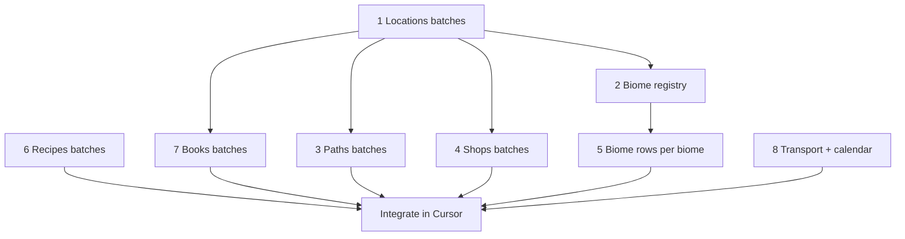

# Prompt generation — full westmarch configs

How to use external LLMs (ChatGPT, etc.) to author **layer-2 world data** for a westmarch-generic server config — from a ~20-location sandbox up to **100+ locations** and the exploration/economy/content that makes them playable.

**Prompt files:** [`src/prompts/`](../../../../src/prompts/README.md)  
**Schema:** [data-shapes.md](../westmarch-statement/data-shapes.md) · [server-config.md](../westmarch-statement/server-config.md)  
**Example presets:** [gvars/configs.md](../westmarch-statement/gvars/configs.md)

---

## What gets prompted vs not

| Source | Assets |
|--------|--------|
| **LLM prompts** (`src/prompts/`) | Locations, paths, shops, biome registry, biome encounter rows, setting recipes, setting books, calendar, transport |
| **TSV pipeline** ([content-pipeline.md](../westmarch-statement/content-pipeline.md)) | Monsters, items, potions, magic items, spells — engine catalogues from `assets/*.tsv` |
| **Engine presets** | Default biome modules under `src/gvars/configs/biomes/` — reference via `engine:configs/biomes/<code>` until you author custom biome rows |
| **Human / starter template** | `subsystems` toggles, `policies`, `display` branding, `channel_policy`, svar wiring |

A **rich** server enables subsystems in [starter.gvar](../../../../src/gvars/configs/starter.gvar), then fills world data and catalogues. Prompts cover the bulk **authoring** work; Cursor integrates validated Python into `src/gvars/configs/<preset>.gvar`.

---

## How many prompts?

**Nine asset prompts** (+ shared templates), not one mega-prompt. Reasons:

1. **Context limits** — 100 locations + paths + encounters exceed one chat.
2. **Validation** — smaller outputs are easier to check before merge.
3. **Dependencies** — paths need location ids; shops need location `services`; biome rows need registry codes.
4. **Parallelism** — biome pool chats run one per biome while you batch locations elsewhere.

See [assets.md](assets.md) for the full catalog, batch sizes, and dependencies.

---

## File format (repo)

Each asset uses **two files** under `src/prompts/<setting>/`:

| File | Role |
|------|------|
| **`*.prompt.md`** | Copy **entire file** into ChatGPT — no maintainer meta |
| **`*.md`** | Checklist, integration notes, follow-ups |

Shared: [`src/prompts/_templates/`](../../../../src/prompts/_templates/) (`revision`, `expand-batch`).

Setting folders today:

| Folder | Preset target |
|--------|----------------|
| [`forgotten-realms/`](../../../../src/prompts/forgotten-realms/) | `forgotten_realms_2014.gvar` (and 2024 flavour fork) |
| `generic-fantasy/` *(planned)* | Neutral names — duplicate FR prompts with setting block swapped |
| `spelljammer/` *(planned)* | Astral/sky transport emphasis |

---

## Recommended build order

Detailed steps: [workflow.md](workflow.md).

---

## Scale guidance

| Server size | Locations | Typical approach |
|-------------|-----------|------------------|
| **Demo / small** | ~10 | One chat, `Mode: bootstrap` |
| **Small campaign** | 20–40 | Bootstrap + 1–2 `Mode: expand` + paths/shops for hub region |
| **Regional westmarch** | 50–100 | Many location batches by geography (coast, valley, wilds); paths in subgraphs; shops at hubs only |
| **Large westmarch** | 100+ | Location batches by **region** (never one 100-key dict); biome rows only for biomes you actually use; engine presets for generic terrain |

**Rule of thumb:** one ChatGPT response ≈ **10–15 locations**, **15–25 paths**, **5–10 shops**, or **one biome’s pool slice**. Expand with [`expand-batch.prompt.md`](../../../../src/prompts/_templates/expand-batch.prompt.md) in the same chat.

---

## Integration

After each validated batch, paste into Cursor with a concrete instruction, e.g.:

> Merge this `world_data_paths` list into `forgotten_realms_2014.gvar` under `world_data.paths`. Do not duplicate edges with the same `from`, `to`, and `requirements.transport`.

Doc files under each prompt include copy-paste integration snippets.

---

## Related

- [workflow.md](workflow.md) — step-by-step for a new preset
- [assets.md](assets.md) — prompt catalog table
- [src/prompts/README.md](../../../../src/prompts/README.md) — copy-paste conventions
