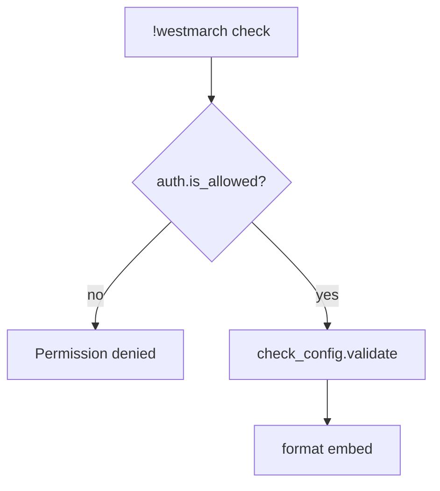

# westmarch check — MVP implementation

**Subsystem:** admin *(not in config)* · **Phase:** 0–1

**Subcommand** of [`!westmarch`](westmarch.md) — validate the server’s configuration and report errors/warnings.

## Player-facing behaviour

```
!westmarch check
```

- **Who may run:** `auth.is_allowed()` (admin roles).
- **Output:** embed with overall status (**OK** / **issues found**) and bullet lists of **errors** (blocking) and **warnings** (non-blocking).
- **Does not mutate** svars, gvars, or config.

## Validation logic

Implemented in **[check_config.gvar](../../gvars/check_config.md)** — **`check_config.validate()`** returns **`(errors, warnings)`**.

**`check.alias`** is a thin wrapper: **`auth.is_allowed()`** → **`check_config.validate()`** → format embed. No validation rules in the alias body.

[config.gvar](../../gvars/config.md) loads and merges only; **`check_config.gvar`** uses **`config.get_config()`** and inspects svar wiring directly when reporting “not set” vs “bad UUID”.

| Check | Severity | Example message |
|-------|----------|-----------------|
| `westmarch_config` svar unset | Error | Svar not set — engine uses safe defaults only |
| Svar set but gvar missing / unloadable | Error | Config gvar UUID not found |
| Missing or malformed `subsystems` | Error | subsystems.exploration must be an object |
| `exploration.config.enc_biome_source == "location"` but travel/location off | Error | Location inference requires travel + location command |
| `exploration.config.enc_biome_source == "location"` but no **`world_data.locations`** | Error | Config locations required |
| **`travel`** enabled but no **`world_data.locations`** / **`default_location`** | Error | Travel requires world data |
| Biome code referenced but missing from **`world_data.biomes`** | Error | Register biome or fix location activities |
| **`biomes.*.gvar_id`** unloadable | Error | Biome gvar UUID not found |
| Legacy top-level **`locations`** without **`world_data`** | Warning | Migrate to **`world_data.locations`** |
| Invalid `enc_biome_source` value | Error | Must be `auto`, `argument`, or `location` |
| `enc_biome_source == "auto"` with travel/locations configured | Info | Effective mode: inferred from location |
| `enc_biome_source == "auto"` without travel/locations | Info | Effective mode: manual biome argument |
| `exploration.config.distribution` sum ≠ 100 | Error | Percentages must total 100 (combat + quest + gather) |
| Unknown key in `exploration.config.distribution` | Error | Only `combat`, `quest`, `gather` allowed |
| Invalid `distribution_policy` value | Error | Must be `random` or `balanced` |
| Kind > 0% in `distribution` but no entries in biome **`pools[activity][kind]`** | Warning | e.g. `quest: 25` but forest biome has empty quest bucket |
| `policies.time.mode == "world_clock"` but no **`world_data.calendars`** | Warning | Time policy expects calendar data |
| **`policies.downtime.mode == "tracked"`** but **`subsystems.downtime.enabled`** false | Error | Tracked downtime requires **`!downtime`** subsystem enabled |
| **`policies.downtime.max_workdays`** set and **< 1** | Error | max_workdays must be positive or omitted |
| **`policies.crafting.require_downtime_before_roll`** true but downtime not **tracked** | Warning | Crafting downtime enforcement needs **`policies.downtime.mode: tracked`** |
| Crafting command enabled + **`workdays_cost > 0`** but downtime not tracked | Warning | Command config spends workdays but downtime is not tracked |
| **`policies.downtime.acquisition == "world_clock"`** but **`policies.time.mode`** not **`world_clock`** | Warning | World-clock workday grants need world clock time policy |
| **`policies.exploration.avoid_repeat_encounters`** not **`off`** but stats / encounter id logging unavailable | Warning | Repeat avoidance needs **`stats.add_log`** with **`encounter_id`** |
| **`policies.economy.enforce_cooldowns`** true, **`commands.job`** on, **`command_config.job.cooldown_seconds > 0`** | Info | Job cooldown active — duration from **`command_config.job`** |
| **`policies.combat.scale_encounters_to_level`** true | Warning | Combat scaling not implemented in MVP |
| **`policies.combat.roll_monster_hp`** false with combat-heavy distribution | Info | Monster HP not rolled in combat embeds — GM discretion |
| **`policies.quest.self_assign`** true but **`misc.commands.quest`** off | Error | Self-assign requires **`!quest`** enabled |
| **`policies.quest.max_active`** set and **< 1** | Error | max_active must be positive or omitted |
| **`policies.economy.enforce_wallet_caps`** true but currency missing **`max_balance`** | Warning | Set max_balance on each currency or disable caps |
| **`policies.economy.starting_gold`** set and **< 0** | Error | starting_gold must be non-negative or omitted |
| **`policies.inventory.enforce_*`** true | Warning | Inventory enforcement not implemented in MVP |
| **`policies.inventory.enforce_encumbrance`** true but **`track_encumbrance`** false | Warning | Encumbrance enforcement needs tracking enabled |
| **`policies.travel.consume_rations`** but empty **`rations_item`** | Warning | Set rations_item (default **Rations**) |
| `policies.travel.consume_rations` but no rations item configured | Warning | Rations policy on — verify item name matches sheet/catalogue |
| Subsystem enabled but required data absent | Error | `travel` on but no **`world_data.locations`** / **`default_location`** |
| Command enabled but parent subsystem off | Warning | `commands.enc` true while `exploration.enabled` false |
| Extension gvar pointer unset or bad UUID | Error | `extensions.monsters` does not resolve |
| Catalogue empty while commands need it | Warning | `craft` on but `items_list` empty |
| Invalid `library_topic_source` | Error | Must be `inferred`, `balanced`, `manual`, or `restricted` |
| Invalid `rules_version` | Error | Must be `2014` or `2024` when set |
| `rules_version` set and differs from Avrae rules setting | Warning | Config override active — align Avrae or update catalogues |
| Invalid `display.colour` | Error | Must be `#RRGGBB` or `RRGGBB` (6 hex digits) — base, subsystem **`display`**, or **`command_display`** |
| Invalid `policies.display.footer_behaviour` | Error | Must be `helpful_tips`, `string`, `help`, `credits`, or `balanced` |
| `footer_behaviour` is `string` but no `footer` at any display layer | Warning | Runtime falls back to title / world name |
| Unknown key in `command_display` | Warning | Key does not match a command in that subsystem’s **`commands`** map |
| `policies.languages.allowed` contains unknown language name | Warning | Name not in rules-edition language table |
| `library_topic_source == "restricted"` but `allowed_topics` empty | Error | Restricted library search requires allowed topic list |
| `library_topic_source` inferred/balanced, location off, no `library_topics` on locations | Warning | Location-based topic inference limited |
| `subsystems.admin` present | Warning | Admin is not configurable — remove; GM hub is role-gated |

## Generic architecture



Diagnostic detail when svar unset is OK here (GM-facing command).

## Implementation checklist

- [ ] **`check_config.gvar`** — [gvars/check_config.md](../../gvars/check_config.md); pluggable rules per subsystem
- [ ] **`check.alias`** — auth + validate + embed only
- [ ] **`auth.is_allowed()`** — [gvars/auth.md](../../gvars/auth.md)
- [ ] **`.alias-test`** — OK fixture, broken fixture, permission denied

## Related

- [check_config.md](../../gvars/check_config.md) — validation implementation
- [show.md](show.md) · [setup.md](setup.md) · [config.md](../../gvars/config.md)
