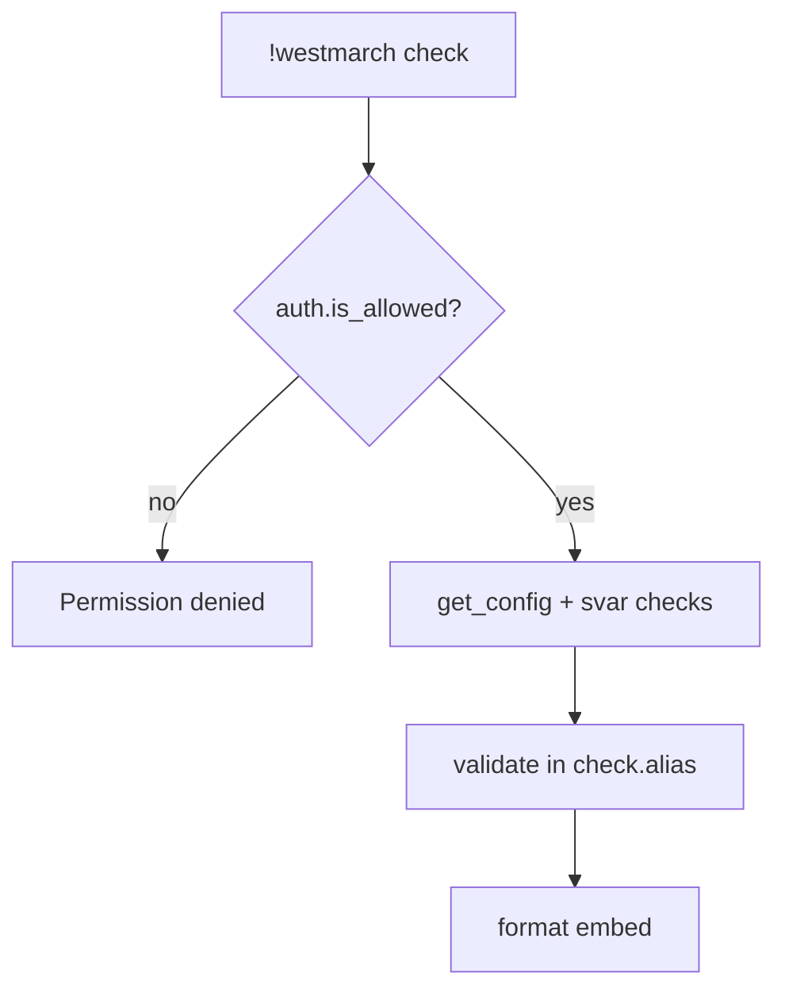

# westmarch check — MVP implementation

**Subsystem:** admin *(not in config)* · **Phase:** 0–1

**Subcommand** of [`!westmarch`](westmarch.md) — validate the server’s configuration and report errors/warnings.

## Player-facing behaviour

```
!westmarch check
```

- **Who may run:** `auth.is_allowed()` (admin roles).
- **Output:** embed with overall status (**OK** / **issues found**) and bullet lists of **errors** (blocking) and **warnings** (non-blocking).
- **Does not mutate** svars, gvars, or config.

## Validation logic

Lives in **`check.alias`** (or a private helper in that file) — **not** in [config.gvar](../../gvars/config.md). Uses **`config.get_config()`** with no args; also inspects svar wiring directly when reporting “not set” vs “bad UUID”.

| Check | Severity | Example message |
|-------|----------|-----------------|
| `westmarch_config` svar unset | Error | Svar not set — engine uses safe defaults only |
| Svar set but gvar missing / unloadable | Error | Config gvar UUID not found |
| Missing or malformed `subsystems` | Error | subsystems.exploration must be an object |
| `exploration.config.enc_biome_source == "location"` but travel/location off | Error | Location inference requires travel + location command |
| `exploration.config.enc_biome_source == "location"` but no `locations` | Error | Config locations required |
| Invalid `enc_biome_source` value | Error | Must be `argument` or `location` |
| `exploration.config.distribution` sum ≠ 100 | Error | Percentages must total 100 (combat + quest + gather) |
| Unknown key in `exploration.config.distribution` | Error | Only `combat`, `quest`, `gather` allowed |
| Invalid `distribution_policy` value | Error | Must be `random` or `balanced` |
| Kind > 0% in `distribution` but no pool entries of that kind | Warning | e.g. `quest: 25` but no quest-tagged encounters in biome pools |
| `policies.time.mode == "world_clock"` but no `world_clock` config | Warning | Time policy expects world clock data |
| `policies.travel.consume_rations` but no rations item configured | Warning | Rations policy on — define item name in future `policies` or items config |
| Subsystem enabled but required data absent | Error | `travel` on but no `locations` / `default_location` |
| Command enabled but parent subsystem off | Warning | `commands.enc` true while `exploration.enabled` false |
| Extension gvar pointer unset or bad UUID | Error | `extensions.monsters` does not resolve |
| Catalogue empty while commands need it | Warning | `craft` on but `items_list` empty |
| `subsystems.admin` present | Warning | Admin is not configurable — remove; GM hub is role-gated |

## Generic architecture



Diagnostic detail when svar unset is OK here (GM-facing command).

## Implementation checklist

- [ ] Validation helpers in **`check.alias`** — pluggable rules per subsystem
- [ ] **`auth.is_allowed()`** — [gvars/auth.md](../../gvars/auth.md)
- [ ] **`config.get_config()`** — [gvars/config.md](../../gvars/config.md)
- [ ] **`.alias-test`** — OK fixture, broken fixture, permission denied

## Related

- [show.md](show.md) · [setup.md](setup.md) · [gvars/config.md](../../gvars/config.md)
