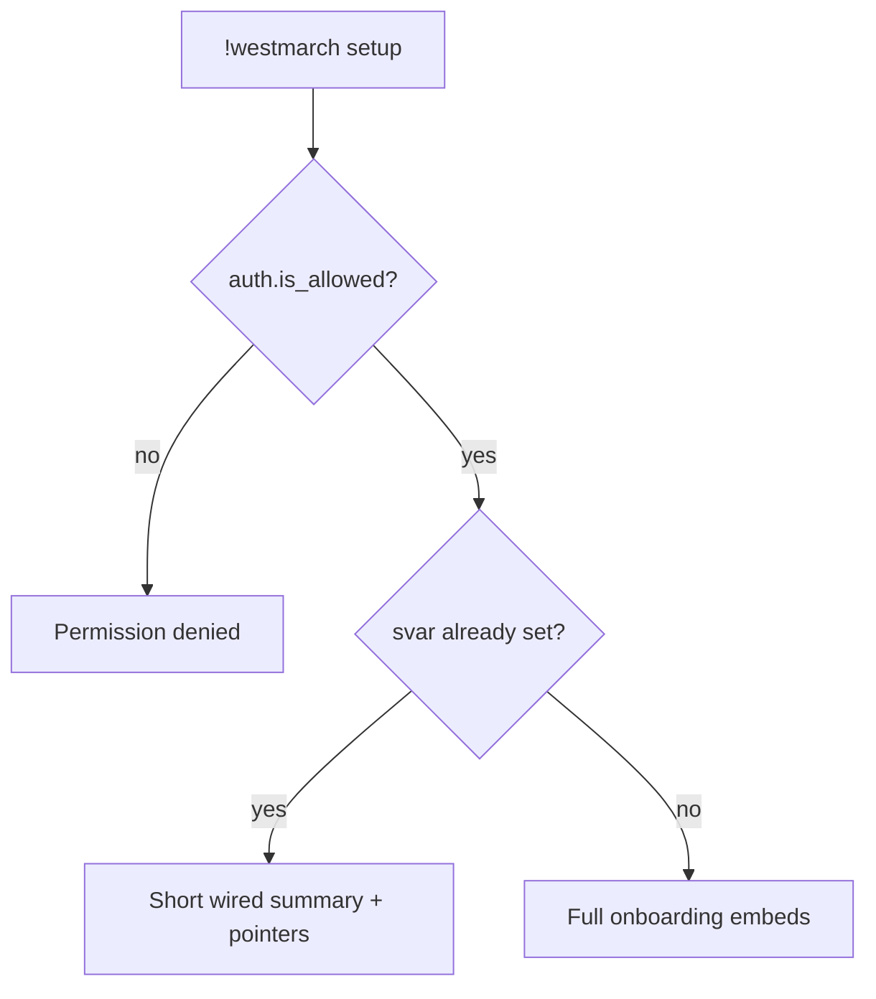

# westmarch setup — MVP implementation

**Subsystem:** admin *(not in config)* · **Phase:** 0–1

**Subcommand** of [`!westmarch`](westmarch.md) — onboarding for server owners: how to create a config gvar, wire the svar, and verify.

## Player-facing behaviour

```
!westmarch setup
```

- **Who may run:** same gate as [westmarch.md](westmarch.md) — Administrator or `admin_roles` / Avrae defaults.
- **Output:** one or more embeds (paginate if needed) with numbered setup steps and **copy-paste-ready** Avrae commands.
- **Does not mutate** svars or gvars — displays instructions only.

### When already wired

If `westmarch_config` svar is set and config loads:

- Short “already wired” summary (gvar UUID truncated, load OK).
- Point to **`!westmarch check`** and **`!westmarch show`**.
- Optional footer: “Re-run setup anytime for the full guide.”

## Onboarding content (MVP)

Embed sections in order:

### 1 — Subscribe to the engine

- Subscribe to the **westmarch-generic** workshop on [Avrae](https://avrae.io/dashboard/workshop) (link from public setup doc when published).
- Ensure your account has **Dragonspeaker** or **Server Aliaser** (or Discord Administrator) on this server.

### 2 — Create a config gvar

**Option A — duplicate template *(recommended when published)***
- Open the template config gvar in the workshop (UUID in public `docs/setup.md` / engine env `TEMPLATE_CONFIG_GVAR`).
- **Duplicate** it into your workshop, then edit subsystem toggles.

**Option B — create from scratch**

Avrae assigns a UUID when you create a gvar. Multi-line config is easiest via the editor after a minimal create:

```
!gvar create # westmarch config — replace via editor
```

Avrae replies with your new gvar **UUID**. Then open the editor and paste the starter body:

```
!gvar editor <your-gvar-uuid>
```

**Starter body** (valid Draconic module — no `<drac2>` delimiters):

```py
subsystems = {
    "exploration": {
        "enabled": False,
        "commands": {
            "enc": False,
            "forage": False,
            "fish": False,
            "mine": False,
            "lumber": False,
            "hunt": False,
            "loot": False,
        },
        "config": {
            "enc_biome_source": "argument",
            "distribution_policy": "random",
            "distribution": {"combat": 25, "quest": 25, "gather": 50},
        },
    },
    "travel": {
        "enabled": False,
        "commands": {
            "travel": False,
            "location": False,
            "time": False,
            "weather": False,
        },
    },
    "downtime": {"enabled": False},
    "crafting": {
        "enabled": False,
        "commands": {
            "craft": False,
            "brew": False,
            "enchant": False,
            "scribe": False,
        },
    },
    "economy": {
        "enabled": False,
        "commands": {
            "job": False,
            "buy": False,
            "sell": False,
            "wallet": False,
        },
    },
    "content": {
        "enabled": False,
        "commands": {
            "library": False,
            "read": False,
        },
    },
    "misc": {
        "enabled": False,
        "commands": {
            "quest": False,
            "recipe": False,
        },
    },
}
```

Optional **`policies`** — house rules: [data-shapes.md § Server policies](../../data-shapes.md#server-policies). **`subsystems.*.config`** — per-subsystem behaviour (e.g. exploration encounter mix): [data-shapes.md § exploration.config](../../data-shapes.md#explorationconfig). Omitted keys use engine defaults ([starter.gvar](../../../../templates/config/starter.gvar)).

Replace starter **`subsystems`** toggles for your server. Enable subsystems and add world data (`locations`, tables, etc.) as you port each vertical — see [server-config.md](../../server-config.md).

### 3 — Wire the server svar

Point this Discord server at your config gvar UUID:

```
!svar westmarch_config <your-gvar-uuid>
```

- **Svar name** is fixed: **`westmarch_config`** (see [solution-statement.md](../../solution-statement.md)).
- **Value** is only the 36-character gvar UUID string — not Python, not JSON.
- Requires **Dragonspeaker**, **Server Aliaser**, or Discord Administrator.

To swap configs later (new season, staging world):

```
!svar westmarch_config <other-gvar-uuid>
```

To clear configuration:

```
!svar delete westmarch_config
```

### 4 — Verify

```
!westmarch check
!westmarch show
```

Fix any errors in your config gvar, then re-run **`check`**. Player commands stay inert or show “not configured” until subsystems are enabled and data is present.

## Implementation notes

- **`setup.alias`** — build onboarding embeds from [templates/config/starter.gvar](../../../../../templates/config/starter.gvar)
- **`TEMPLATE_CONFIG_GVAR`** in **`env`** — optional link to published duplicate template
- Do **not** auto-substitute the invoker’s gvar UUID in step 3 unless svar is already set (then show current value for confirmation).

## Generic architecture



## Implementation checklist

- [ ] **`setup.alias`** under `westmarch/`
- [ ] **`.alias-test`** — permission denied; unwired shows steps; wired shows summary
- [ ] Wire env + sourcemaps (sub-alias of `westmarch`)

## Related

- [westmarch.md](westmarch.md) — parent hub
- [check.md](check.md) · [show.md](show.md) — post-setup verification
- [mvp-commands.md](../../mvp-commands.md) — full `subsystems` reference
- [US-1.1](../../user-stories.md), [US-1.2](../../user-stories.md), [US-2.3](../../user-stories.md)
