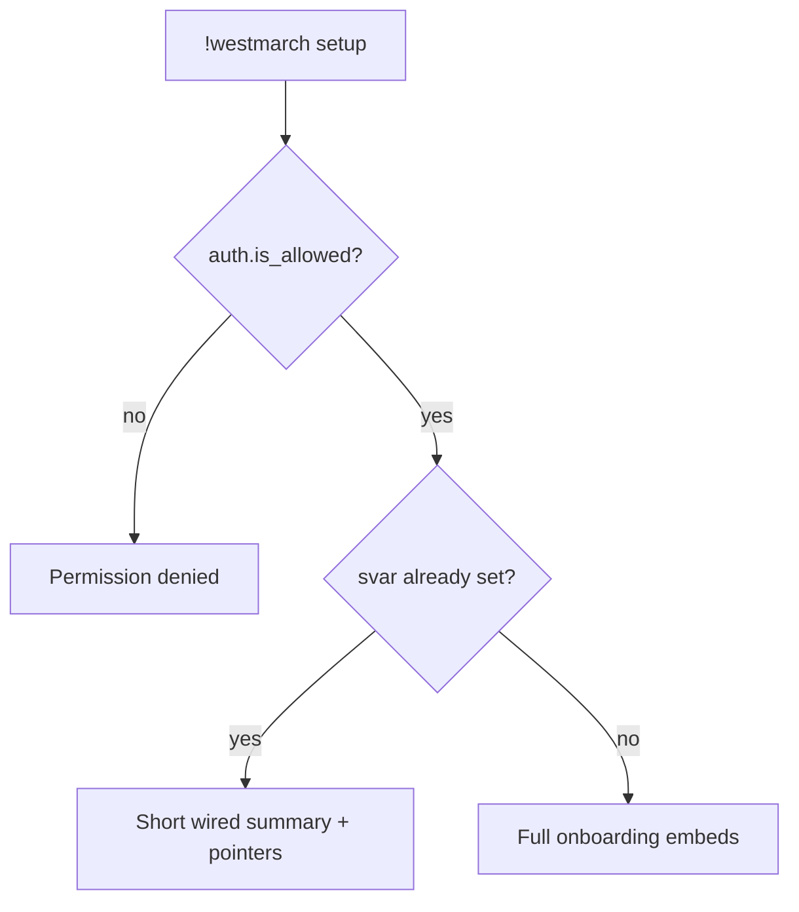

# westmarch setup — MVP implementation

**Subsystem:** admin *(not in config)* · **Phase:** 0–1

**Subcommand** of [`!westmarch`](westmarch.md) — onboarding for server owners: how to create a config gvar, wire the svar, validate in the editor, and review with Discord summary output.

**Status:** implemented in `src/aliases/westmarch/setup.alias`; older unchecked checklist items below are retained as implementation-history context until the command docs get a full checklist refresh.

## Player-facing behaviour

```
!westmarch setup
!westmarch setup -p <page-number-or-title>
```

- **Who may run:** same gate as [westmarch.md](westmarch.md) — **`Dragonspeaker`** or **`Server Aliaser`** (Avrae aliasing permissions; not GM/DM).
- **Output:** one setup page at a time with numbered page index and **copy-paste-ready** Avrae commands.
- **Does not mutate** svars or gvars — displays instructions only.
- **Default page:** page 1 (**Initial Setup**) when `westmarch_config` is unset; page 2 (**General Configuration**) when it is set and loadable.
- **Page lookup:** `!westmarch setup -p 1` or `!westmarch setup -p "Initial Setup"`.

### When already wired

If `westmarch_config` svar is set and config loads, page 2 shows:

- Full config gvar UUID and Avrae dashboard lookup link.
- Point to the editor **Check** page and **`!westmarch show`**.
- Page index for the rest of the setup guide.

## Pages

| # | Page | Purpose |
|---|------|---------|
| 1 | **Initial Setup** | Subscribe, create starter config gvar inline, add editors, wire svar, open editor Check |
| 2 | **General Configuration** | Explain svar → config gvar loading, dashboard link, editor/show workflow |
| 3 | **Exploration Subsystem** | Exploration toggles and config fields (`enc_biome_source`, distribution, cooldowns) |
| 4 | **World Data** | High-level `world_data` map and implemented surfaces |
| 5 | **Biomes and Locations** | Biome registry, encounter-pool gvars, location inference |
| 6 | **Monster Data** | `world_data.monsters` overrides for hunt/loot |
| 7 | **Recommended Workshops** | Companion workshop recommendations and `policies.player_setup` checks |

## Onboarding content (MVP)

Embed sections in order:

### 1 — Subscribe to the engine

- Subscribe to the **westmarch-generic** workshop on [Avrae](https://avrae.io/dashboard/workshop) (see [docs/setup.md](../../../../../docs/setup.md)).
- Ensure your account has **Dragonspeaker** or **Server Aliaser** on this server (Avrae aliasing permissions — for editing aliases, gvars, and svars).

### 2 — Create a config gvar

**Option A — duplicate template *(recommended)***
- Minimal: [src/gvars/configs/starter.gvar](../../../../src/gvars/configs/starter.gvar)
- Prefab worlds: [gvars/configs.md](../../gvars/configs.md) — Forgotten Realms, generic fantasy, Spelljammer (duplicate published UUID or paste from repo)
- Open the template or preset in the workshop (UUID in [docs/setup.md](../../../../../docs/setup.md) when published / engine env `TEMPLATE_CONFIG_GVAR`).
- **Duplicate** it into your workshop, then edit subsystem toggles.

**Create from scratch**

Avrae assigns a UUID when you create a gvar. The setup page prints a compact starter directly in the command:

```
!gvar create # westmarch config
subsystems = {
    "exploration": {"enabled": False, "commands": {"enc": False, ...}},
}
```

Open or edit later:

```text
!gvar editor <your-gvar-uuid>
```

Named links for browser work:

- [Westmarch config editor](https://sykander.github.io/westmarch-generic/) — accepts `?westmarch_config=<your-gvar-uuid>` to prefill the gvar id.
- [Avrae gvar dashboard](https://avrae.io/dashboard/gvars) — accepts `?lookup=<your-gvar-uuid>` for dashboard lookup.

Add another editor:

```text
!gvar editor <your-gvar-uuid> @TheirDiscordName
```

Optional **`policies`** — house rules: [data-shapes.md § Server policies](../../data-shapes.md#server-policies). **`subsystems.*.config`** — per-subsystem behaviour. Omitted keys use engine defaults ([starter.gvar](../../../../src/gvars/configs/starter.gvar)).

Replace starter **`subsystems`** toggles for your server. Enable subsystems and add world data (`locations`, tables, etc.) as you port each vertical — see [server-config.md](../../server-config.md).

### 3 — Wire the server svar

Point this Discord server at your config gvar UUID:

```
!svar westmarch_config <your-gvar-uuid>
!westmarch show
```

- **Svar name** is fixed: **`westmarch_config`** (see [solution-statement.md](../../solution-statement.md)).
- **Value** is only the 36-character gvar UUID string — not Python, not JSON.
- Requires **Dragonspeaker** or **Server Aliaser** (Avrae aliasing permissions).

To swap configs later (new season, staging world):

```
!svar westmarch_config <other-gvar-uuid>
```

To clear configuration:

```
!svar delete westmarch_config
```

### 4 — Verify

```
!westmarch show
```

Fix any errors shown by the web editor, then re-run **`show`**. Player commands stay inert or show “not configured” until subsystems are enabled and data is present.

## Implementation notes

- **`setup.alias`** — build onboarding embeds from [src/gvars/configs/starter.gvar](../../../../../src/gvars/configs/starter.gvar)
- **`TEMPLATE_CONFIG_GVAR`** in **`env`** — optional link to published duplicate template
- Do **not** auto-substitute the invoker’s gvar UUID in step 3 unless svar is already set (then show current value for confirmation).

## Generic architecture



## Implementation checklist

- [ ] **`setup.alias`** under `westmarch/`
- [ ] **`.alias-test`** — permission denied; unwired shows steps; wired shows summary
- [ ] Wire env + sourcemaps (sub-alias of `westmarch`)

## Related

- [westmarch.md](westmarch.md) — parent hub
- [show.md](show.md) — post-setup review
- [mvp-commands.md](../../mvp-commands.md) — full `subsystems` reference
- [US-1.1](../../user-stories.md), [US-1.2](../../user-stories.md), [US-2.3](../../user-stories.md)
