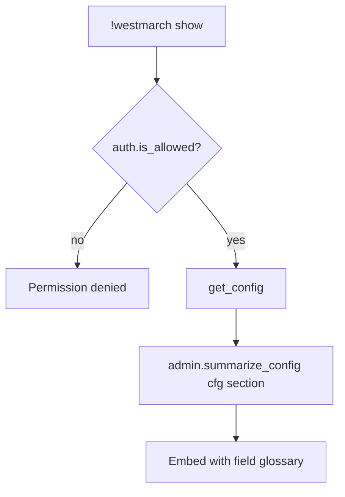

# westmarch show — MVP implementation

**Subsystem:** admin *(not in config)* · **Phase:** 0–1

**Subcommand** of [`!westmarch`](westmarch.md) — readable summary of the server’s loaded config for GMs and content authors.

## Player-facing behaviour

```
!westmarch show
!westmarch show <section>   # optional MVP stretch: exploration | travel | economy | …
```

- **Who may run:** same as [westmarch.md](westmarch.md).
- **Output:** embed explaining **what is configured**, not a raw gvar dump.

### MVP summary sections

| Section | Content |
|---------|---------|
| **Wiring** | Svar name, config gvar UUID (truncated ok), load status |
| **Subsystems** | Table: subsystem → enabled/disabled; per-command toggles; non-default **`config`** keys |
| **Policies** | Summary of `policies.*` modes (time, travel costs, downtime, crafting automation, inventory limits) — [data-shapes.md](../../data-shapes.md#server-policies) |
| **Runtime** | Resolved rules edition (Avrae / engine default); Discord guild name when in guild |
| **Data overview** | Counts where cheap: e.g. N areas, N shops, N books, catalogue sizes |
| **Pointers** | Link to public schema docs; suggest `!westmarch check` if issues suspected |

Each section includes a **one-line explanation** where helpful (e.g. resolved rules edition from Avrae, not stored in config).

### Explicit non-goals

- Do **not** post full `ITEMS_LIST`, monster shards, or book bodies to Discord.
- Do **not** expose other servers’ data — guild-scoped svar only.

Optional **`verbose`** flag (Phase 1+): extra keys, extension gvar UUIDs, sample area codes — still capped for embed limits.

## Generic architecture



Footer may note validation warnings from the same rules as **`check`** when useful.

## Implementation checklist

- [ ] **`admin.summarize_config(config, section=None)`**
- [ ] **`show.alias`** under `westmarch/` — permission, optional section arg
- [ ] **`.alias-test`** — template fixture; permission denied; no catalogue dump
- [ ] Wire env + sourcemaps (sub-alias of `westmarch`)

## Related

- [setup.md](setup.md) — onboarding companion
- [westmarch.md](westmarch.md) — parent hub
- [README.md](README.md) — access control
