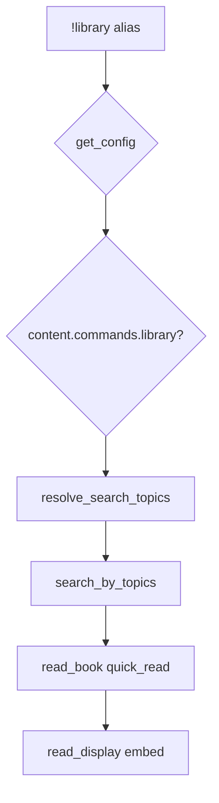

# library — MVP implementation

**Subsystem:** content · **Toggle:** `subsystems.content.commands.library` · **Phase:** 1 (Tier G)

Sixth in this folder’s sequence. **Not** part of the encounter pipeline — uses the westmarch **library** book engine instead of `process_encounters`.

Pairs with **read** ([read.md](read.md)) when designing; ships in Tier G.

## Player-facing behaviour

Search the stacks by topic; receive one random matching volume and a **quick read** (comprehension-scored skim).

Topic behaviour is controlled by **`subsystems.content.config.library_topic_source`** — [data-shapes.md § content.config](../../data-shapes.md#contentconfig).

### By `library_topic_source`

| Mode | Invocation | Topics |
|------|------------|--------|
| **`manual`** *(default)* | `!library <topics> [comprehend] [bonuses]` | Player **must** supply `<topics>` (arg 0; quote multi-word) |
| **`inferred`** | `!library [comprehend] [bonuses]` | **No** topic arg — engine infers from location, recent play, character profile |
| **`balanced`** | `!library [topics] [comprehend] [bonuses]` | Inferred topics **plus** optional player topics |
| **`restricted`** | `!library <topics> [comprehend] [bonuses]` | Player **must** supply topics; each must be in config **`allowed_topics`** |

Shared flags:

- **`comprehend`** — Comprehend Languages for that slip.
- **Cooldown:** **`policies.content.enforce_library_cooldowns`**; **`command_config.library.cooldown_seconds`** (default **120**); **[pc.gvar](../../gvars/pc.md)** **`check_cooldown(ch, "library")`**.
- **Embed body:** **`description`** only — a short in-game excerpt, not the full volume ([data-shapes.md § Book](../../data-shapes.md#book)).
- **Full text link:** when the book has **`content_link`** and the character reaches **100% comprehension** on that title, **`read_display`** adds a link to read the complete work online (public-domain catalogue entries).
- On high comprehension (>50), embed suggests `!read "<title>"` for deep study.

**`restricted`** example config:

```py
"content": {
    "enabled": True,
    "commands": { "library": True, "read": True },
    "config": {
        "library_topic_source": "restricted",
        "allowed_topics": ["history", "arcana", "nature", "religion"],
    },
},
```

## westmarch reference

| Artifact | Path |
|----------|------|
| Alias | `westmarch/src/aliases/exploration/library.alias` |
| Alias tests | `westmarch/src/aliases/exploration/library.alias-test` |
| Engine | `westmarch/src/gvars/utils/library.gvar` |
| Architecture spec | `westmarch/docs/library/library-architecture.md` |

Call path:

```text
library.resolve_search_topics(cfg, ch, args, argslist)
  → library.search_by_topics(cfg, topics, ch, args, argslist)
  → library.read_book(book, ch, args, "quick_read", argslist)
  → library.read_display(rr)
```

## Generic architecture



### Engine vs config split

| Data | Owner | Notes |
|------|-------|-------|
| Topic inference + search + comprehension | **Engine** [library.gvar](../../gvars/library.md) | `infer_topics`, `resolve_search_topics` |
| **`library_topic_source`**, **`allowed_topics`** | **Config** | [content.config](../../data-shapes.md#contentconfig) |
| Book catalogue (title, author, topics, tags, body) | **Config** gvar | May need **extension gvar** for large corpora |
| Location **`library_topics`** | **Config** | Optional per [Location](../../data-shapes.md#location) |
| **`policies.languages.allowed`** | **Config** | Setting-valid languages for Comprehend / language-tagged books |
| Cooldown / comprehension cvars | **Engine** [pc.gvar](../../gvars/pc.md) | |
| Embed branding | **`display.get_display()`** | Inherits base **`display`**, subsystem/command overrides ([display.gvar](../../gvars/display.md)) |

### Config loader integration

1. `auth.is_allowed("library")`
2. **`library.resolve_search_topics(cfg, ch, args, argslist)`** — honour **`content.config`**
3. Pass book corpus: **`search_by_topics(..., books=cfg.books)`** (API TBD during port)
4. **`rules_edition`** — languages helper may branch on 2014 vs 2024 ([mvp-commands.md](../../mvp-commands.md))

## Prerequisites

- Config loader from **enc** Phase 0
- Vendored **`core/`** — **`embeds`**, **`rolls`**, **`languages`** via `env.gvars.*` ([core.md](../../gvars/core.md))
- Book fixture in template config (2–3 volumes with topics for search tests)

Activity commands and **crafting** are **not** hard dependencies, but **`inferred`** / **`balanced`** modes produce richer results when exploration, travel, and crafting have run on the character.

## MVP scope

### In scope (initial port)

- All four **`library_topic_source`** modes ([data-shapes.md](../../data-shapes.md#contentconfig))
- Topic search → single random book from candidate pool (~20 internal candidates per westmarch spec)
- Quick read with comprehension score, skill roll field, censoring
- **`content_link`** footer when comprehension reaches **100** and book defines a URL ([library.gvar](../../gvars/library.md))
- Cooldown enforcement (skip in Development)
- Help embed reflects active **`library_topic_source`** (usage differs per mode)
- Alias-tests: help, manual search, restricted reject, inferred/balanced smoke *(fixture history)*

### Defer / phase later

- Full westmarch book corpus extract
- **read** deep-read command (separate doc when added)
- Tunable **`inferred_sources`** weights per signal
- LRU eviction tuning playtests (architecture doc retention targets)
- Extension gvar sharding for oversized catalogues

## Implementation checklist

- [ ] Port **`library.gvar`** — `infer_topics`, `resolve_search_topics`, **`read_display`** with **`content_link`** gating; follow [library-architecture.md](https://github.com/Sykander/westmarch/blob/main/docs/library/library-architecture.md)
- [ ] Refactor book source from hard-coded gvar → config `books` (or extension pointer)
- [ ] Port **`library.alias`** — loader, content toggle, topic policy branch
- [ ] Add **`subsystems.content.config`** to schema + template config
- [ ] **`library.alias-test`** — manual, restricted, inferred fixtures; **`content_link`** hidden below 100% comprehension
- [ ] Document public `docs/config/books.md` when schema stabilizes

## Exit criteria

| Criterion | Verification |
|-----------|----------------|
| Each **`library_topic_source`** mode behaves per data-shapes | Alias-tests |
| Topic search returns embed with book title | Alias-test |
| `content.commands.library` off → disabled message | Alias-test |
| **`restricted`** rejects disallowed topic | Alias-test |
| **`inferred`** rejects user-supplied topic args | Alias-test |
| Comprehend flag path does not crash | Optional alias-test row |
| **`content_link`** shown only at 100% comprehension when set | Alias-test |
| CI green | GitHub Actions |

## Related

- [fish.md](fish.md) — prior in this folder’s sequence
- [read.md](read.md) — deep read command (Tier G pair)
- [README.md](README.md) — content subsystem index
- [user-stories.md](../../user-stories.md) — US-6.5
