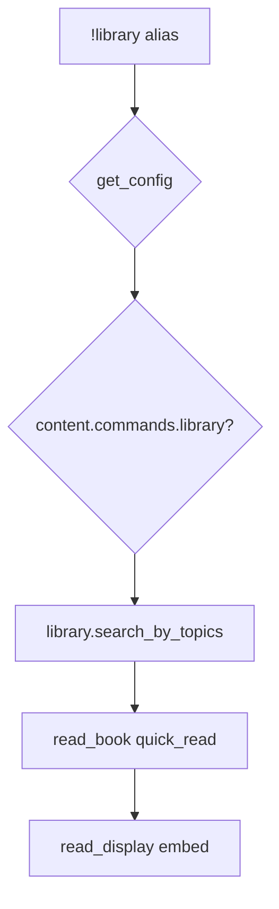

# library — MVP implementation

**Subsystem:** content · **Toggle:** `subsystems.content.commands.library` · **Phase:** 1 (Tier G)

Sixth in this folder’s sequence. **Not** part of the encounter pipeline — uses the westmarch **library** book engine instead of `process_encounters`.

Pairs with **read** ([read.md](read.md)) when designing; ships in Tier G.

## Player-facing behaviour

Search the stacks by topic; receive one random matching volume and a **quick read** (comprehension-scored skim).

```
!library <topics> [comprehend] [bonuses]
```

- **`<topics>`** is always argument 0 (quote multi-word topics).
- **`comprehend`** — Comprehend Languages for that slip.
- **Cooldown:** 120s library search throttle (`bags.library_cooldown_code`).
- On high comprehension (>50), embed suggests `!read "<title>"` for deep study.

## westmarch reference

| Artifact | Path |
|----------|------|
| Alias | `westmarch/src/aliases/exploration/library.alias` |
| Alias tests | `westmarch/src/aliases/exploration/library.alias-test` |
| Engine | `westmarch/src/gvars/utils/library.gvar` |
| Architecture spec | `westmarch/docs/library/library-architecture.md` |

Call path:

```text
library.search_by_topics([topic_blob], ch, args, argslist)
  → library.read_book(book, ch, args, "quick_read", argslist)
  → library.read_display(rr)
```

## Generic architecture



### Engine vs config split

| Data | Owner | Notes |
|------|-------|-------|
| Search, comprehension, censoring | **Engine** [library.gvar](../../gvars/library.md) | |
| Book catalogue (title, author, topics, tags, body) | **Config** gvar | May need **extension gvar** for large corpora |
| Cooldown / comprehension cvars | **Engine** [pc.gvar](../../gvars/pc.md) | |
| Embed footer | **Config** | Server branding |

### Config loader integration

1. `auth.is_allowed()`
2. Pass book corpus into library engine: `library.search_by_topics(..., books=cfg.BOOKS)` (API TBD during port)
3. **`rules_edition`** — languages helper may branch on 2014 vs 2024 ([mvp-commands.md](../../mvp-commands.md))

## Prerequisites

- Config loader from **enc** Phase 0
- drac2-tools **embeds**, **rolls**, **languages** wired in env
- Book fixture in template config (2–3 volumes with topics for search tests)

Activity commands (**enc**–**fish**) are **not** hard dependencies, but completing them first validates the loader before this larger engine port.

## MVP scope

### In scope (initial port)

- Topic search → single random book from candidate pool (~20 internal candidates per westmarch spec)
- Quick read with comprehension score, skill roll field, censoring
- Cooldown enforcement (skip in Development)
- Help embed with usage/examples
- Alias-tests: help, topic search smoke, cooldown message shape

### Defer / phase later

- Full westmarch book corpus extract
- **read** deep-read command (separate doc when added)
- LRU eviction tuning playtests (architecture doc retention targets)
- Extension gvar sharding for oversized catalogues

## Implementation checklist

- [ ] Port **`library.gvar`** — follow [library-architecture.md](https://github.com/Sykander/westmarch/blob/main/docs/library/library-architecture.md)
- [ ] Refactor book source from hard-coded gvar → config `BOOKS` (or extension pointer)
- [ ] Port **`library.alias`** — loader, content toggle, config-backed corpus
- [ ] Add **`subsystems.content`** to schema + template config
- [ ] **`library.alias-test`** with fixture books + mocked svar
- [ ] Document public `docs/config/books.md` when schema stabilizes

## Exit criteria

| Criterion | Verification |
|-----------|----------------|
| Topic search returns embed with book title | Alias-test |
| `content.commands.library` off → disabled message | Alias-test |
| Comprehend flag path does not crash | Optional alias-test row |
| CI green | GitHub Actions |
| Architecture doc decisions honoured (censoring, quick_read 120-char truncate, monotonic comprehension) | Manual review vs westmarch spec |

## Related

- [fish.md](fish.md) — prior in this folder’s sequence
- [read.md](read.md) — deep read command (Tier G pair)
- [README.md](README.md) — content subsystem index
- [user-stories.md](../../user-stories.md) — US-6.5
