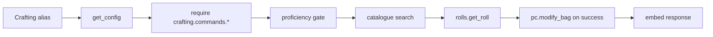

# Crafting — MVP implementation docs

Implementation plans for **crafting** commands in westmarch-generic. These docs sit under [westmarch-statement](../../README.md); scope and toggles are defined in [mvp-commands.md](../../mvp-commands.md) (Tier E).

## Implementation order

| # | Command | Doc | Phase | Notes |
|---|---------|-----|-------|-------|
| 1 | **craft** | [craft.md](craft.md) | 1 (Tier E) | westmarch port; item catalogue + price-band DCs; reference port |
| 2 | **brew** | [brew.md](brew.md) | 1 (Tier E) | Potion catalogue + rarity DCs |
| 3 | **scribe** | [scribe.md](scribe.md) | 1 (Tier E) | Spells catalogue + scroll cost table |
| 4 | **enchant** | [enchant.md](enchant.md) | 1 (Tier E) | Magic item catalogue + rarity DCs |

**Prerequisite:** [downtime/downtime.md](../downtime/downtime.md) (Tier D) — crafting help text assumes players track workdays via `!downtime`; westmarch does **not** auto-deduct downtime in the alias (honour system). **[misc/recipe.md](../misc/recipe.md)** (Tier H) indexes the same catalogues read-only.

## Shared crafting pipeline

Four commands share a roll → pass/fail → optional `modify_bag` pattern; **scribe** swaps **items** for **spells**.



| Layer | craft / brew / enchant | scribe |
|-------|------------------------|--------|
| Alias | `src/aliases/crafting/{cmd}.alias` | same |
| Item catalogue | **[items.gvar](../../gvars/items.md)** — search by type | — |
| Spell catalogue | — | **[spells.gvar](../../gvars/spells.md)** |
| DC / cost tables | **`crafting.gvar`** or config | scroll costs in config |
| Tool prof cvars | **[pc.gvar](../../gvars/pc.md)** constants (or dedicated keys doc) | same |
| **`core/`** | `rolls`, `embeds`, `strings` via `env.gvars.*` | [core.md](../../gvars/core.md) |

### westmarch honour system

All four aliases tell the player to **remove ingredients and downtime before rolling**. The engine does not verify inventory or downtime balance in reference westmarch — only proficiency gates and the skill check run in-code.

**Generic MVP:** preserve this behaviour initially; optional config flag `CRAFTING.enforce_costs` for future strict mode ([US-3.4](../../user-stories.md) house rules).

Reference asset lists: [assets/items.tsv](../../../../../../assets/items.tsv), [assets/recipes.tsv](../../../../../../assets/recipes.tsv).

### Generic differences (all crafting commands)

1. **Catalogues in config** — `items_list`, `potions_list`, `magic_items_list`, `spells_list` move to config gvar (or extension gvars).
2. **Price / rarity / scroll tables in config** — westmarch hard-codes `price_to_costs`, `rarities_to_dc`, `scroll_costs` in aliases.
3. **Subsystem toggle** — `subsystems.crafting.enabled` + per-command flags.
4. **rules_edition** — DC tables, spell lists, and item catalogues may branch 2014 vs 2024 ([mvp-commands.md](../../mvp-commands.md)).
5. **Help from config** — price table and scroll cost strings built from config ([US-6.3](../../user-stories.md)).
6. **Salvage** — documented in help only in westmarch; no in-alias salvage flow — defer explicit salvage subcommand.

## Config surface (crafting)

```py
subsystems = {
    "crafting": {
        "enabled": True,
        "commands": {
            "craft": True,
            "brew": True,
            "enchant": True,
            "scribe": True,
        },
    },
}

# Item catalogues (may be extension gvar pointers)
ITEMS_LIST = [ ... ]           # type "Item"
POTIONS_LIST = [ ... ]         # type "Potion"
MAGIC_ITEMS_LIST = [ ... ]     # type "Magic Item"
SPELLS_LIST = [ ... ]          # scribe only

# Craft — gp value band → dc, workdays, materials (from craft.alias)
CRAFT_PRICE_BANDS = {
    "1": { "dc": "1d6+3", "workdays": 1, "materials": 1 },
    "15": { "dc": "1d8+4", "workdays": 3, "materials": 3 },
    # ...
}

# Brew / enchant — rarity → dc dice
CRAFT_RARITY_DC = {
    "common": "1d6+4",
    "uncommon": "1d10+5",
    "rare": "2d12kh1+10",
    "very rare": "2d20kh1+15",
    "legendary": "3d20kh1+20",
}

# Scribe — spell level → downtime, gold, shard, dc
SCRIBE_SCROLL_COSTS = {
    "0": { "downtime": 1, "gold": 15, "shard": "any", "dc": 10 },
    "1": { "downtime": 1, "gold": 25, "shard": 1, "dc": 11 },
    # ...
}

# Optional per-command tool/skill lists (else engine defaults match westmarch)
CRAFTING_PROFICIENCIES = {
    "craft": { "tools": ["Smith's Tools", ...], "skills": [] },
    "brew": { "tools": ["Herbalism Kit", ...], "skills": ["Nature"] },
    "enchant": { "tools": ["Jeweler's Tools"], "skills": ["Arcana"] },
    "scribe": { "tools": ["Calligrapher's Supplies", ...], "skills": ["Arcana"] },
}
```

## Dependencies

| Command | Requires |
|---------|----------|
| **craft** | Config loader, items catalogue, `CRAFT_PRICE_BANDS` |
| **brew** | Items/potions catalogue, `CRAFT_RARITY_DC` |
| **scribe** | Spells catalogue, `SCRIBE_SCROLL_COSTS` |
| **enchant** | Magic items catalogue, `CRAFT_RARITY_DC` |
| All | **downtime** command/docs for player workflow (Tier D) |

## Testing approach

- `.alias-test` per command; fixture catalogues in `.varfile.json` config gvar.
- Minimal catalogue: 1–2 entries per type with known rarity/gp/value.
- Tool proficiency: set `pTools` / `eTools` cvars in varfile or use character with proficiencies.
- Tests assert help, no match, ambiguous match, and smoke roll embed (footer/title).

## Related documents

- [mvp-commands.md](../../mvp-commands.md) — Tier E, **recipe** (Tier H)
- [economy/README.md](../economy/README.md) — buy/sell share item names with catalogues
- Reference: [westmarch crafting aliases](https://github.com/Sykander/westmarch/tree/main/src/aliases/crafting)
