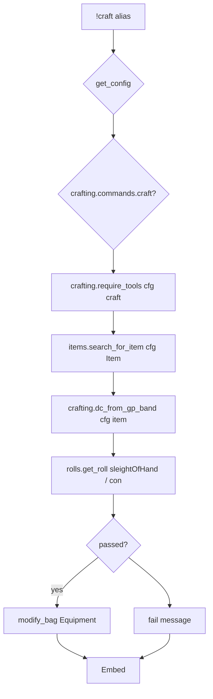

# craft — MVP implementation

**Subsystem:** crafting · **Toggle:** `subsystems.crafting.commands.craft` · **Phase:** 1 (Tier E)

First crafting port. Reference westmarch command: craft mundane **items** by gp value band → DC → Constitution-based Sleight of Hand check.

## Player-facing behaviour

```
!craft <item> [bonuses]
```

- **Help:** item price table (workdays, materials), tool proficiency requirements, usage, salvage note (honour system).
- **Prerequisites (messaging):** secure location, materials + downtime removed manually, artisan tool proficiency (from cvar or sheet).
- **Roll:** Sleight of Hand check using **Constitution**; DC from item gp value band.
- **Success:** add item to **Equipment** bag via `modify_bag`.

## westmarch reference

| Artifact | Path |
|----------|------|
| Alias | `westmarch/src/aliases/crafting/craft.alias` |
| Alias tests | `westmarch/src/aliases/crafting/craft.alias-test` |
| Item search | `westmarch/src/gvars/utils/items.gvar` — `search_for_item(..., type_str="Item")` |
| Tool cvars | **[pc.gvar](../../gvars/pc.md)** — `CVAR_TOOL_PROF`, `CVAR_TOOL_EXP` |

GP value bands (hard-coded in alias → move to config `CRAFT_PRICE_BANDS`):

| Min gp | DC dice | Workdays | Materials |
|--------|---------|----------|-----------|
| 1+ | 1d6+3 | 1 | 1 |
| 15+ | 1d8+4 | 3 | 3 |
| … | … | … | … |
| 1000000+ | 3d20kh1+20 | 30 | 100 |

Tools (11 artisan tools): Carpenter's, Cobbler's, Glassblower's, Jeweler's, Leatherworker's, Mason's, Potter's, Smith's, Tinker's, Weaver's, Woodcarver's.

## Generic architecture



### Engine vs config split

| Data | Owner |
|------|-------|
| `items.gvar` search helpers | **Engine**; corpus from **config** |
| `CRAFT_PRICE_BANDS` | **Config** |
| `CRAFTING_PROFICIENCIES.craft` | **Config** (optional override) |
| Roll + bag wiring | **Alias** or **`crafting.gvar`** |

Extract shared helpers into **`crafting.gvar`**: `require_proficiency`, `resolve_price_band`, `format_price_table_for_help`.

## Prerequisites

- Config loader (Phase 0)
- Fixture **ITEMS_LIST** with at least one item with parseable `value` (e.g. `"15 gp"`)
- Tier D **downtime** documented for players (not enforced in alias)

## Implementation checklist

### Minimum shippable

- [ ] Port / refactor **`items.gvar`** — load lists from config UUID or inline arrays
- [ ] **`crafting.gvar`** — price band DC, help table formatter, tool gate
- [ ] **`craft.alias`** — loader, toggle, config-driven help + tables
- [ ] Template config — `CRAFT_PRICE_BANDS`, minimal `ITEMS_LIST`
- [ ] **`craft.alias-test`** — help, no tool prof, item smoke (port westmarch Pony case with fixture)
- [ ] Wire env + sourcemaps

### Out of scope (initial)

- Auto-deduct materials / downtime
- In-alias salvage attempt
- 2024 crafting rule variants (document when `rules_edition` branches exist)

## Exit criteria

| Criterion | Verification |
|-----------|----------------|
| Known fixture item → roll embed | Alias-test |
| No matching tools → prof error | Alias-test |
| Toggle off / unset svar | Alias-test |
| Help shows config price table | Alias-test metadata |

## Related

- [README.md](README.md) — shared pipeline
- [brew.md](brew.md) — next in sequence
