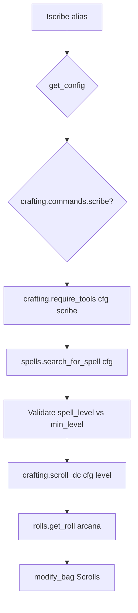

# scribe — MVP implementation

**Subsystem:** crafting · **Toggle:** `subsystems.crafting.commands.scribe` · **Phase:** 1 (Tier E)

Third in this doc sequence. Scribe **spell scrolls** using Arcana check; uses **spells** catalogue (not items).

## Player-facing behaviour

```
!scribe <spell> [-l <spell_level>] [bonuses]
```

- **Help:** scroll costs by spell level (workdays, gp, runic shard), tool/skill requirements, usage.
- **Prerequisites:** can cast the spell, gold/shard + downtime removed manually, Arcana prof or scribe tools.
- **Level flag `-l`:** scroll level (defaults to spell's minimum level); validates cantrip / min level rules.
- **Roll:** Arcana check; DC from `SCRIBE_SCROLL_COSTS` keyed by spell level (westmarch uses `spell_dict.level` for DC lookup).
- **Success:** add `Scroll of {Spell} ({N} Level)` to **Scrolls** bag.

## westmarch reference

| Artifact | Path |
|----------|------|
| Alias | `westmarch/src/aliases/crafting/scribe.alias` |
| Alias tests | `westmarch/src/aliases/crafting/scribe.alias-test` |
| Spells | `westmarch/src/gvars/utils/spells.gvar` — `search_for_spell` |

Tools: Calligrapher's Supplies, Cartographer's Tools, Forgery Kit.  
Skills: Arcana (sheet prof OR tools).

Scroll cost table (move to config `SCRIBE_SCROLL_COSTS`) — levels 0–9 with downtime, gold, shard, dc.

**westmarch-specific:** runic shard costs in help text referenced `bags.get_runes()`. Generic: optional scroll prices use config **`currencies`** ids; balances via **`!wallet`** ([wallet.md](../economy/wallet.md)).

## Generic architecture



### Engine vs config split

| Data | Owner |
|------|-------|
| `spells.gvar` | **Engine**; `SPELLS_LIST` from **config** |
| `SCRIBE_SCROLL_COSTS` | **Config** |
| Scroll name formatting | **Engine** `crafting.format_scroll_name` |
| Optional scroll currency costs | **Config** `currencies` + `SCRIBE_COSTS` |

### rules_edition

Spell list and available levels may differ 2014 vs 2024 — filter `SPELLS_LIST` or use edition-keyed config slice when porting reference data.

## Prerequisites

- **`crafting.gvar`** proficiency helpers from craft/brew
- Fixture **SPELLS_LIST** (2+ spells, levels 0 and 1+)
- Config **`SCRIBE_SCROLL_COSTS`**

Does **not** require items catalogue beyond shared crafting infra.

## Implementation checklist

- [ ] Port **`spells.gvar`** — config-backed `search_for_spell`
- [ ] Extend **`crafting.gvar`** — scroll cost help formatter, level validation, DC lookup
- [ ] **`scribe.alias`** — loader, toggle, `-l` handling via `argparse`
- [ ] Template config spells + scroll costs
- [ ] **`scribe.alias-test`** — help, level validation errors, scribe smoke
- [ ] Document optional wallet currency costs in [data-shapes.md](../../data-shapes.md)

### Out of scope (initial)

- Verify character knows spell / has spell slot
- Auto-deduct gp, shards, downtime
- Cantrip vs level scroll edge cases beyond westmarch validation

## Exit criteria

| Criterion | Verification |
|-----------|----------------|
| Valid spell → scribe embed | Alias-test |
| `-l` below min level → error | Alias-test |
| Cantrip level mismatch → error | Alias-test |
| Toggle off / unset svar | Alias-test |

## Related

- [brew.md](brew.md) — prior port
- [enchant.md](enchant.md) — next in sequence
