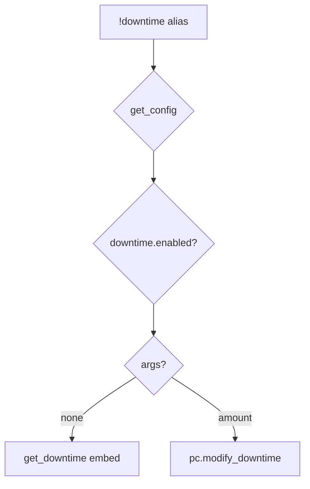

# downtime — MVP implementation

**Subsystem:** character · **Toggle:** `subsystems.downtime.enabled` · **Phase:** 1 (Tier D)

Single subsystem toggle (no per-command flags). westmarch tracks **workdays** in character cvars; crafting aliases assume players spend downtime manually before rolling.

## Player-facing behaviour

```
!downtime              # show available workdays
!downtime <amount>     # add/subtract workdays (dice expression allowed)
```

- **Help:** usage + workday/workweek explanation field.
- **Modify:** `vroll` on expression; **`pc.modify_downtime(ch, delta)`**.

## westmarch reference

| Artifact | Path |
|----------|------|
| Alias | `westmarch/src/aliases/misc/downtime.alias` |
| Alias tests | `westmarch/src/aliases/misc/downtime.alias-test` |
| Helpers | **[pc.gvar](../../gvars/pc.md)** — `get_downtime`, `modify_downtime` |

## Generic architecture



### Config surface

**Policy** ([data-shapes.md](../../data-shapes.md#server-policies)): `policies.downtime.mode` — use **`tracked`** for cvar enforcement.

```py
DOWNTIME = {
    "workday_hours": 8,
    "workweek_days": 5,
    "labels": { "singular": "workday", "plural": "workdays" },
}
```

Optional rates/labels for [US-3.4](../../user-stories.md) house rules.

## Prerequisites

- Config loader
- Engine **[pc.gvar](../../gvars/pc.md)** downtime helpers

## Implementation checklist

- [ ] Port downtime into **`pc.gvar`** — `get_downtime` / `modify_downtime`
- [ ] **`downtime.alias`** — loader, `require_subsystem(cfg, "downtime")`
- [ ] Config **`DOWNTIME`** labels in help embed
- [ ] **`downtime.alias-test`** — help, check balance, modify smoke
- [ ] Document link from [crafting/README.md](../crafting/README.md)

## Exit criteria

Check/show/modify workdays; toggle off; CI green.

## Related

- [README.md](README.md) — downtime subsystem
- [crafting/README.md](../crafting/README.md) — crafting prerequisite
