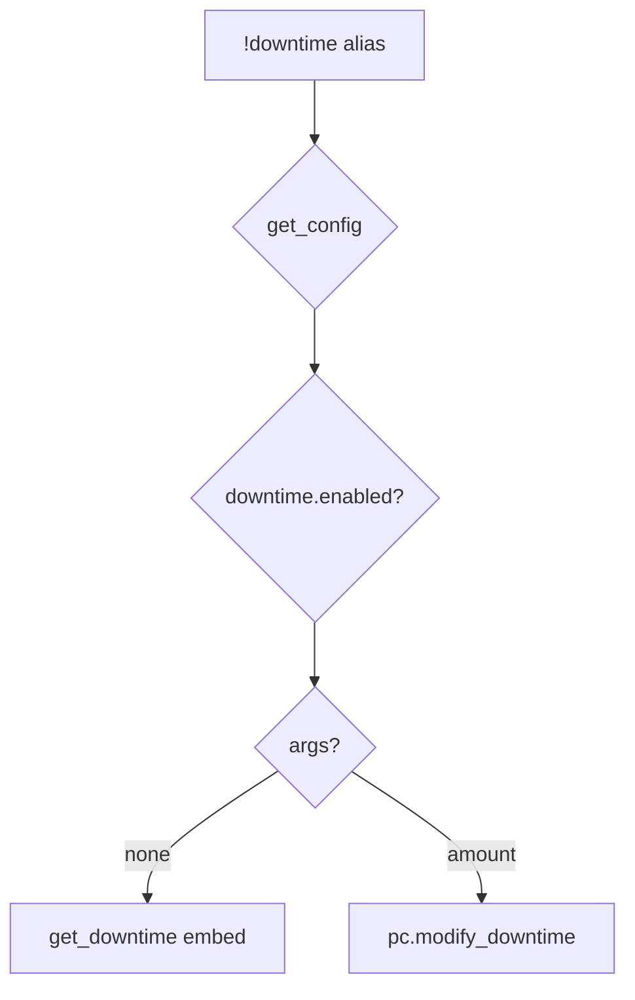

# downtime — MVP implementation

**Subsystem:** downtime · **Toggle:** `subsystems.downtime.enabled` · **Phase:** 1 (Tier D)

Single subsystem toggle (no per-command flags). westmarch tracks **workdays** in character cvars; crafting aliases assume players spend downtime manually before rolling.

## Player-facing behaviour

```
!downtime              # show available workdays
!downtime <amount>     # add/subtract workdays; signed numbers and dice allowed
!downtime spend <amt>  # spend workdays
!downtime setup        # initialise wg_downtime if needed
!downtime reset yes    # reset balance to 0
```

- **Help:** usage + workday/workweek explanation field.
- **Modify:** `vroll` on expression; **`pc.modify_downtime(ch, delta)`**.
- **State:** `wg_downtime` cvar stores the current available workday balance. Legacy `wg_downtime_start` / `wg_downtime_used` are read as a fallback.

## westmarch reference

| Artifact | Path |
|----------|------|
| Alias | `westmarch/src/aliases/misc/downtime.alias` |
| Alias tests | `westmarch/src/aliases/misc/downtime.alias-test` |
| Helpers | **[pc.gvar](../../gvars/pc.md)** — `get_downtime`, `modify_downtime` |

## Generic architecture



### Config surface

**Policy** ([data-shapes.md § downtime](../../data-shapes.md#downtime)):

| Key | MVP |
|-----|-----|
| **`mode`** | **`tracked`** — cvar enforcement; **`manual`** — player-editable cvar ledger but no cross-command enforcement; **`off`** — no cvar use |
| **`max_workdays`** | Cap on accumulated workdays per character; **`None`** = unlimited |
| **`acquisition`** | **`manual`** only in MVP — **`!downtime <amount>`** or GM grants |

**Requires:** when **`mode == "tracked"`**, **`subsystems.downtime.enabled`** must be **`True`** — the web config editor reports an error otherwise.

**Labels** (not policy) — **`subsystems.downtime.config`**:

```py
"config": {
    "workday_hours": 8,
    "workweek_days": 5,
    "labels": { "singular": "workday", "plural": "workdays" },
},
```

Optional **`command_config.downtime.cooldown_seconds`** (usually **0**).

## Prerequisites

- Config loader
- Engine **[pc.gvar](../../gvars/pc.md)** downtime helpers

## Implementation checklist

- [x] Port downtime into **`pc.gvar`** — `get_downtime` / `modify_downtime`
- [x] **`downtime.alias`** — loader, `require_subsystem(cfg, "downtime")`
- [x] Config downtime labels in help/status embed text
- [x] **`downtime.alias-test`** — help, check balance, modify, reset, off mode
- [x] Editor checks for downtime/crafting policy dependencies
- [x] Document link from [crafting/README.md](../crafting/README.md)

## Exit criteria

Check/show/modify workdays; toggle off; CI green.

## Related

- [README.md](README.md) — downtime subsystem
- [crafting/README.md](../crafting/README.md) — crafting prerequisite
