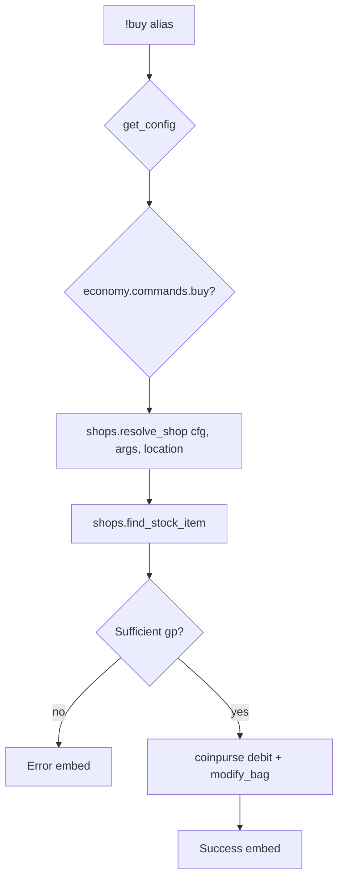

# buy — MVP implementation

**Subsystem:** economy · **Toggle:** `subsystems.economy.commands.buy` · **Phase:** 1 (Tier F)

**Greenfield** — no westmarch alias. Design together with [sell.md](sell.md); both use **`shops.gvar`**.

## Player-facing behaviour *(MVP outline)*

Purchase items from a configured shop; debit gp from coinpurse; add items to inventory.

```
!buy [shop] <item> [qty]
```

Proposed MVP syntax (finalize during implementation):

| Form | Meaning |
|------|---------|
| `!buy rope` | Buy from default shop or only shop matching current location |
| `!buy general_store rope` | Explicit shop id |
| `!buy "Healing Potion" 2` | Quantity default 1 |

- **Help:** list shops available at current location (or all shops if no travel gate), usage, examples.
- **Location gate:** when **travel** is ported, restrict shops by `SHOPS.*.locations` vs player area; **MVP fallback:** ignore location or require explicit shop id.
- **Stock:** optional finite `qty`; decrement in cvar shop state or config-only unlimited stock for v1.
- **Price:** `price_gp` from config; optional modifiers later.

## westmarch reference

None. Closest patterns:

| Pattern | Source | Reuse |
|---------|--------|-------|
| Coinpurse credit | `job.alias`, `loot.alias` | **Debit** with `modify_coins(gp=-cost)` |
| Bag add | **[pc.gvar](../../gvars/pc.md)** `modify_bag` | Add purchased item |
| Story “merchant” encounters | biome gvars | Flavour only — not transactional |

## Generic architecture



### Engine: [shops.gvar](../../gvars/shops.md)

| Function | Responsibility |
|----------|----------------|
| `list_shops(config, location=None)` | Shops player can access |
| `resolve_shop(config, shop_id, location=None)` | Single shop or error |
| `find_stock_item(shop, item_query)` | Prefix / exact name match on stock entries |
| `price_for_buy(shop, item_entry, qty)` | Total gp cost |
| `execute_buy(character, shop, item_entry, qty)` | Debit + bag add; return result dict for embed |

Keep transaction logic in **engine**; stock definitions in **config**.

### Config: `SHOPS`

See [README.md](README.md) schema sketch. Stock entries reference item display names consistent with Avrae sheet / future **items** config.

Optional extension fields (defer):

- `currency` — wallet currency id (see [wallet.md](wallet.md)); gp uses coinpurse separately
- `requirements` — faction rep, quest flags
- `restock_hours` — timed inventory refresh

## Prerequisites

- [job.md](job.md) — economy loader + coinpurse pattern proven
- Engine **[pc.gvar](../../gvars/pc.md)** — `modify_gold`, `modify_bag`, `modify_wallet`
- Template config with at least one shop + 2 stock items
- **Items config** (Tier E) not strictly required if stock uses plain item name strings

## Implementation checklist

### Design (before code)

- [ ] Freeze MVP command syntax (`shop` optional vs required)
- [ ] Decide finite stock v1: **unlimited** (config-only) vs per-shop cvar ledger
- [ ] Document shop schema in `docs/config/shops.md` (public, when stable)

### Minimum shippable

- [ ] **`shops.gvar`** — resolve shop, find item, price, buy transaction
- [ ] **`buy.alias`** — loader, toggle, help with shop list from config
- [ ] Template **`SHOPS`** fixture
- [ ] **`buy.alias-test`** — help, unknown item, insufficient funds (varfile gp), success smoke
- [ ] Wire env + sourcemaps

### MVP deferrals

- Location gating via **travel** (document no-op or explicit shop id)
- Finite stock / restock
- Bulk buy syntax edge cases
- Buy magic items with attunement checks

## Exit criteria

| Criterion | Verification |
|-----------|----------------|
| Buy listed item debits gp and adds to bag | Alias-test |
| Unknown shop/item → clear error | Alias-test |
| Toggle off / unset svar | Alias-test |
| Shares `shops.gvar` API with sell | Code review |

## Related

- [job.md](job.md) — prior port
- [sell.md](sell.md) — paired command; implement immediately after buy
