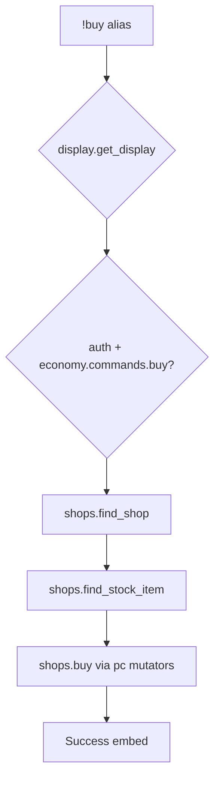

# buy — MVP implementation

**Subsystem:** economy · **Toggle:** `subsystems.economy.commands.buy` · **Phase:** 1 (Tier F)

**Greenfield** — no westmarch alias. Design together with [sell.md](sell.md); both use **[shops.gvar](../../gvars/shops.md)** and config **`shops`**.

## Player-facing behaviour *(MVP outline)*

Purchase items from a configured shop; debit gp or wallet currencies; add items to inventory.

```
!buy [shop] <item> [qty]
```

| Form | Meaning |
|------|---------|
| `!buy rope` | Buy from default shop or only shop matching current location |
| `!buy general_store rope` | Explicit shop id |
| `!buy "Healing Potion" 2` | Quantity default 1 |

- **Help:** list shops available at current location (or all shops if no travel gate), usage, examples.
- **Location gate:** when **travel** is on, restrict by shop **`location_id`** vs character location; **MVP fallback:** ignore location or require explicit shop id.
- **Stock:** optional finite **`qty`** on [StockEntry](../../data-shapes.md#stockentry); unlimited when omitted.
- **Price:** **`stock[].price`** — `{ "gold": N }` and/or wallet ids ([data-shapes § Shop](../../data-shapes.md#shop)).

## westmarch reference

None. Closest patterns:

| Pattern | Source | Generic |
|---------|--------|---------|
| gp debit | job, loot | **`shops.buy`** → **`pc.modify_gold`** |
| Bag add | loot | **`shops.buy`** → **`pc.modify_bag`** |
| Wallet debit | — | **`shops.buy`** → **`pc.modify_wallet`** |

## Generic architecture



### Engine: [shops.gvar](../../gvars/shops.md)

| Function | Responsibility |
|----------|----------------|
| `list_shops(config, location_id=None)` | Shops player can access |
| `find_shop(config, query, location_id=None)` | Single shop or error |
| `find_stock_item(shop, item_query, config)` | Match stock row |
| `price_for_buy(shop, stock_entry, qty)` | Total price dict |
| `buy(ch, config, shop, item_query, qty=1)` | **`pc`** debit + bag add; `(success, message)` |

Keep transaction logic in **shops.gvar**; stock definitions in config **`shops`**.

### Config

[data-shapes.md § Shop](../../data-shapes.md#shop) — top-level **`shops`** dict (not a separate `SHOPS` constant).

## Prerequisites

- [job.md](job.md) — economy loader pattern
- **[pc.gvar](../../gvars/pc.md)** — all debits/credits via **`shops.buy`**
- Template config with at least one shop + 2 stock items

## Implementation checklist

### Minimum shippable

- [ ] **`shops.gvar`** — resolve shop, find item, **`buy`** via **`pc`**
- [ ] **`buy.alias`** — `display.get_display()`, toggle, help
- [ ] Template **`shops`** fixture in starter or test config
- [ ] **`buy.alias-test`** — help, unknown item, insufficient funds, success smoke

### MVP deferrals

- Location gating via **travel** (document no-op or explicit shop id)
- Finite stock cvar ledger (config **`qty`** only for v1)
- Buy magic items with attunement checks

## Exit criteria

| Criterion | Verification |
|-----------|----------------|
| Buy listed item debits gp/wallet and adds to bag | Alias-test |
| Unknown shop/item → clear error | Alias-test |
| Toggle off / unset svar | Alias-test |
| Shares **`shops.gvar`** with sell | Code review |

## Related

- [sell.md](sell.md) · [README.md](README.md)
