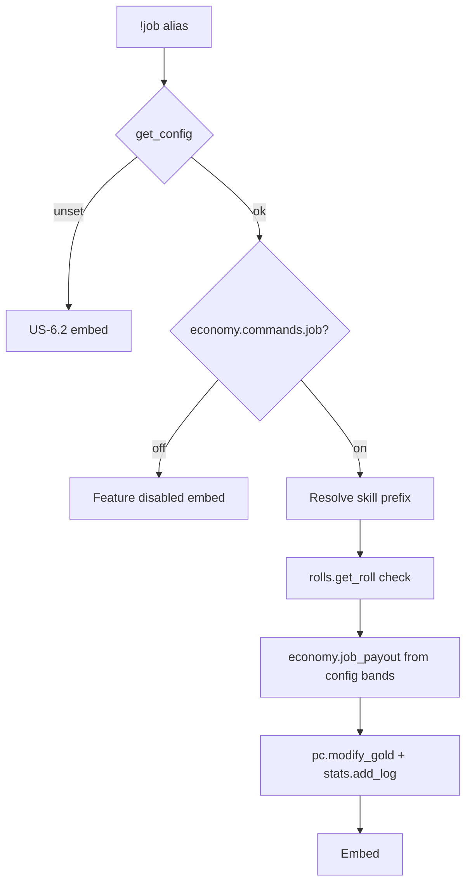

# job — MVP implementation

**Subsystem:** economy · **Toggle:** `subsystems.economy.commands.job` · **Phase:** 1 (Tier F)

**Status:** implemented in `src/aliases/economy/job.alias`; older unchecked checklist items below are retained as implementation-history context until the command docs get a full checklist refresh.

First economy port. Reference westmarch command: skill check → gp payout → coinpurse credit with cooldown.

## Player-facing behaviour

Work for pay using a skill check; gp is rolled from a payout table based on check total.

```
!job <skill> [bonuses]
```

- **Help** (`!job`, `!job help`, `!job ?`): usage + skill hint.
- **Skill:** prefix match against allowed skills (all 5e skills by default, or config allow-list).
- **Bonuses:** `adv`, `guidance`, `-b …` via **`env.gvars.rolls`** **`get_roll`** ([core.md](../../gvars/core.md)).
- **Payout:** tiered dice by check total; credit via **`pc.modify_gold(ch, payout)`**.
- **Cooldown:** via **`stats.add_log`** / **`pc.check_cooldown(ch, "job")`** — default 8 hours (28800s); config **`JOB.cooldown_seconds`**.

## westmarch reference

| Artifact | Path |
|----------|------|
| Alias | `westmarch/src/aliases/misc/job.alias` |
| Alias tests | `westmarch/src/aliases/misc/job.alias-test` |

westmarch keeps payout bands and cooldown **hard-coded** in the alias:

| Check total | Payout dice |
|-------------|-------------|
| ≤ 0 | `0` |
| ≤ 5 | `1d4-1` |
| ≤ 10 | `1d4+1` |
| ≤ 15 | `1d6+1` |
| ≤ 20 | `1d8+2` |
| > 20 | `1d8+3` |

Cooldown: **`policies.economy.enforce_cooldowns`**; duration from **`subsystems.economy.command_config.job.cooldown_seconds`** (default **28800**). Workdays: **`workdays_cost`** on same entry when downtime is **tracked** — westmarch default is cooldown-only (**`workdays_cost: 0`**).

No separate job gvar in westmarch; logic is entirely in the alias.

## Generic architecture



### Engine vs config split

| Data | Owner | Notes |
|------|-------|-------|
| Roll + embed wiring | **Alias** or thin **`economy.gvar`** | Extract payout loop to gvar if alias grows |
| `JOB.payout_bands` | **Config** | Mirrors westmarch tiers; servers can rebalance |
| `JOB.cooldown_seconds` | **`command_config.job`** | Default **28800** — see [Command config](../../data-shapes.md#command-config) |
| `JOB.allowed_skills` | **Config** | Optional restrict list |
| `subsystems.economy.config.jobs` | **Config** | Named local job display/check metadata; gated by boolean `location.commands.job` |
| `subsystems.economy.config.job_location_policy` | **Config** | `off`, `warn`, or `check` for local job enforcement |
| Cooldown | **stats.gvar** + **pc.check_cooldown** | Key **`"job"`** |
| Skill names / edition | **Engine** `get_rules_edition()` | **`core/rolls`**; branch if 2024 skill renames apply |
| Work-flavour beats | **Location encounter gvar** | Optional when **`commands.job`** — not on biomes ([location_encounters.gvar](../../gvars/location_encounters.md)) |

### Config loader integration

1. `auth.is_allowed("job")` — combined gate for the canonical command key
2. Read `cfg.JOB` (or defaults matching westmarch if section missing)
3. Filter skill resolution against `allowed_skills` when set

## Implementation checklist

### Minimum shippable

- [ ] Add `job_cooldown` key to **[pc.gvar](../../gvars/pc.md)** cooldown constants
- [ ] **`economy.gvar`** (optional) — `resolve_payout_band(total, bands)` helper
- [ ] **`job.alias`** — loader, toggle, config bands, namespaced cooldown
- [ ] Template config **`JOB`** section with westmarch-default bands
- [ ] **`job.alias-test`** — port westmarch cases (help, fake skill, sleight, athletic+adv, bonuses)
- [ ] Wire env + sourcemaps

### Improvements over westmarch

- [ ] Payout tables in config ([US-3.4](../../user-stories.md) house rules)
- [ ] Skip cooldown in Development env (match exploration aliases)
- [ ] Help lists allowed skills when config restricts them

### Out of scope (initial)

- Employer-specific pay, non-skill job names, and per-location payout tables
- Integration with **downtime** workdays
- Wallet currency payouts via config `currencies` + [wallet.md](wallet.md)

## Exit criteria

| Criterion | Verification |
|-----------|----------------|
| Valid skill → roll + gp embed | Alias-test |
| Unknown skill → error embed | Alias-test |
| Toggle off / unset svar | Alias-test |
| Payout uses config bands | Unit alias-test with custom band in fixture |
| CI green | GitHub Actions |

## Follow-on ports

[buy.md](buy.md) and [sell.md](sell.md) share **`shops.gvar`**; land after **job** proves economy toggles and coinpurse flows.

## Related

- [README.md](README.md) — economy subsystem
- [buy.md](buy.md) — next in sequence
