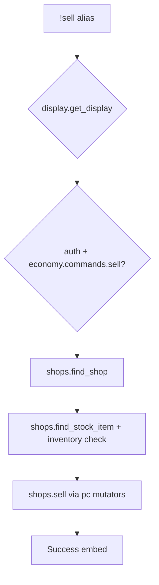

# sell — MVP implementation

**Subsystem:** economy · **Toggle:** `subsystems.economy.commands.sell` · **Phase:** 1 (Tier F)

**Greenfield** — pairs with [buy.md](buy.md). Uses **[shops.gvar](../../gvars/shops.md)** and config **`shops`**.

## Player-facing behaviour *(MVP outline)*

Sell items from inventory to a configured vendor; credit gp or wallet currencies.

```
!sell [shop] <item> [qty]
```

Mirror **buy** argument shape ([US-6.4](../../user-stories.md)).

- **Help:** shops with **`accepts_sells: True`**, usage, examples.
- **Acceptance:** shop must allow sell; item must match a stock row (MVP — no generic fence vendor).
- **Price:** shop **`buyback`** × list **`price`**, unless row **`sell_price`** override ([data-shapes § StockEntry](../../data-shapes.md#stockentry)).
- **Inventory:** **`shops.sell`** → **`pc.modify_bag`** remove; verify player holds enough qty.

## westmarch reference

None. **`shops.sell`** credits via **`pc.modify_gold`** / **`pc.modify_wallet`**.

## Generic architecture



### Engine: [shops.gvar](../../gvars/shops.md)

| Function | Responsibility |
|----------|----------------|
| `find_shop` | Same as buy |
| `find_stock_item` | Match stock row + player holds item |
| `price_for_sell(shop, stock_entry, qty)` | Payout dict |
| `sell(ch, config, shop, item_query, qty=1)` | **`pc`** bag remove + credit; `(success, message)` |

Shop and sell availability are **location-scoped** — see [buy.md](buy.md) and [location_encounters.gvar](../../gvars/location_encounters.md).

### Config example

```py
shops = {
    "general_store": {
        "id": "general_store",
        "name": "General Store",
        "accepts_sells": True,
        "buyback": 0.5,
        "stock": [
            { "item": "Rope", "price": { "gold": 1 } },
        ],
    },
}
```

Full shape: [data-shapes.md § Shop](../../data-shapes.md#shop).

## Prerequisites

- [buy.md](buy.md) — **`shops.gvar`** skeleton and **`shops`** fixture
- Player inventory in alias-tests (varfile character with rope, etc.)

## Implementation checklist

- [ ] **`shops.gvar`** — **`sell`** via **`pc`**
- [ ] **`sell.alias`** — loader, toggle, help
- [ ] **`sell.alias-test`** — help, item not held, shop won't buy, success smoke

### MVP deferrals

- Sell items not in shop stock list
- Partial stack / attunement
- Location gates (same as buy)

## Exit criteria

| Criterion | Verification |
|-----------|----------------|
| Sell held item credits gp per buyback | Alias-test |
| Shop with **`accepts_sells: False`** rejects | Alias-test |
| Tier F cluster: job + wallet + buy + sell | Tracking |

## Tier F exit criteria (job + wallet + buy + sell)

| Criterion | Status |
|-----------|--------|
| All four economy commands gated independently | Required |
| Config drives job payouts, **`currencies`**, and **`shops`** | Required |
| **`pc`** mutations (gp, wallet, bags) in **`shops.gvar`** only | Required |
| Location-aware shops when **travel** lands | OK deferred |

## Related

- [buy.md](buy.md) · [README.md](README.md)
