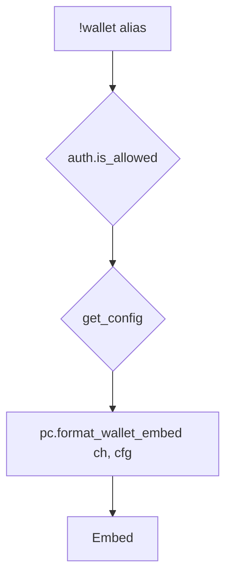

# wallet — MVP implementation

**Subsystem:** economy · **Toggle:** `subsystems.economy.commands.wallet` · **Phase:** 1 (Tier F)

**Status:** implemented in `src/aliases/economy/wallet.alias`; older unchecked checklist items below are retained as implementation-history context until the command docs get a full checklist refresh.

**New command** — view and manage **server-defined currencies** (not Avrae gp). One command for all currencies configured in the owner’s config gvar; no per-currency commands like `!runes`.

## Player-facing behaviour

```
!wallet                      # all configured currencies + balances
!wallet <currency_id>        # one currency detail
!wallet help
```

MVP is **read-only display**. Spend/transfer subcommands (`pay`, `give`, …) deferred until shop/crafting integration needs them — mutations go through **[pc.gvar](../../gvars/pc.md)** **`modify_wallet(ch, currency_id, delta)`** for encounters, paths, and **buy**.

- **Help** (`!wallet`, `!wallet help`, `!wallet ?`): list configured currency display names.
- **No cooldown** for balance checks.
- **Gp / coinpurse** stays on the Avrae sheet — **`!wallet`** is only for config **`currencies`**.

## Config

Owners define currencies in [data-shapes.md § Currency](../../data-shapes.md#currency). Example:

```py
currencies = {
    "shards": {
        "name": "Arcane Shard",
        "plural": "Arcane Shards",
    },
    "favour": {
        "name": "Temple Favour",
        "plural": "Temple Favour",
    },
}
```

A westmarch migrator may **name** a currency “Runes” here — the engine never hard-codes that label.

Toggle:

```py
"economy": {
    "enabled": True,
    "commands": { "job": True, "buy": True, "sell": True, "wallet": True },
},
```

**Editor validation:** economy + `wallet` enabled but empty `currencies` → error; unknown currency id in shop/encounter config → error.

## Generic architecture



### Engine vs config split

| Data | Owner |
|------|-------|
| **[pc.gvar](../../gvars/pc.md)** — balances, `modify_wallet`, embed formatting | **Engine** |
| **`currencies`** definitions (id, name, plural, symbol) | **Config** |
| Per-character balances | **Character cvar** (`wg_wallet_{id}` — see pc.md) |

### Integration points

- [encounters](../../gvars/encounters.md) — outcome `{ "type": "currency", "id": "shards", "total": N }` → **`pc.modify_wallet`**
- [data-shapes.md § Path](../../data-shapes.md#path) — `cost` keys besides `gold` match currency ids
- [buy.md](buy.md) — optional shop prices in wallet currencies
- [scribe.md](../crafting/scribe.md) — optional scroll costs referencing currency ids

## westmarch reference

westmarch used a dedicated **runes** meta command and `bags.get_runes()`. Generic: same behaviour via **`!wallet`** + config-defined ids + **`pc.modify_wallet`**.

## Implementation checklist

### Minimum shippable

- [ ] **[pc.gvar](../../gvars/pc.md)** — `get_wallet_balances`, `modify_wallet`, `format_wallet_embed`
- [ ] **`wallet.alias`** — loader, toggle, help, list + single-currency view
- [ ] Template config with 1–2 sample **`currencies`**
- [ ] **`wallet.alias-test`** — help, no balances (zeros), fixture with one credit
- [ ] **`encounters`** — `currency` outcome → **`pc.modify_wallet`**
- [ ] Wire env + sourcemaps under `src/aliases/economy/`

### Out of scope (initial)

- Player `!wallet pay` / `!wallet give`
- GM admin adjust via alias (workshop/cvar tools only)
- Exchange rates between currencies

## Exit criteria

| Criterion | Verification |
|-----------|----------------|
| Config defines currencies → embed lists them | Alias-test |
| Encounter currency outcome updates balance | Encounter + pc integration test |
| Toggle off → disabled message | Alias-test |
| No hard-coded currency names in engine | Code review |

## Related

- [README.md](README.md) — economy subsystem
- [gvars/pc.md](../../gvars/pc.md) — character state API
- [server-config.md](../../server-config.md) — config layers
- [data-shapes.md](../../data-shapes.md) — currency shape
