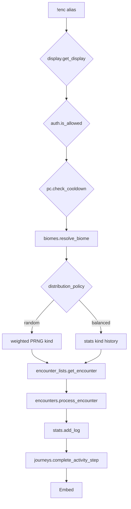

# enc — MVP implementation

**Subsystem:** exploration · **Toggle:** `subsystems.exploration.commands.enc` · **Phase:** 0 (Tier A anchor)

First port in westmarch-generic. Proves [config](../../gvars/config.md), [auth](../../gvars/auth.md), [display](../../gvars/display.md), [biomes](../../gvars/biomes.md), encounter list builder, encounter engine, and [stats](../../gvars/stats.md) end-to-end. Shapes: [data-shapes.md](../../data-shapes.md).

## Player-facing behaviour

Generate a **general exploration** encounter — kind (combat / quest / gather) then a specific encounter from the biome pool.

### Biome source (`enc_biome_source`)

Applies to **all** exploration activity commands; **`enc`** is the reference implementation.

| Value | Mode | Usage | Help lists |
|-------|------|-------|------------|
| **`auto`** *(default)* | Adapts to server | Manual when no location data; inferred when travel + locations configured | Biome codes **or** locations note |
| **`argument`** | Manual | `!enc <biome> [bonuses]` | Biome codes from **`world_data.biomes`** |
| **`location`** | Inferred | `!enc [bonuses]` — biome from character location | Locations; biome inferred |

**Inferred** requires travel + **`world_data.locations`** + character location — [data-shapes.md § exploration.config](../../data-shapes.md#explorationconfig).

Manual biome input is matched with **`lists.search_list`** against registered biome codes. One match is accepted; no matches or multiple matches return a player-facing error.

### Encounter kind mix (`distribution_policy` + `distribution`)

| Key | Values | Effect |
|-----|--------|--------|
| **`distribution_policy`** | **`random`** *(default)* \| **`balanced`** | How kind is chosen before a specific encounter |
| **`distribution`** | `{ combat, quest, gather }` → **100** total | Target % for each kind |

| `distribution_policy` | Player experience |
|-----------------------|-------------------|
| **`random`** | Each roll independently picks kind by weight. |
| **`balanced`** | Engine tracks recent kinds via **[stats.gvar](../../gvars/stats.md)**; favours under-represented kinds. |

- **Cooldown:** **`policies.exploration.enforce_cooldowns`**; **`command_config.enc.cooldown_seconds`** (default **120**); **`pc.check_cooldown`** reads **`stats`** **`last_used_at`**; skipped in Development env.
- **Repeat avoidance:** **`policies.exploration.avoid_repeat_encounters`** — see [encounter_lists.md](../../gvars/encounter_lists.md).
- **Bonuses:** passed through to **`encounters.process_encounter`**.

## westmarch reference

| Artifact | Path |
|----------|------|
| Alias | `westmarch/src/aliases/exploration/enc.alias` |
| List builder | `westmarch/src/gvars/utils/encounters/encounter_lists.gvar` |
| Encounters engine | [encounters.md](../../gvars/encounters.md) |

Key call path:

```text
display.get_display() + auth
  → biomes.resolve_biome("enc", args, ch, cfg)
  → encounter_lists.get_encounter(biome, "enc", ch, cfg)
  → encounters.process_encounter(...)
  → stats.add_log(ch, extras={ biome, encounter_kind })
```

## Generic architecture



### Config loader integration

1. **`display.get_display()`** + **`auth.is_allowed()`**
2. **`cfg = config.get_config()`**
3. **`biomes.resolve_biome("enc", args, ch, cfg)`**
4. **`encounter_lists.get_encounter(biome, "enc", ch, cfg)`**
5. **`encounters.process_encounter(...)`**
6. **`stats.add_log(ch, extras={...})`**
7. **`journeys.complete_activity_step(ch, cfg, "enc", biome)`** when the active journey step matches

## Implementation checklist

### Phase 0

- [x] Defaults + editor validation (distribution sum, **`enc_biome_source`** cross-subsystem rules)
- [x] **`enc.alias-test`** — **`random`** mode with fixture biome rows tagged **`enc.*`**
- [x] Minimal pools: at least one gather encounter (combat optional until Tier C)

### Phase 1

- [x] **`balanced`** mode via stats kind counters
- [x] Matching journey encounter steps auto-complete after successful `!enc`
- [ ] Quest-tagged encounters when **`misc.quest`** ships

## Related

- [README.md](README.md) · [data-shapes.md § exploration.config](../../data-shapes.md#explorationconfig)
- [gvars/biomes.md](../../gvars/biomes.md) · [gvars/stats.md](../../gvars/stats.md)
