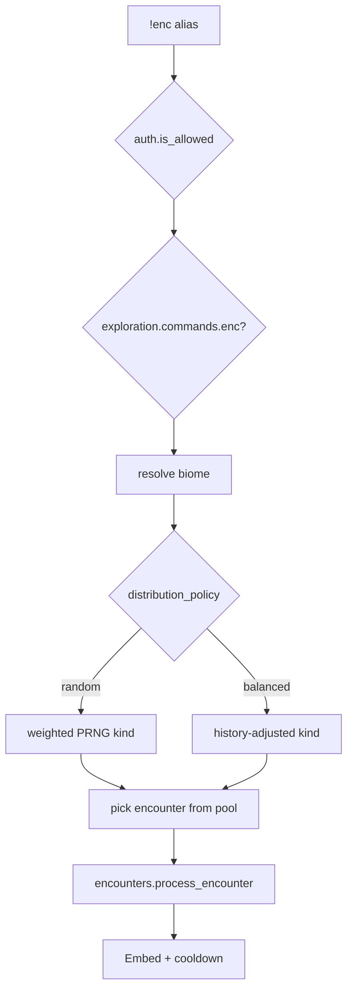

# enc — MVP implementation

**Subsystem:** exploration · **Toggle:** `subsystems.exploration.commands.enc` · **Phase:** 0 (Tier A anchor)

First port in westmarch-generic. Proves [config](../../gvars/config.md), [auth](../../gvars/auth.md), encounter list builder, and encounter engine gvars end-to-end. Shapes: [data-shapes.md](../../data-shapes.md).

## Player-facing behaviour

Generate a **general exploration** encounter for a biome pool — kind (combat / quest / gather) then a specific encounter.

### Biome source (`enc_biome_source`)

| Value | Usage | Help lists |
|-------|-------|------------|
| **`argument`** *(default)* | `!enc <biome> [bonuses]` — westmarch style | Biome codes from config pools |
| **`location`** | `!enc [bonuses]` — biome from character’s current place | Locations + note that biome is inferred |

**`location`** requires travel + **`locations`** config — [data-shapes.md § exploration.config](../../data-shapes.md#explorationconfig).

### Encounter kind mix (`distribution_policy` + `distribution`)

| Key | Values | Effect |
|-----|--------|--------|
| **`distribution_policy`** | **`random`** *(default)* \| **`balanced`** | How kind is chosen before a specific encounter |
| **`distribution`** | `{ combat, quest, gather }` → **100** total | Target % for each kind |

| `distribution_policy` | Player experience |
|-----------------------|-------------------|
| **`random`** | Each **`!enc`** independently rolls kind by weight (true pseudo-random). |
| **`balanced`** | Engine tracks recent kinds per character; favours under-represented kinds so mix matches **`distribution`** without long streaks. |

Example owner config (combat-light tables):

```py
"distribution_policy": "balanced",
"distribution": { "combat": 20, "quest": 20, "gather": 60 },
```

Pool entries should set **`encounter["kind"]`** (`combat` \| `quest` \| `gather`) or rely on inference (`cr > 0` → combat). **`!westmarch check`** validates percentages sum to 100.

- **Cooldown:** `policies.exploration.enforce_cooldowns`; skipped in Development env.
- **Bonuses:** passed through to **`encounters.process_encounter`**.

## westmarch reference

| Artifact | Path |
|----------|------|
| Alias | `westmarch/src/aliases/exploration/enc.alias` |
| List builder | `westmarch/src/gvars/encounters/encounter_lists.gvar` |
| Encounters engine | [encounters.md](../../gvars/encounters.md) |

Key call path:

```text
resolve biome (argument or location)
  → pick kind (distribution_policy + distribution)
  → pick encounter from biome pool for that kind
  → encounters.process_encounter(...)
```

## Generic architecture



### Config loader integration

1. `auth.is_allowed()`
2. `cfg = config.get_config()`
3. Read **`cfg.subsystems.exploration.config`** — biome source, distribution policy, distribution mix
4. **`encounter_lists.get_encounter(..., config=cfg)`** — returns one encounter dict

## Implementation checklist

### Phase 0

- [ ] Defaults + **`!westmarch check`** (distribution sum, cross-subsystem rules)
- [ ] **`enc.alias-test`** — **`random`** mode with fixture pools per kind
- [ ] Minimal pools: at least one combat, gather encounter each

### Phase 1

- [ ] **`balanced`** mode + per-character kind history cvar
- [ ] Quest-tagged encounters when **`misc.quest`** ships

## Related

- [README.md](README.md) · [data-shapes.md § exploration.config](../../data-shapes.md#explorationconfig)
