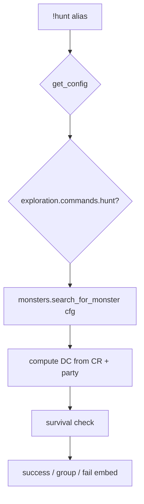

# hunt — MVP implementation

**Subsystem:** exploration · **Toggle:** `subsystems.exploration.commands.hunt` · **Phase:** 1 (Tier C)

Survival check to track a creature before combat. westmarch expects **`!enc`** in the region first (messaging only — not enforced in alias).

## Player-facing behaviour

```
!hunt <creature> [party_size] [-n roll_number] [bonuses]
```

- **Help:** enc prerequisite note, usage, group hunt `-n` chaining.
- **Creature:** prefix/exact search in monsters catalogue.
- **DC:** `floor((10 if party_size==1 else 8*party_size) + cr)`.
- **Roll:** Survival check.
- **Success:** embed with `!i madd` suggestion for combat init.
- **Group failure:** copy-paste command for next hunter with `-b {total}[previous] -n {n+1}`.

## westmarch reference

| Artifact | Path |
|----------|------|
| Alias | `westmarch/src/aliases/misc/hunt.alias` |
| Alias tests | `westmarch/src/aliases/misc/hunt.alias-test` |
| Monsters | `westmarch/src/gvars/utils/monsters.gvar` — `search_for_monster` |

## Generic architecture



### Engine vs config split

| Data | Owner |
|------|-------|
| `monsters.gvar` search | **[monsters.gvar](../../gvars/monsters.md)**; catalogue in **config** |
| DC formula | **Engine**; coefficients optional in config `HUNT.dc` |
| CR from monster entry | **Config** catalogue |

Large monster lists likely need Option C extension gvars ([solution-statement.md](../../solution-statement.md)).

## Prerequisites

- Config loader
- Minimal **MONSTERS** fixture (name, cr, image_url optional)
- Exploration activity cluster optional (messaging references enc)

## Implementation checklist

- [ ] Port **`monsters.gvar`** — config-backed search
- [ ] **`hunt.alias`** — loader, toggle, group hunt flow
- [ ] **`hunt.alias-test`** — help, unknown creature, hunt smoke
- [ ] **`rules_edition`** — monster assumptions if catalogue differs

## Related

- [fish.md](fish.md) — prior in exploration sequence (Tier B)
- [loot.md](loot.md) — paired combat loop command
- [README.md](README.md) — exploration subsystem
