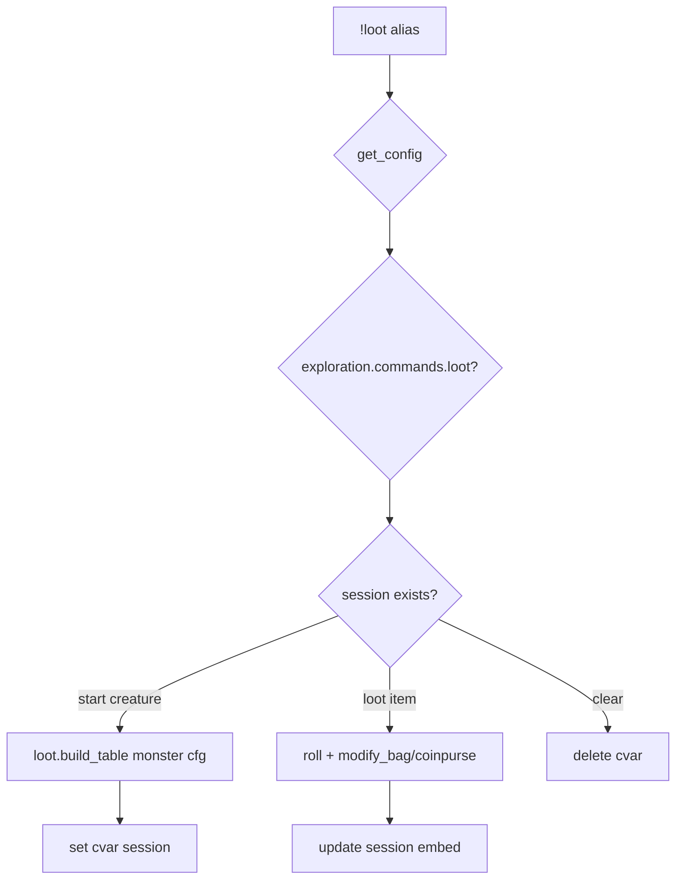

# loot — MVP implementation

**Subsystem:** exploration · **Toggle:** `subsystems.exploration.commands.loot` · **Phase:** 1 (Tier C)

Two-phase loot session: select creature → loot items with skill checks. State stored in character cvar — key TBD in **[pc.gvar](../../gvars/pc.md)** (`CVAR_LOOT_SESSION`).

## Player-facing behaviour

```
!loot <creature>           # start session — build loot table from monster
!loot <item> [bonuses]     # attempt one lootable entry
!loot clear                # end session
!loot                      # show current session (when active)
```

- **Help:** three-phase usage.
- **Start:** resolve creature with shared monster lookup, then roll generic westmarch-style loot opportunities from monster type, size, and CR.
- **Loot item:** roll configured skill vs lootable DC; on success add to bag or coinpurse.
- **Session:** JSON cvar until cleared or empty.
- **Monster art:** if the catalogue has `image_url`, display it on the initial session embed according to `subsystems.exploration.config.monster_images.loot`; do not repeat it on follow-up status or roll embeds.
- **DC visibility:** `subsystems.exploration.config.show_check_dcs.loot` controls whether session and roll text include numeric DCs.

Default opportunities mirror the westmarch alias:

| Creature gate | Possible opportunity | Check / storage |
|----------------|----------------------|-----------------|
| Person-like type | `Coins` | `Sleight of Hand`; Avrae coinpurse |
| Non-person type | `<Monster> Trophy [CR n]` | type-based check; `Trophies` bag |
| Edible non-person type | `<Monster> Ration` | `Survival`; `Rations` bag |

Type-based checks use `Nature` for beast/plant, `Religion` for celestial/fiend/undead, `Arcana` for aberration/elemental/construct, and `Survival` otherwise.

## westmarch reference

| Artifact | Path |
|----------|------|
| Alias | `westmarch/src/aliases/misc/loot.alias` |
| Alias tests | `westmarch/src/aliases/misc/loot.alias-test` |
| Monsters | [monsters.gvar](../../gvars/monsters.md) — type, CR for loot generation |
| Session engine | [loot.gvar](../../gvars/loot.md) |

Loot generation logic is **inline in alias** (~100 lines) — extract to **`loot.gvar`** for generic.

## Generic architecture



### Engine vs config split

| Data | Owner |
|------|-------|
| Loot table rules by type/size/CR | **Engine** [loot.gvar](../../gvars/loot.md); tunable via config `LOOT_RULES` later |
| Monster art / DC visibility | **Config** under `subsystems.exploration.config` |
| Monster catalogue | **Config** |
| Session cvar key | **Engine** `loot.gvar` (`wg_loot_session`) |

## Prerequisites

- [hunt.md](hunt.md) or standalone — needs monsters config
- **[pc.gvar](../../gvars/pc.md)** — `modify_bag`, `modify_gold`

## Implementation checklist

- [x] **[loot.gvar](../../gvars/loot.md)** — `build_lootables`, session state machine helpers
- [x] **`loot.alias`** — loader, toggle, session state machine
- [x] Namespaced loot session cvar
- [x] **`loot.alias-test`** — help, start session, status, clear, ambiguity, successful item extraction
- [ ] Optional config overrides for GP ranges by CR

## Exit criteria

Start → loot → clear flow; toggle off; CI green.

## Related

- [hunt.md](hunt.md) — prior port
- [README.md](README.md) — exploration subsystem
