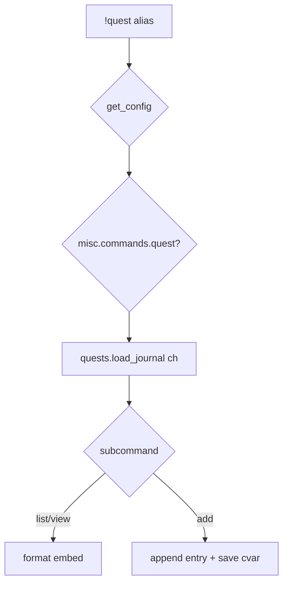

# quest — MVP implementation

**Subsystem:** misc · **Toggle:** `subsystems.misc.commands.quest` · **Phase:** 1 (Tier H)

**Greenfield** — structured quest log in Discord. See [mvp-commands.md](../../mvp-commands.md) outline.

## Player-facing behaviour *(MVP outline)*

```
!quest                       # list active / recent quests
!quest <quest_id|name>       # view quest detail + journal entries
!quest add <quest> <entry>   # append journal note under a quest
```

Finalize syntax during design (IDs vs slug names, nested sub-quests).

- **View:** active, completed, optional categories from config labels.
- **Add entry:** player-authored journal text under an existing quest bucket.
- **Storage:** character cvar JSON — engine **[quests.gvar](../../gvars/quests.md)**; config may define quest templates/categories only.

- Optional later: link to exploration quest-weighted encounters via **`policies.quest.self_assign`** — auto-activate quest entries from encounter outcomes ([data-shapes § quest policy](../../data-shapes.md#quest)).
- Post-MVP: **`!journal quest`** routes here with identical behaviour — [journal.md](journal.md).

## westmarch reference

None as a player command. Related data:

| Artifact | Notes |
|----------|-------|
| `quest_encounters.gvar` | Encounter pools — not quest log UI |
| `encounter_lists.get_quest_encounters` | Defer for generic MVP |

## Generic architecture



### Config surface

**Policy** ([data-shapes § quest](../../data-shapes.md#quest)):

| Key | Default | Meaning |
|-----|---------|---------|
| **`self_assign`** | **`False`** | Encounter quest outcomes auto-add to journal |
| **`max_active`** | **`None`** | Cap active quests per character |

```py
"config": {
    "categories": ["main", "side", "personal"],
    "display_labels": { "main": "Main Quests" },
},
```

### Cvar schema *(sketch)*

```py
{
  "active": [
    {
      "id": "find-the-missing-scout",
      "title": "Find the Missing Scout",
      "category": "main",
      "entries": [
        { "at": 1700000000, "text": "Spoke to the innkeeper in River Town." }
      ],
      "subquests": []
    }
  ],
  "completed": []
}
```

## Prerequisites

- Config loader
- Engine **`quests.gvar`** — load/save/list/append with size limits (similar budget thinking as library comprehension cvar)

## Implementation checklist

- [ ] Design doc freeze — command grammar + cvar schema
- [ ] **[quests.gvar](../../gvars/quests.md)**
- [ ] **`quest.alias`**
- [ ] Template config `QUESTS` categories
- [ ] **`quest.alias-test`** — list empty, add entry, view quest

## Exit criteria

Add + view journal entry round-trip; toggle off; cvar under size budget.

## Related

- [README.md](README.md) — misc subsystem
- [recipe.md](recipe.md) — paired Tier H command
