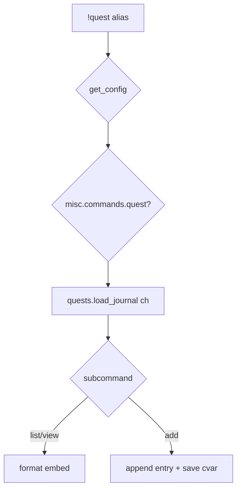

# quest

**Subsystem:** misc · **Toggle:** `subsystems.misc.commands.quest` · **Phase:** 1 (Tier H)

Structured per-character quest notes in Discord. See [mvp-commands.md](../../mvp-commands.md) for the broader misc subsystem context.

## Player-facing behaviour

```text
!quest                       # list active / recent quests
!quest completed             # list completed quests
!quest <quest_id|name>       # view quest detail and notes
!quest add <quest> <note>    # append a journal note, creating the quest if needed
!quest done <quest>          # mark completed
!quest active <quest>        # mark active again
```

- **View:** active, completed, or all stored quest notes.
- **Add entry:** player-authored journal text under an existing or new quest bucket.
- **Storage:** character cvar JSON in `wg_quests` through engine **[quests.gvar](../../gvars/quests.md)**.

- Optional later: link to exploration quest-weighted encounters via **`policies.quest.self_assign`** — auto-activate quest entries from encounter outcomes ([data-shapes § quest policy](../../data-shapes.md#quest)).
- Post-MVP: **`!journal quest`** routes here with identical behaviour — [journal.md](journal.md).

## westmarch reference

None as a player command. Related data:

| Artifact | Notes |
|----------|-------|
| `quest_encounters.gvar` | Encounter pools — not quest log UI |
| `encounter_lists.get_quest_encounters` | Defer for generic MVP |

## Generic architecture



### Config surface

**Policy** ([data-shapes § quest](../../data-shapes.md#quest)):

| Key | Default | Meaning |
|-----|---------|---------|
| **`self_assign`** | **`False`** | Encounter quest outcomes auto-add to journal |
| **`max_active`** | **`None`** | Cap active quests per character |

```py
subsystems = {
    "misc": {"enabled": True, "commands": {"quest": True}},
}

policies = {
    "quest": {"self_assign": False, "max_active": None},
}
```

To try quest-flavoured exploration content, add `enc.quest` rows to a named location's `encounters` pool or `encounters_gvar_id` module. `policies.quest.self_assign = True` uses encounter outcomes with `quest_id`; when enabled, the editor also requires `subsystems.misc.commands.quest`.

### Cvar schema *(sketch)*

```py
{
  "active": [
    {
      "id": "find-the-missing-scout",
      "title": "Find the Missing Scout",
      "category": "main",
      "entries": [
        { "at": 1700000000, "text": "Spoke to the innkeeper in River Town." }
      ],
      "subquests": []
    }
  ],
  "completed": []
}
```

## Tests

Coverage lives in `src/aliases/misc/quest.alias-test`.

## Related

- [README.md](README.md) — misc subsystem
- [recipe.md](recipe.md) — paired Tier H command
