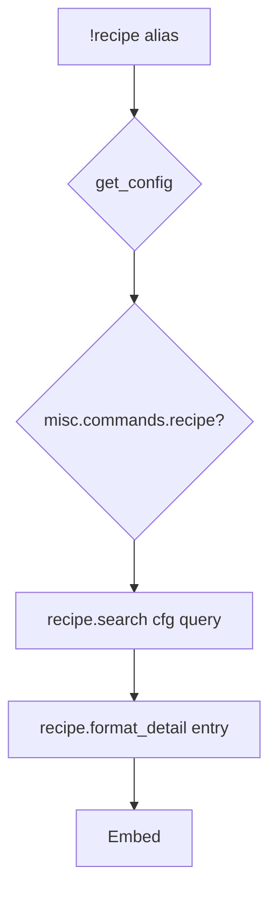

# recipe — MVP implementation

**Subsystem:** misc · **Toggle:** `subsystems.misc.commands.recipe` · **Phase:** 1 (Tier H)

**Greenfield** — read-only recipe browser. Complements [crafting/](../crafting/README.md) commands without consuming materials or downtime.

## Player-facing behaviour *(MVP outline)*

```
!recipe <query>              # search recipes by name
!recipe ingredient <item>    # recipes listing that item in consumed or required
!recipe <name>               # show one recipe — ingredients, downtime, DC hints
```

- **Search:** across **`recipes`** config ([data-shapes.md § Recipe](../../data-shapes.md#recipe)) plus item catalogues from [items.tsv](../../../../../public/assets/items.tsv).
- **Display:** `consumed`, `required`, workdays, spells; gp-band hints for mundane craft without a recipe row.
- **Read-only** — no rolls, no bag changes.

## westmarch reference

None as a dedicated command. Generic uses structured **`recipes`** rows ([recipes.tsv](../../../../../public/assets/recipes.tsv)) with separate **`consumed`** and **`required`** material lists.

## Generic architecture



### Engine: [recipe.gvar](../../gvars/recipe.md)

| Function | Responsibility |
|----------|----------------|
| `search(config, query, mode)` | Name/tag/ingredient filter |
| `format_recipe(config, entry, kind)` | craft \| potion \| magic item layout |
| `merge_catalogues(config)` | ITEMS + POTIONS + MAGIC_ITEMS + **`recipes`** |

Reuse **`CRAFT_PRICE_BANDS`**, **`CRAFT_RARITY_DC`** from config ([crafting/README.md](../crafting/README.md)).

## Prerequisites

- [crafting/craft.md](../crafting/craft.md) — catalogues + config tables
- **`recipes`** seeded from [recipes.tsv](../../../../../public/assets/recipes.tsv)
- Config loader

## Implementation checklist

- [ ] **[recipe.gvar](../../gvars/recipe.md)** — search + format
- [ ] **`recipe.alias`** — loader, misc toggle, help
- [ ] **`recipe.alias-test`** — search hit, no match, detail view
- [ ] Cross-link from crafting help (“use `!recipe` to browse”)

## Tier H exit criteria (quest + recipe)

| Criterion | Status |
|-----------|--------|
| Both misc commands independently toggled | Required |
| **recipe** indexes Tier E catalogues | Required |
| **quest** cvar journal round-trip | Required |

## Related

- [quest.md](quest.md) — paired Tier H command
- [README.md](README.md) — misc subsystem
- [crafting/README.md](../crafting/README.md) — catalogue source
