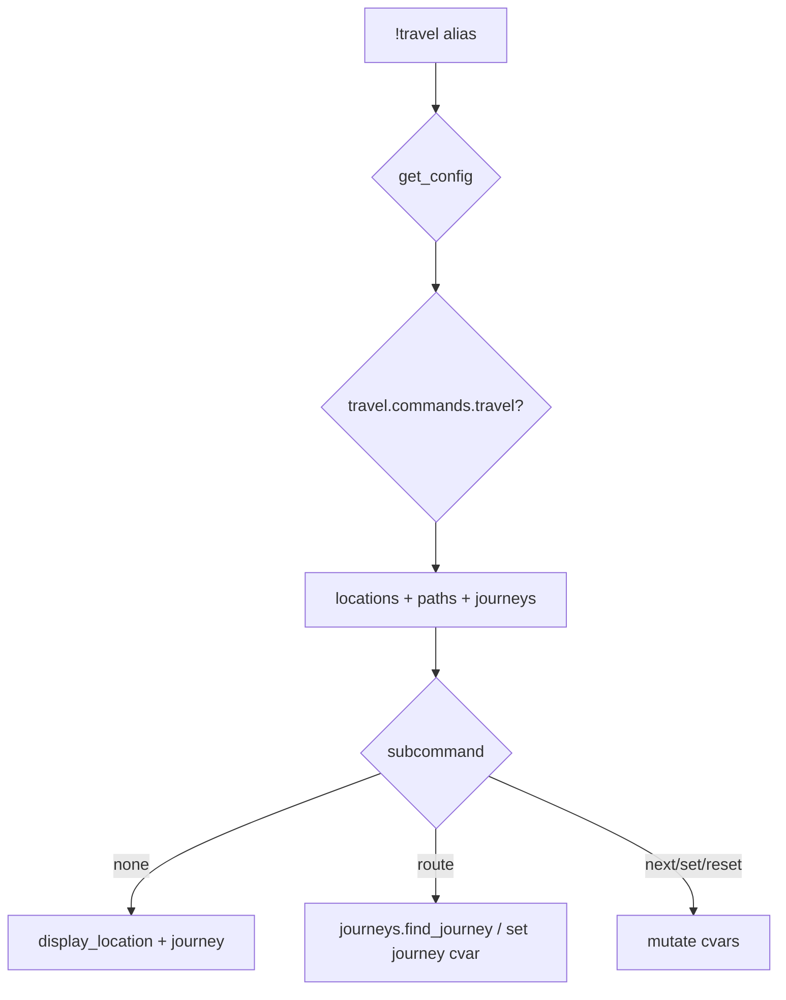

# travel — MVP implementation

**Subsystem:** travel · **Toggle:** `subsystems.travel.commands.travel` · **Phase:** 1 (Tier C)

westmarch **travel** manages character location, journey planning, route display, and manual step progression. Powers **`journeys.gvar`**, which [location.md](location.md) and **enc** journey hooks depend on.

## Player-facing behaviour

```
!travel                          # current location + active journey progress
!travel <location> [journey|track]  # route to nearby area; optional set journey
!travel next                     # advance journey step manually
!travel reset                    # clear journey progress
!travel set <location>           # GM-style set location (reset journey)
```

Optional flags: `horse`, `boat` — affect path steps from config.

## westmarch reference

| Artifact | Path |
|----------|------|
| Alias | `westmarch/src/aliases/misc/travel.alias` |
| Alias tests | `westmarch/src/aliases/misc/travel.alias-test` |
| Journeys | `westmarch/src/gvars/areas/journeys.gvar` |
| Areas | `westmarch/src/gvars/areas/areas.gvar` |
| Paths | `westmarch/src/gvars/areas/paths.gvar` |

Character cvars: `Westmarch_location`, `Westmarch_journey`, `Westmarch_locations_data`.

## Generic architecture



### Engine vs config split

| Data | Owner |
|------|-------|
| Location lookup + display | **Engine** [locations.gvar](../../gvars/locations.md) |
| Path edges + routing + journey cvars | **Engine** [paths.gvar](../../gvars/paths.md) + [journeys.gvar](../../gvars/journeys.md) |
| Journey cvars, `next_step` | **Engine** `journeys.gvar` *(planned)* |
| `locations`, `paths`, `default_location` | **Config** — [data-shapes.md](../../data-shapes.md) |
| Activity codes per location | **Config** `locations.*.activities` — feeds travel help table |

### Integration points

- [location.md](location.md) — read-only subset
- [exploration/enc.md](../exploration/enc.md) — `journeys.next_step()` on matching enc step
- [economy/buy.md](../economy/buy.md) — optional shop location gates

## Implementation checklist

### Minimum shippable

- [ ] Port **`locations.gvar`** — [gvars/locations.md](../../gvars/locations.md)
- [ ] Port **[paths.gvar](../../gvars/paths.md)** + **[journeys.gvar](../../gvars/journeys.md)** — `find_journey` Dijkstra parity
- [ ] Port **`journeys.gvar`** — config defaults, get/set location/journey cvars
- [ ] **`travel.alias`** — loader, toggle, `!travel` status view + `set` + `reset`
- [ ] Defer full multi-leg journey UI to Phase 1b if needed; prove location cvar + one route
- [ ] Template config — 2 locations, 1 path ([data-shapes.md](../../data-shapes.md))
- [ ] **`travel.alias-test`** — help, location display smoke
- [ ] Unblocks **location** status command

### MVP deferrals

- Full journey markdown with horse/boat branching parity
- Gold-cost path steps with coinpurse debit
- Area activity table in travel embed (link to exploration help)

## Exit criteria

| Criterion | Verification |
|-----------|----------------|
| Set location → persists in cvar | Alias-test |
| Bare `!travel` shows location name | Alias-test |
| Toggle off / unset svar | Alias-test |

## Related

- [README.md](README.md) — travel subsystem
- [downtime/downtime.md](../downtime/downtime.md) — Tier D (separate subsystem)
