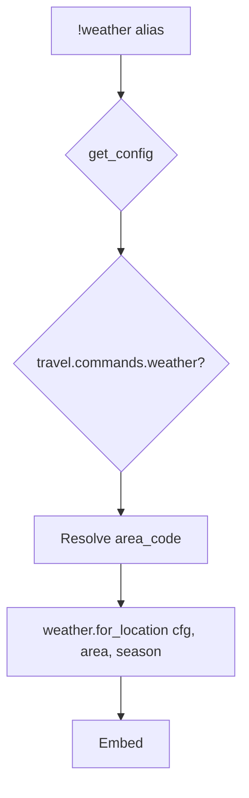

# weather — MVP implementation

**Subsystem:** travel · **Toggle:** `subsystems.travel.commands.weather` · **Phase:** 1 (Tier C)

**Greenfield** — regional weather from config, scoped to the player’s current location (or a named area).

## Player-facing behaviour

Show weather at the character’s location or at a specified area.

```
!weather
!weather <area_code>
```

- **No args:** resolve area from [location.md](location.md) / `journeys.get_location()` → map to `area_code` via config.
- **Area code:** prefix match against exploration area codes (e.g. `forest`, `urban`) when player wants a forecast elsewhere.
- **Help:** usage + list of known area codes from config.
- **No cooldown** in MVP (optional throttle later).

Output: short embed — location name, season (if **time** enabled), weather description, optional flavour line from config.

## westmarch reference

None. Weather is not a standalone command in westmarch.

Related config concepts:

| Concept | MVP use |
|---------|---------|
| Exploration `AREA_CODES` | Same codes as **enc** / **forage** for regional keys |
| Season | Derived from **time** `world_season()` or static `default` table |

## Generic architecture



### Engine: [weather.gvar](../../gvars/weather.md)

| Function | Responsibility |
|----------|----------------|
| `resolve_area_code(config, character, args)` | From arg or journeys + area map |
| `current_season(config)` | Call [clock.gvar](../../gvars/clock.md) **`season()`** if time enabled; else `"default"` |
| `pick_weather(config, area_code, season)` | Choose line from table (deterministic seed from day + area for stable daily weather, or random — document choice) |
| `format_weather_embed(config, area, weather_text, season)` | Build embed |

**Recommendation for MVP:** deterministic weather per in-world day + area (same answer all day) using hash of `(world_day_index, area_code)` into table index — testable and avoids spam rerolls.

### Config: `WEATHER`

See [README.md](README.md). Tables keyed by area code then season (or `default`).

## Prerequisites

- [location.md](location.md) — area resolution for no-arg form (or explicit area-only MVP)
- [time.md](time.md) — optional; season tables fall back to `default` when time off
- Shared **area codes** with exploration config

## Implementation checklist

### Minimum shippable

- [ ] **[weather.gvar](../../gvars/weather.md)** — resolve area, pick weather, format embed
- [ ] **`weather.alias`** — loader, toggle, help with area list
- [ ] Template **`WEATHER.by_area`** for 2+ areas
- [ ] **`weather.alias-test`** — explicit area code; no-arg with location cvar fixture
- [ ] Wire env + sourcemaps

### MVP deferrals

- Hourly weather changes
- Weather affecting exploration rolls
- Named locations not aligned to area codes

## Exit criteria

| Criterion | Verification |
|-----------|----------------|
| `!weather forest` → string from forest table | Alias-test |
| `!weather` with location cvar → correct region | Alias-test |
| Toggle off / unset svar | Alias-test |
| Tier C travel cluster documented complete | Tracking |

## Tier C travel exit criteria (location + time + weather)

| Criterion | Status |
|-----------|--------|
| All three toggles independent of `travel` command | Required |
| Location cvar shared with future **travel** port | Required |
| Time does not shadow Drac2 `time()` | Required |
| Weather no-arg uses same location as **enc** area context | Required |

## Related

- [time.md](time.md) — prior port
- [location.md](location.md) — area resolution
- [README.md](README.md) — config schema
