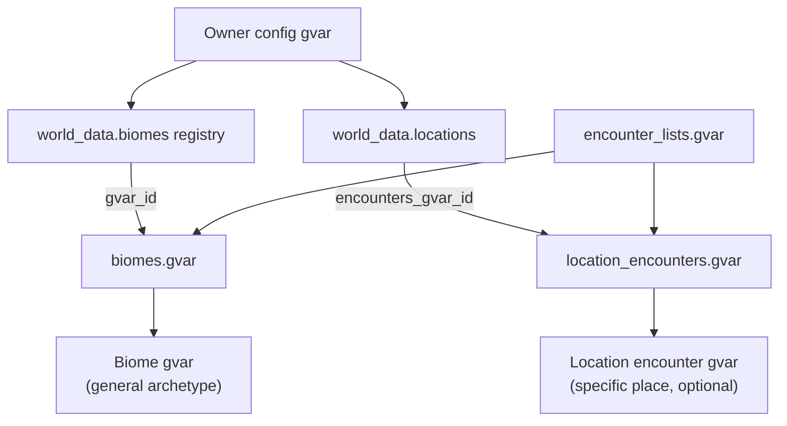

# Biome data shape — investigation

**Status:** Draft · **Date:** 2026-05-29  
**Audience:** Engine maintainers, server owners, content authors  
**Related:** [data-shapes.md § Biome registry / Biome gvar body](data-shapes.md#biome-registry), [gvars/biomes.md](gvars/biomes.md), [encounter_lists.md](gvars/encounter_lists.md), [review.md § Exploration audit](review.md)

---

## TL;DR

**Yes — we defined a partial biome shape in the initial statement**, but only at a **high level**:

| Layer | Documented today | Gap |
|-------|------------------|-----|
| **Registry entry** (`world_data.biomes[code]`) | `gvar_id`, optional `name` | No per-server overrides, aliases, or display beyond name |
| **Biome gvar body** (lazy-loaded module) | **`pools`** — exploration & gathering only | **Location encounter modules** (lazy gvar) for place-specific economy / crafting / content; see §3–5 |
| **Location encounter module** *(new)* | Optional lazy gvar per location | Shape spec + loader — Phase 1; dungeons per location post-MVP |
| **Encounter** (atomic unit inside pools) | Full [Encounter *(input)*](data-shapes.md#encounter-input) shape | **`kind`** is only `combat \| quest \| gather` — all flavour (ambush, story, heal, trade hint) lives inside encounter content, not biome structure |

This doc inventories **requirements**, compares **shape options**, and recommends a path before we write preset bodies under [src/gvars/configs/biomes/](../../../../src/gvars/configs/biomes/README.md).

---

## What the initial statement already decided

### 1. Three-layer world model *(fixed — do not collapse)*



| Layer | Holds | Example |
|-------|-------|---------|
| **Registry on config** | Pointers + display metadata | `"forest": { gvar_id, name }`, `"oakwood_wilds": { name, biome, encounters_gvar_id }` |
| **Biome gvar body** | Encounters **generally true** for an archetype | Wolves and berry patches in *a* temperate forest — not Oakwood's elven shrine |
| **Location encounter gvar** | Encounters **specific to this named place** | Oakwood settlement's smithy jobs, Misty Forest wilds' fey ambushes, pyramid dungeon entrance |

- **Registry** stays on the owner config — small, versioned with the campaign.
- **Biome bodies** stay in **separate gvars** — large, forkable, lazy-loaded, **reused** across many locations ([solution-statement.md](solution-statement.md) Option C).
- **Location bodies** are **optional** separate gvars — lazy-loaded when a place needs more than its biome baseline.
- Engine presets ship at **`src/gvars/configs/biomes/<code>.gvar`**; owners duplicate and point **`gvar_id`** at their copy.

**Division of responsibility:** Biomes answer *“what might happen in this **kind** of wilderness?”* Locations answer *“what is **unique** about **this** place?”* — commands offered, shops, jobs, library topics, dungeon access, and place-specific encounter prose all live at the **location** layer (config and/or location gvar), not on biomes.

### 2. Selection algorithm *(fixed for MVP)*

Documented in [encounter_lists.md](gvars/encounter_lists.md) and [data-shapes.md § Biome gvar body](data-shapes.md#biome-gvar-body-separate-workshop-module):

1. Resolve biome code (`biomes.resolve_biome`)
2. Choose **`kind`** ∈ `{ combat, quest, gather }` from **`subsystems.exploration.config.distribution`**
3. Load **`pools[activity][kind]`**
4. Uniform random pick (weighted pick and d100 tables — **deferred**)

**Important:** Server-wide **mix percentages** (25% combat / 25% quest / 50% gather) live in **config**, not in the biome gvar. Biomes supply **eligible entries**; config supplies **how often each kind is rolled**.

### 3. What biomes cover — exploration & gathering only

Biome gvars hold **`pools`** for **wilderness-style** activities — things that are **generally true** for the archetype, not for a named forest or settlement.

| Activity | Pool key | Typical kinds | Role |
|----------|----------|---------------|------|
| `!enc` | `pools.enc` | combat, quest, gather | General wilderness — story, combat, mixed outcomes |
| `!forage` | `pools.forage` | gather | Herbs, berries, rations |
| `!mine` | `pools.mine` | gather | Ore, gems, stone |
| `!fish` | `pools.fish` | gather | Catch, line snaps, bait |
| `!lumber` | `pools.lumber` | gather | Felling, hauling, timber |
| `!hunt` | `pools.hunt` | combat | Targeted combat — often higher CR than `enc` combat |

**Selection:** **`enc`** uses **`exploration.config.distribution`** → kind → uniform pick within **`pools.enc[kind]`**. Specialist activities (`forage`, `mine`, …) usually expose a single kind.

**Not on biomes:** `job`, `buy`, `sell`, `craft`, `brew`, `enchant`, `scribe`, `library`, `read`, **`wallet`**, dungeons — see §4 (rejected) and §5 (locations).

**Authoring rule:** If content references a **named NPC**, **specific shop**, **settlement**, or **quest tied to one place**, it belongs on a **location**, not a biome preset.

---

### 4. Considered and rejected — service activities on biomes

During investigation we mapped **economy**, **crafting**, and **content** commands to biome pool keys (`pools.job`, `pools.buy`, `pools.library`, …) as optional “flavour-only” layers alongside config mechanics.

**Why we rejected that:**

| Issue | Detail |
|-------|--------|
| **Wrong abstraction** | When `commands.buy` is enabled at a place, players expect **that location's** stock and vendors — not “forest-generic” trade prose shared by every forest on the server |
| **Same for job / craft / library** | Dock work in River Town and elven scriptorium study in Misty Settlement are **place** stories, not biome-wide defaults |
| **Conflicts with reuse** | Three different forests sharing the **`forest`** biome would incorrectly inherit the same merchants and workshops |
| **Original instinct was right** | Trade, crafting benches, and library access were always **location / economy / content** concerns in the statement — we briefly reintroduced them on biomes for symmetry with exploration pools and rolled that back |

**Where those activities live instead:**

| Activity family | Configuration | Encounter prose *(optional)* |
|-----------------|---------------|------------------------------|
| **Economy** (`job`, `buy`, `sell`) | Location **`commands`**, config **`shops`** ([shops.gvar](gvars/shops.md)), payout bands | Location encounter gvar |
| **Crafting** (`craft`, `brew`, …) | Location **`commands`**, crafting config, **`services`** | Location encounter gvar |
| **Content** (`library`, `read`) | Location **`commands`**, **`library_topics`**, book catalogue | Location encounter gvar |
| **Dungeons** *(post-MVP)* | Location **`dungeon_ids`** | Dungeon modules — westmarch-style clears |

westmarch folded all of the above into biome **`encounters`** mega-lists; generic **splits** generic wilderness (biome) from place-specific (location).

---

### 5. What locations cover — specific places

Each [Location](data-shapes.md#location) in **`world_data.locations`** is a **named place** on the map. Locations combine:

1. **Inline config** — display, **`commands`**, **`services`**, **`library_topics`**, shop wiring, optional **`dungeon_ids`**
2. **Optional lazy-loaded encounter gvar** — **`encounters_gvar_id`** (workshop UUID), same **`pools`** shape as biomes but scoped to **this place**

#### Location `commands` map

| Value | Meaning |
|-------|---------|
| **`["forest", …]`** | Exploration — biome code(s) for **`!enc`**, **`!forage`**, etc. |
| **`True`** | Service command available **here** — **`job`**, **`buy`**, **`craft`**, **`library`**, … |

Economy / crafting / content keys do **not** require biome pool keys — they require **location-appropriate config** (e.g. a shop with matching **`location_id`**, or entries in the location encounter gvar).

#### Location encounter module *(lazy gvar)*

```py
# Owner workshop — e.g. oakwood_settlement_encounters.gvar
pools = {
    "enc": {
        "gather": [ { "name": "Ancient oak heart", … } ],  # supplements forest biome
    },
    "job":  { "gather": [ { "name": "Mill labour", … } ] },
    "buy":  { "gather": [ { "name": "Village market day", … } ] },
    "library": { "gather": [ { "name": "Oakwood chronicles shelf", … } ] },
}
```

Referenced from config:

```py
"oakwood_settlement": {
    "name": "Oakwood Village",
    "biome": "forest",
    "commands": {
        "enc": ["forest"],
        "job": True,
        "buy": True,
        "sell": True,
        "library": True,
    },
    "services": ["oakwood_general_store"],
    "library_topics": ["nature", "history", "local"],
    "encounters_gvar_id": "<owner-workshop-uuid>",
    # "dungeon_ids": ["whispering_hollow"],  # post-MVP
}
```

#### Pool merge at roll time

| Activity type | Pool sources |
|---------------|--------------|
| **Exploration & gathering** | **Union** biome **`pools[activity][kind]`** + location **`pools[activity][kind]`** (when location gvar loaded), then uniform pick |
| **Economy / crafting / content** | Location gvar only *(if present)* + config mechanics; **no** biome fallback |
| **No location gvar** | Exploration uses biome only; services use config-only (e.g. shop stock without extra prose beat) |

Loader: [location_encounters.gvar](gvars/location_encounters.md) *(Phase 1 spec)*.

---

### 6. Owner world-building scenarios

Examples of what the three-layer model enables — add to [problem-statement.md](problem-statement.md) as representative goals.

#### Three forests on one server

An owner wants **three distinct forest regions**, each with multiple locations:

| Region | Wilds locations | Settlement | Biomes used |
|--------|-----------------|------------|-------------|
| **Oakwood** | 3× wilds | 1× village | Wilds → **`forest`**; village → **`forest`** + location gvar (mill, market) |
| **Misty Forest** | 5× wilds | 1× elven town | Wilds → **`dark_forest`**; town → **`elven_settlement`** + location gvar |
| **Jungle expanse** | 3× wilds | 1× pyramid | Wilds → **`jungle`**; pyramid → **`pyramid`** + location gvar + **`dungeon_ids`** *(post-MVP)* |

Each wilds location shares its region's **biome** for generic encounters (wolves vs stirges vs panthers) but can add a **location gvar** for regional quirks (Misty wilds #3 always rolls fey-adjacent beats). Settlements share little beyond optional biome code for **`!enc`** at the town gates — most content is **location-specific**.

#### Steampunk conversion server

Owner forks engine presets into **`factory_district`**, **`airship_docks`**, **`clockwork_wastes`** biomes for wilderness **`!enc`** / **`!mine`**. Each named district is a **location** with **`commands.craft`**, **`commands.job`**, custom **`shops`**, and a location gvar for brass-rail ambience and inventors' workshops — without polluting generic “wastes” biome rolls with city-specific NPCs.

#### Gestalt / high-power server

Owner reuses standard **`mountain`** / **`cave`** biomes but scales callable **`cr`** on encounters. **Locations** gate **`hunt`** and **`dungeon_ids`** to tiered hunting grounds; **`command_config`** and shop prices live in config, not biome bodies.

---

### 7. Explicit non-goals already in the statement

| Topic | Decision | Where |
|-------|----------|-------|
| d100 synthetic encounter tables | **Dropped** | data-shapes, biomes.md |
| westmarch **`encounters`** mega-pool + global **`combat_encounters`** mix-in | **Dropped** — split into activity/kind buckets | data-shapes |
| Engine-side CR scaling | **Deferred** — `policies.combat.scale_encounters_to_level` default **off** | data-shapes § policies.combat, review.md |
| Inline biome pools in owner config | **Rejected** — registry + lazy gvar only | server-config.md, review.md |

---

## Requirements inventory

### A. Server owner workflows

| ID | Requirement | Notes |
|----|-------------|-------|
| **R1** | Assign biomes to **locations** and **journey path steps** to flavour exploration | `location.commands.enc → ["forest"]`, path `{ type: "encounter", biome: "forest" }` |
| **R2** | **Fork** an engine preset biome into an owner workshop gvar, edit, wire registry | Duplicate `engine:configs/biomes/forest` → edit → `gvar_id: "<uuid>"` |
| **R3** | Build a world from **reusable biome modules** without copying encounter prose into every location | Many locations → one biome code; place-specific prose → location gvar |
| **R3b** | Configure **named places** with their own encounters, shops, jobs, libraries | Location **`commands`**, **`services`**, optional **`encounters_gvar_id`** |
| **R4** | **Static** encounters (fixed CR, fixed loot) as default | Callable fields optional for advanced owners |
| **R5** | **Level scaling** when desired — **owner-authored**, not engine magic | Callable `cr`, `monsters`, `outcomes`, or template factories reading `ectx["character"]` |
| **R6** | Validate biome + location wiring in **`!westmarch check`** | Registry codes, unloadable gvar, empty pool when kind % > 0; **`encounters_gvar_id`** loadability |

### B. Encounter variety (your list + discovered gaps)

Players and GMs expect biomes to support **general wilderness flavour**, not named-place content. Mapped to **`kind`** model:

| Scope | Player-facing need | Where it lives | `kind` |
|-------|-------------------|----------------|--------|
| **Biome** | General story / lore / ambience | `pools.enc` | gather / quest |
| **Biome** | Forage / mine / fish / lumber | `pools.forage`, etc. | gather |
| **Biome** | Combat / hunt | `pools.enc.combat`, `pools.hunt` | combat |
| **Biome** | Quest hooks in the wild | `pools.enc.quest` | quest |
| **Location** | Trade, jobs, workshops, library | Location gvar + config **`shops`** / **`services`** | gather *(prose)* |
| **Location** | Place-specific exploration beats | Location gvar **`pools.enc`** *(merged with biome)* | * |
| **Location** | Dungeon access *(post-MVP)* | **`dungeon_ids`** on location | N/A |
| **Biome** | Buffs, hazards, gold finds in wild | `pools.enc.gather` | gather |
| **—** | Loot after combat | **`!loot`** | N/A |
| **—** | Weather / season | **`!weather`**, calendar | N/A |

**Takeaway:** Biomes carry **generic wilderness**; locations carry **named-place** content via config + optional encounter gvar. Service commands never require biome pool keys. At the selection layer, the open question remains whether **`combat | quest | gather`** is enough within exploration **`gather`**, or Option C tagging is needed (see shape options).

### C. Runtime / engine constraints

| ID | Requirement | Source |
|----|-------------|--------|
| **C1** | Gvar size limits — biomes must shard or stay modular | review.md, solution-statement |
| **C2** | Lazy load — unused biomes never fetched | biomes.md |
| **C3** | Draconic module = valid `.gvar` body (no `<drac2>` wrapper in config/biome bodies) | setup.md |
| **C4** | Callable encounter fields use single **`ectx`** arg | data-shapes § ectx |
| **C5** | Selection must fail gracefully when pool empty | encounter_lists.md |
| **C6** | Port from westmarch presets without copying mega-pool architecture | configs/biomes/README.md |

### D. Authoring / tooling

| ID | Requirement | Source |
|----|-------------|--------|
| **D1** | LLM batch prompt per biome (`biome-pools-batch`) | [prompt-generation/assets.md](../prompt-generation/assets.md) |
| **D2** | Optional future **`utils/port-biome.js`** from westmarch | review.md P2 |
| **D3** | Human-readable biome **metadata** for `!westmarch show` / GM docs | show.md *(stretch)* |
| **D4** | Diff-friendly fork workflow (owner sees what changed vs engine preset) | R2 |

| **D5** | Location encounter batch prompts / port tooling | This investigation §5 |

---

## Design tensions

### 1. Kind (3-way) vs semantic categories (many-way)

**Config distribution** only understands **three kinds**. westmarch forest had dozens of semantic types (story, ambush, heal, gold, recipe, …) in one **`encounters`** list, then mixed **`combat_encounters`** into every roll.

**westmarch-generic** moved mixing to **explicit kind buckets** so GMs control combat frequency via config, not implicit global combat injection.

**Tension:** Story ambience and mechanical forage both land in **`gather`** unless we add sub-filters.

### 2. Biome vs location responsibilities

| Concern | Biome gvar | Location (config + optional encounter gvar) |
|---------|------------|---------------------------------------------|
| Generic wilderness encounters | **`pools.enc`**, **`pools.forage`**, … | Optional **`pools.enc`** supplements merged at roll time |
| Which exploration biomes apply | Defines pools for **code** | **`commands.enc`** → biome code list |
| Jobs, trade, crafting, library | **Not configured here** (§4) | **`commands.*`**, **`services`**, **`shops`**, location gvar |
| Shop stock & prices | — | Config **`shops`** with **`location_id`** |
| Library topic hints | — | **`library_topics`** on location |
| Dungeons *(post-MVP)* | — | **`dungeon_ids`** — which dungeons enterable here |
| Display name / image | Optional biome **`name`** in metadata | **`name`**, **`description`**, **`image`** |
| Default biome for inferred mode | — | **`location.biome`** fallback |

Biomes describe **archetypes** (*a* forest, *a* jungle); locations describe **named places** (*Oakwood wilds #2*, *Elven settlement*). When both define exploration pools, **union then pick** — location adds specificity; biome fills generic gaps.

### 3. Static vs scaling

**Agreed direction (user + statement):** Engine does **not** scale CR inside the workshop. Owners who want scaling:

- Use **callable** `cr`, `monsters`, `outcomes` on encounters
- Or build encounters via **`encounter_templates`** factories at module load time *(static per deploy, not per roll)*
- Or maintain **tier variants** as separate entries (`"Wolf (low)"`, `"Wolf (high)"`) and accept duplication

Optional **biome-level hint** (`scaling: "owner" | "static"`) is documentation-only unless we add engine hooks later.

### 4. Exploration `kind` vs service commands

**Exploration & gathering** uses config **`distribution`** over three **`kind`** values. Economy, crafting, content, and dungeons are **not** biome pool keys — they are location-scoped (§4–5). Do not add them as fourth/fifth **`kind`** values on exploration **`distribution`**.

Generic wilderness trade *hints* may still appear as **`gather`** entries in **`pools.enc`** when no shop exists at that location; once **`commands.buy`** is enabled, use location **`shops`** + location gvar instead.

---

## westmarch reference (what we are porting *from*)

westmarch `src/gvars/encounters/biomes/forest.gvar` (representative):

| Export | Role | generic mapping |
|--------|------|-----------------|
| **`encounters`** | Mega-list (story + gather + heal + gold + library hints + merchant hints + …) | **Biome:** split by **`kind`** into exploration pools. **Location gvar:** place-specific service + unique exploration beats |
| **`combat_encounters`** | Injected into many rolls | **`pools.<activity>.combat`** only |
| **`recipe_encounters`** | Global recipe drops | Tag **`gather`** outcomes or config **`recipes`** |
| **`mine_encounters`**, **`fish_encounters`**, … | Per-activity flat lists | **`pools.mine.gather`**, etc. |
| **`enc_encounters`** | Often empty | Dropped |

Porting is **semantic rewrite**, not a literal copy ([configs/biomes/README.md](../../../../src/gvars/configs/biomes/README.md)).

---

## Shape options

### Option A — **Pools only** *(current statement default)*

```py
# Biome gvar — exploration & gathering only
pools = {
    "enc": {
        "combat": [ encounter, … ],
        "quest":  [ encounter, … ],
        "gather": [ encounter, … ],
    },
    "forage": { "gather": [ … ] },
    "mine":   { "gather": [ … ] },
    "fish":   { "gather": [ … ] },
    "lumber": { "gather": [ … ] },
    "hunt":   { "combat": [ … ] },
}
```

| Pros | Cons |
|------|------|
| Already documented; matches `encounter_lists` | No biome identity beyond pools |
| Minimal engine changes | Metadata is archetype flavour only — not shop/library wiring |
| Easy mental model for authors | All non-combat/non-quest flavour competes in **`gather`** |
| Fork = copy one dict tree | Large biomes = large single gvar |

**Best when:** MVP speed, westmarch ports, owners comfortable with template diversity inside encounters.

---

### Option B — **Metadata + pools** *(recommended baseline)*

```py
# Biome gvar
code = "forest"                    # optional — should match registry key
name = "Temperate Forest"            # optional — display; registry.name overrides?
description = "…"                  # optional — GM / !location flavour helper
tags = [ "nature", "woodland" ]    # optional — docs, future filters
# library_topics — location-only; not on biome (§4)

pools = { … }                      # exploration & gathering only (§3)
```

Registry unchanged:

```py
"forest": { "gvar_id": "engine:configs/biomes/forest", "name": "Forest" }
```

| Pros | Cons |
|------|------|
| Biome reads as a **place archetype**, not just a bag of rolls | Slight duplication with registry `name` |
| **`tags`** enable future filtering without breaking kind-first MVP | More fields to validate in check_config |
| Still one lazy-loaded module | **`library_topics`** belong on **locations**, not biomes (§4) |

**Engine work:** `biomes.gvar` exposes optional getters; **`location_encounters.gvar`** loads place-specific pools; **`check_config`** validates biome + location wiring.

---

### Option C — **Pools + encounter tags (two-stage pick)**

Keep Option B metadata. Encounters gain optional tags:

```py
{
    "kind": "gather",
    "tags": [ "story", "flavour" ],   # or "forage", "hazard", "heal"
    "name": "…",
    "description": "…",
}
```

Selection becomes:

1. Config picks **`kind`**
2. Engine picks **`activity`** pool **`pools[activity][kind]`**
3. *(Optional)* Biome or activity **default tag filter** narrows subset — e.g. `forage` prefers `tags` intersect `{ forage, herb }`, falls back to full pool if empty

Activity defaults (new, optional on biome):

```py
activity_filters = {
    "forage": { "prefer_tags": [ "forage", "herb" ] },
    "enc":    { "prefer_tags": [ "story" ], "weight": 0.3 },  # stretch — weighted sub-mix
}
```

| Pros | Cons |
|------|------|
| Separates story from mechanical gather **without** new kinds | More selection logic |
| Supports ambush/hazard/buff semantics for analytics & repeat avoidance | Authors must tag consistently |
| Scaling still on encounter callables | **`activity_filters`** needs spec + tests |

**Best when:** Large biomes (100+ entries) where uniform random within **`gather`** feels wrong.

---

### Option D — **Extended kind axis** *(not recommended for MVP)*

Add kinds: `story`, `trade`, `library`, `hazard`, `buff`, …

Requires **config distribution redesign** (percentages sum to 100 across N kinds) and breaks existing **`exploration.config.distribution`** contract.

| Pros | Cons |
|------|------|
| Explicit GM control per semantic type | Breaking change to config + stats **`kinds`** counters |
| Self-documenting pools | Combinatorial explosion (activity × kind) |
| | Harder for owners to reason about mix |

**Defer** unless playtesting proves three kinds insufficient after tagging (Option C).

---

### Option E — **Indirection / encounter registry** *(post-MVP)*

Biome stores references:

```py
encounter_catalog = { "wolf_ambush": { … }, … }
pools = { "enc": { "combat": [ "wolf_ambush", "bandit_net" ] } }
```

| Pros | Cons |
|------|------|
| Dedup shared encounters across biomes | Extra resolution pass |
| Easier cross-biome reuse | Worse Draconic ergonomics for small servers |
| | Not needed until catalogue size forces it |

---

## Comparison matrix

| Criterion | A Pools only | B Metadata+pools | C Tags + filters | D Extended kinds |
|-----------|--------------|------------------|------------------|------------------|
| Matches current docs | ✓ | ~partial | ~partial | ✗ |
| Story vs forage separation | ✗ | ✗ | ✓ | ✓ |
| Config distribution unchanged | ✓ | ✓ | ✓ | ✗ |
| Owner fork simplicity | ✓ | ✓ | ~ | ~ |
| Biome vs location clarity | ~ | ✓ | ✓ | ~ |
| Level scaling in owner gvar | ✓ | ✓ | ✓ | ✓ |
| Implementation cost | **Low** | **Low–medium** | **Medium** | **High** |

---

## Recommendation

### Phase 0–1 (now)

1. **Adopt Option B** for **biome** bodies — optional **`code`**, **`name`**, **`description`**, **`tags`** alongside exploration **`pools`** only (§3).
2. **Adopt location encounter modules** — optional **`encounters_gvar_id`** on each location; same **`pools`** shape, any activity family (§5).
3. **Keep scaling owner-side** — callable encounter fields + templates.
4. **Do not put economy / crafting / content on biomes** — rejected after investigation (§4); location + config only.
5. **Require `encounter_id`** on preset entries when **`avoid_repeat_encounters`** is enabled.

### Phase 1+ (after first ports)

6. **Prototype Option C** on one large biome preset (e.g. **`forest`**) if **`gather`** feels too noisy.
7. **`check_config`** — biome pool shape, location **`encounters_gvar_id`** loadability, shop **`location_id`** consistency.
8. **`dungeon_ids`** on locations when dungeon vertical lands (post-MVP).

### Explicitly not planned

- Engine CR scaling (`policies.combat.scale_encounters_to_level` remains deferred).
- d100 table generation.
- Inline biome pools on owner config.

---

## Proposed canonical shape (B)

### Registry entry *(owner config — unchanged)*

```py
world_data = {
    "biomes": {
        "deep_forest": {
            "gvar_id": "a1b2c3d4-e5f6-7890-abcd-ef1234567890",
            "name": "Deep Forest",
        },
    },
}
```

### Biome gvar body *(owner or engine preset)*

```py
"""Deep forest — owner fork of engine forest preset."""

code = "deep_forest"
name = "Deep Forest"
description = "Ancient woodland; fey signs and old battlefields."
tags = [ "nature", "woodland", "fey" ]

pools = {
    "enc": {
        "combat": [
            {
                "encounter_id": "forest_wolf_ambush",
                "kind": "combat",
                "name": "Wolf pack",
                "description": "Grey shapes slip between the trees…",
                "cr": "1",
                "monsters": [ "Wolf" ],
            },
            {
                "encounter_id": "forest_owlbear_perception",
                "kind": "combat",
                "name": "Owlbear",
                "description": "An owls hoot catches your attention…",
                "rolls": [ … ],
                "cr": "3",
                "monsters": [ "Owlbear" ],
            },
        ],
        "quest": [
            {
                "encounter_id": "forest_lost_hunter",
                "kind": "quest",
                "name": "Lost hunter",
                "description": "A hunter asks for escort back to town…",
                # outcomes with quest_id — when quest vertical lands
            },
        ],
        "gather": [
            {
                "encounter_id": "forest_statue_arthur",
                "kind": "gather",
                "name": "Stone statue",
                "description": "A weathered statue of a legendary king…",
            },
            {
                "encounter_id": "forest_wild_berries",
                "kind": "gather",
                "name": "Wild berries",
                "description": "You come across wild berries…",
                "rolls": [ … ],
                "outcomes": [ { "type": "item", "name": "Berries", "total": 1, "bag": "Rations" } ],
            },
        ],
    },
    "forage": { "gather": [ … ] },
    "mine":   { "gather": [ … ] },
    "fish":   { "gather": [ … ] },
    "lumber": { "gather": [ … ] },
    "hunt":   { "combat": [ … ] },
}
```

### Location encounter gvar *(same owner fork — settlement)*

```py
"""Oakwood Village — place-specific encounters."""

pools = {
    "enc": {
        "gather": [
            {
                "encounter_id": "oakwood_heart_tree",
                "kind": "gather",
                "name": "Heart of the oakwood",
                "description": "The oldest oak in the region — a landmark every villager knows.",
            },
        ],
    },
    "library": {
        "gather": [
            {
                "encounter_id": "oakwood_chronicles",
                "kind": "gather",
                "name": "Village chronicles",
                "description": "The clerk keeps ledgers of local history… try `!library history`.",
            },
        ],
    },
    "job": {
        "gather": [
            {
                "encounter_id": "oakwood_mill_shift",
                "kind": "gather",
                "name": "Mill shift",
                "description": "The miller needs strong backs for the afternoon grind…",
            },
        ],
    },
}
```

Wire via **`encounters_gvar_id`** on the **`oakwood_settlement`** location entry (§5).

### Scaling example *(owner responsibility)*

```py
def cr(ectx):
    level = ectx["character"].levels.total_level
    if level < 5:
        return "1"
    if level < 10:
        return "3"
    return "5"

{
    "encounter_id": "forest_wolf_scaled",
    "kind": "combat",
    "name": "Wolves",
    "description": "The pack sizes itself to the party…",
    "cr": cr,
    "monsters": [ "Wolf" ],
}
```

Engine **`encounters.process_encounter`** already resolves callables before combat — no new workshop logic required.

---

## Open questions

| # | Question | Owner | Suggested default |
|---|----------|-------|-------------------|
| 1 | Should **`registry.name`** or **`biome.name`** win for display? | Engine | Registry overrides; biome `name` is fallback for fork-only gvars |
| 2 | Merge **`library_topics`**: location only, or inherit from region? | Engine | **Location only** — biomes do not carry topics (§4) |
| 3 | Is **`encounter_id`** required on all preset entries? | Engine | Required in engine presets; optional for owner stubs until repeat policy on |
| 4 | Weighted pick within kind? | Engine | Uniform random MVP; **`weight`** field post-MVP |
| 5 | Per-activity **`distribution`** override? | Product | Defer — shared mix is intentional ([review.md](review.md)) |
| 6 | Biome **`version`** / **`forked_from`** for diff tooling? | Tooling | Optional string fields — not runtime |
| 7 | Weather linkage — biome **`seasons`** overrides? | Product | Defer to **`!weather`** + location; biome **`tags`** only |
| 8 | Biome + location pool **merge** for exploration? | Engine | **Union** lists, then uniform pick — location supplements biome (§5) |
| 9 | When do service commands roll location encounter prose? | Engine | Optional beat when location gvar + pool exist; mechanics always from config |
| 10 | **`dungeon_ids`** shape and loader? | Engine | List on location; post-MVP dungeon registry — westmarch-style instance clears |

---

## Next steps

1. **Update [data-shapes.md](data-shapes.md)** — biome body (exploration only), location **`encounters_gvar_id`**, location encounter module shape.
2. **Spec [location_encounters.gvar](gvars/location_encounters.md)** — lazy load, merge with biome pools.
3. **Implement first biome preset** — `forest.gvar` (exploration pools only).
4. **Extend `check_config.validate()`** — biome + location encounter wiring.
5. **Add owner scenarios** to [problem-statement.md](problem-statement.md) (§6).

---

## Related documents

- [data-shapes.md § Biome registry / Biome gvar body](data-shapes.md#biome-registry)
- [gvars/biomes.md](gvars/biomes.md) · [gvars/encounter_lists.md](gvars/encounter_lists.md) · [gvars/encounter_templates.md](gvars/encounter_templates.md)
- [gvars/location_encounters.md](gvars/location_encounters.md) · [gvars/locations.md](gvars/locations.md)
- [gvars/world_data.md](gvars/world_data.md) · [server-config.md](server-config.md)
- [src/gvars/configs/biomes/README.md](../../../../src/gvars/configs/biomes/README.md)
- [review.md § Exploration audit](review.md) · [../prompt-generation/assets.md](../prompt-generation/assets.md)
