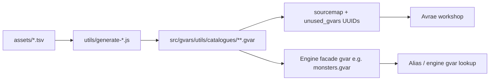

# Content pipeline — TSV → gvars

How **reference catalogues** in [assets/](../../../../assets/README.md) become **workshop gvar bodies** under `src/gvars/`, and how **runtime** loads only the shards it needs.

Maintainer scripts live in **[utils/README.md](../../../utils/README.md)**. This doc is the architecture; that file is the command reference.

---

## Goals

| Goal | Approach |
|------|----------|
| Editors use spreadsheets | TSV in **`assets/`** (Google Sheets → export) |
| Gvars stay under size limits | **Split shards** — same strategy as [westmarch](https://github.com/Sykander/westmarch), with grouped generic names (`monsters_a`, `items_list`, …) |
| Lookups stay fast | **Lazy load** one shard per search — do not import every catalogue at alias start |
| Server owners customize | Engine presets + optional owner overrides via config **`extensions.*`** or duplicated shards |
| Reproducible builds | **`npm run generate:*`** from TSV — committed outputs, CI diff optional later |

**Not in scope for generate utils:** owner **`world_data`** (locations, paths, …) — authored in config gvar or example presets; biomes are separate lazy gvars ([biomes.md](gvars/biomes.md)), not inlined from TSV in MVP.

---

## Pipeline overview



1. **Edit** TSV (or copy from westmarch — see [assets/README.md](../../../../assets/README.md)).
2. **Run** generate script(s) — writes shard **bodies** to `src/gvars/`.
3. **Register** new shard files in **`utils/sourcemap.*.json`** with UUIDs from **`unused_gvars.md`**; **`make build`**.
4. **Deploy** workshop — facades resolve shards via **`env.gvars.*`** at runtime.

Generate scripts are **Node** (repo root), same toolchain as **`publish-avrae generate-env`**. They do **not** run inside Avrae.

---

## Shard layout *(westmarch-aligned, improved runtime)*

Large lists are **never** one monolithic gvar. Split rules:

| Source TSV | Shard files *(planned)* | Split key | Facade module |
|------------|-------------------------|-----------|---------------|
| [monsters.tsv](../../../../assets/monsters.tsv) | `catalogues/monsters/monsters_{a-z}.gvar` + `monsters_names.gvar` | First letter of **`name`**; names list for lookup | [monsters.gvar](gvars/monsters.md) |
| [items.tsv](../../../../assets/items.tsv) | `items_list`, `potions_list`, `magic_items_list` | **`type`** column | [items.gvar](gvars/items.md) |
| [spells.tsv](../../../../assets/spells.tsv) | `spells/spells_list.gvar` *(split by level later if size requires)* | — | [spells.gvar](gvars/spells.md) |
| [books-forgotten-realms.tsv](../../../../assets/books-forgotten-realms.tsv) | `configs/books/forgotten_realms_{a-z}.gvar` or single file until count grows | First letter of **`name`** | [library.gvar](gvars/library.md) |
| [books-real.tsv](../../../../assets/books-real.tsv) | `configs/books/real_{a-z}.gvar` | Same | library |

Book rows include optional **`content_link`** (full text URL) — see [data-shapes.md § Book](data-shapes.md#book). **`description`** is embed excerpt only; **`content_link`** is shown in-game only at **100%** comprehension when set.
| [recipes.tsv](../../../../assets/recipes.tsv) | **`configs/recipes/recipes_list.gvar`** — merge into owner config **`recipes`** or reference as extension | **`kind`** or single file | [recipe.gvar](gvars/recipe.md) |

**Biomes** — not TSV-driven for MVP; hand-authored or ported raw JSON row-list modules under [src/gvars/configs/biomes/](../../../src/gvars/configs/biomes/README.md), referenced from **`world_data.biomes.*.gvar_id`**.

### westmarch vs westmarch-generic runtime

| | westmarch | westmarch-generic *(target)* |
|---|-----------|-------------------------------|
| Monster lookup | Load **one letter** shard via `get_gvar` | Same |
| Item lookup | **Eager** load all three lists at import | **Lazy** — load **`items_list` / `potions_list` / `magic_items_list`** only when search scope needs that type (or after type filter) |
| Book lookup | Single large `books.gvar` | Split by corpus + letter; load one shard per search prefix |
| Data in shard file | Raw **JSON** body (`JSON.stringify(rows)`) | Same for generated shards — `load_json(get_gvar(uuid))` in facade |

Facades keep a **per-invocation cache** `{ shard_id: parsed_rows }` — second lookup in the same alias reuses memory without re-fetching the gvar.

User-entered names should be resolved with **`lists.search_list`** over a small names/index gvar where available, then load the exact data shard only after the result is unique. Commands should report no matches, exactly one match, or ask for a more specific input and show up to five matches.

---

## Shard file format

Generated catalogue shards use **JSON array** as the gvar body (westmarch convention):

```json
[
  {"name": "Aboleth", "cr": 10, "source": "MM", ...},
  ...
]
```

Draconic **facade** modules map shard keys → workshop UUIDs and implement search:

```py
# monsters.gvar (sketch)
LETTER_GVARS = { "a": env.gvars.monsters_a, ... }
_cache = {}

def _load_letter(letter):
    if letter not in _cache:
        _cache[letter] = load_json(get_gvar(LETTER_GVARS[letter]))
    return _cache[letter]

def search(query):
    letter = query.lower()[0]
    if letter in LETTER_GVARS:
        return _filter(_load_letter(letter), query)
    # fallback: widen search only when exact shard miss — document in monsters.gvar
```

Row shapes match [data-shapes.md](data-shapes.md) and column docs in [assets/README.md](../../../../assets/README.md).

**Alternative (later):** emit Draconic `ROWS = [...]` for Drac2-native modules — generators would share the same TSV → row-object step; only the writer differs.

---

## Generate utils

Location: **`utils/`** at repo root — see [utils/README.md](../../../utils/README.md).

| Script | Input | Output |
|--------|-------|--------|
| **`generate-monsters.js`** | `assets/monsters.tsv` | `src/gvars/utils/catalogues/monsters/monsters_{a-z}.gvar`, `monsters_names.gvar` |
| **`generate-items.js`** | `assets/items.tsv` | `items_list`, `potions_list`, `magic_items_list` |
| **`generate-spells.js`** | `assets/spells.tsv` | `spells/spells_list.gvar` |
| **`generate-books.js`** | `books-forgotten-realms.tsv`, `books-real.tsv` | `configs/books/{corpus}_all.gvar` when empty; else `{corpus}_{a-z}.gvar` |
| **`generate-recipes.js`** | `assets/recipes.tsv` | `configs/recipes/recipes_list.gvar` |

Shared library: **`utils/lib/`** — `read-tsv`, `write-json-gvar`, `shard-by`, `manifest`, `sourcemap-shards`.

**npm scripts:**

```bash
npm run generate:monsters   # one catalogue
make build                  # all generators + env/var build
```

Generators auto-register shard slots in sourcemaps (UUIDs from **`unused_gvars.md`**). Run **`make build`** after.

---

## Sourcemaps and UUIDs

Every **new shard file** needs a slot in **`utils/sourcemap.dev.json`** and **`utils/sourcemap.prod.json`**.

Catalogue generators call **`utils/lib/sourcemap-shards.js`** automatically. For hand-added shards:

1. Take UUID from top of **`unused_gvars.md`**
2. Add `{ "name": "monsters_a", "file": "src/gvars/utils/catalogues/monsters/monsters_a.gvar", "id": "…" }` to **both** sourcemaps (different ids)
3. Delete used lines from **`unused_gvars.md`**
4. **`make build`**

---

## Config vs engine catalogues

| Data | Where it lives after generate |
|------|-------------------------------|
| **Engine defaults** | Shards in workshop; facades in **`env.gvars`** |
| **Setting presets** | [src/gvars/configs/](gvars/configs.md) — engine biome presets sourcemapped as `biome_<code>`; **books** and **recipes** remain owner/config data |
| **Example presets** | May **`extensions.monsters`** → engine shard set, or embed a **subset** for tests |
| **Owner server** | Config gvar **`extensions.*`** UUIDs pointing at owner copies of shards, or inline small lists |

Generate utils **do not** replace owner config — they refresh **engine reference data**. Preset configs reference engine UUIDs or `engine:…` slugs where documented.

---

## When to run generators

| Change | Action |
|--------|--------|
| Updated TSV in **`assets/`** | Run affected **`npm run generate:*`**, commit shard outputs |
| New shard file | Sourcemap + **`unused_gvars.md`**, **`make build`** |
| Facade search logic only | Edit Draconic facade; no regenerate |
| Owner-specific catalogue | Edit owner workshop gvar — **no** repo generate |

**CI *(future)*:** fail PR if TSV hash changed but generated JSON shards were not regenerated (`make build && git diff --exit-code`).

---

## Related

- [utils/README.md](../../../utils/README.md) — commands and porting checklist
- [assets/README.md](../../../../assets/README.md) — TSV columns
- [gvars/core.md](gvars/core.md) — runtime helpers vs catalogue data
- [DEVELOPMENT.md](../../../DEVELOPMENT.md) — local workflow
- [solution-statement.md § Option C](solution-statement.md) — extension gvars for oversized tables
