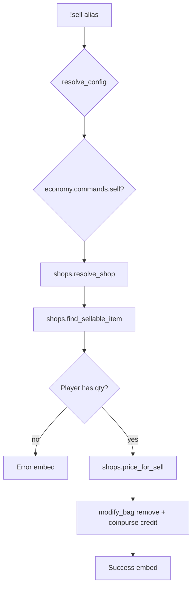

# sell — MVP implementation

**Subsystem:** economy · **Toggle:** `SUBSYSTEMS.economy.commands.sell` · **Phase:** 1 (Tier F)

**Greenfield** — pairs with [buy.md](buy.md). Uses the same **`shops.gvar`** and **`SHOPS`** config.

## Player-facing behaviour *(MVP outline)*

Sell items from inventory to a configured vendor; credit gp to coinpurse.

```
!sell [shop] <item> [qty]
```

Mirror **buy** argument shape for a single learned interface ([US-6.4](../user-stories.md)).

- **Help:** shops that accept player goods (`buys_from_players`), usage, examples.
- **Acceptance:** shop must allow sell (`buys_from_players: True`) and optionally restrict item categories (defer categories in v1 — any listed stock name or generic acceptance).
- **Price:** default `buyback_rate × list price` from matching stock entry; per-item `sell_price_gp` override optional in config.
- **Inventory:** remove from character bag via drac2-tools `modify_bag` negative count; verify player holds enough qty.

## westmarch reference

None. Reuse coinpurse / bag patterns from **job** and **loot**.

## Generic architecture



### Engine: `shops.gvar` (shared with buy)

| Function | Responsibility |
|----------|----------------|
| `shop_accepts_sells(shop)` | Check `buys_from_players` |
| `find_sellable_item(shop, item_query, character)` | Match player inventory to shop buy rules |
| `price_for_sell(shop, item_entry, qty)` | gp offer (buyback rate or override) |
| `execute_sell(character, shop, item_entry, qty)` | Remove items + credit gp |

Implement **`execute_buy`** and **`execute_sell`** in the same module so pricing rules stay consistent.

### Config fields (sell-specific)

```py
"general_store": {
    "name": "General Store",
    "buys_from_players": True,
    "buyback_rate": 0.5,
    "stock": [
        { "item": "Rope", "price_gp": 1, "sell_price_gp": None },  # None → 1 × 0.5 gp
    ],
}
```

## Prerequisites

- [buy.md](buy.md) — **`shops.gvar`** skeleton and `SHOPS` fixture exist
- Player inventory available in alias-tests (varfile character with rope, etc.)

## Implementation checklist

- [ ] Extend **`shops.gvar`** — sell resolution, buyback pricing, inventory check
- [ ] **`sell.alias`** — loader, toggle, help
- [ ] **`sell.alias-test`** — help, item not held, shop won't buy, success smoke
- [ ] Cross-test: buy item then sell it (optional combined alias-test file or manual QA doc)

### MVP deferrals

- Sell items not in shop stock list (generic “fence” vendor)
- Partial stack / charged items / magic item attunement
- Location gates (same as buy)

## Exit criteria

| Criterion | Verification |
|-----------|----------------|
| Sell held item credits gp per buyback rate | Alias-test |
| Shop with `buys_from_players: False` rejects | Alias-test |
| Toggle off / unset svar | Alias-test |
| Tier F economy cluster complete with job + buy | Tracking |

## Tier F exit criteria (job + buy + sell)

| Criterion | Status |
|-----------|--------|
| All three economy commands gated independently | Required |
| Config drives job payouts + shop stock | Required |
| Coinpurse + bag mutations covered in tests | Required |
| Location-aware shops documented as follow-up when **travel** lands | OK deferred |

## Related

- [buy.md](buy.md) — paired command; implement first
- [README.md](README.md) — shared config schema
