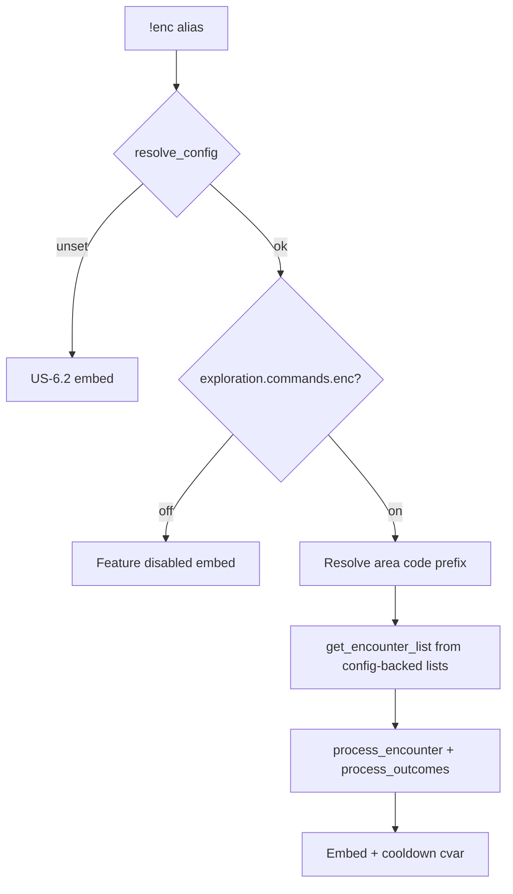

# enc — MVP implementation

**Subsystem:** exploration · **Toggle:** `SUBSYSTEMS.exploration.commands.enc` · **Phase:** 0 (Tier A anchor)

First port in westmarch-generic. Proves the config loader, encounter list builder, and `process_encounters` pipeline end-to-end.

## Player-facing behaviour

Generate a random **general exploration** encounter for a named location (area code).

```
!enc <location> [bonuses]
```

- **Help** (`!enc`, `!enc help`, `!enc ?`): lists area codes from config with display names.
- **Cooldown:** 120 seconds per character (configurable later); skipped in Development env.
- **Bonuses:** passed through to `process_encounters` (`guidance`, `adv`, `-b …` per drac2-tools rolls).
- **Journey hook (westmarch):** if an active travel journey expects `enc <code>` for the current step, completing the roll advances the journey. **Defer in initial MVP** until **travel** is ported; leave a commented hook or no-op call site.

## westmarch reference

| Artifact | Path |
|----------|------|
| Alias | `westmarch/src/aliases/exploration/enc.alias` |
| Alias tests | `westmarch/src/aliases/exploration/enc.alias-test` |
| List builder | `westmarch/src/gvars/encounters/encounter_lists.gvar` |
| Processor | `westmarch/src/gvars/encounters/process_encounters.gvar` |
| Templates | `westmarch/src/gvars/encounters/encounter_templates.gvar` |
| Per-area pools | `westmarch/src/gvars/encounters/{cave,forest,...}.gvar` |

Key call path:

```text
encounter_lists.get_encounter_list(code, "enc")
  → lists.get_random_from_list(..., 1)
  → process_encounters.process_encounter(...)
  → process_encounters.process_outcomes(...)
```

Activity `"enc"` selects `enc_encounters` from the area biome gvar inside `get_encounter_list`.

## Generic architecture



### Engine vs config split

| Data | Owner | Notes |
|------|-------|-------|
| `process_encounters`, roll/outcome logic | **Engine** gvars | Port from westmarch; minimal changes |
| `encounter_templates` | **Engine** initially | Template functions; may reference config tables later |
| `AREA_CODES`, biome encounter pools | **Config** gvar | Extract from westmarch biome gvars |
| Cooldown cvar key name | **Engine** `bags` | Stable string; not server-specific |
| Embed footer / server flavour | **Config** | `SERVER_NAME`, optional `EMBED_FOOTERS.exploration` |
| Quest/combat/recipe pool mixing weights | **Engine** constants first | Same as westmarch `LIST_LENGTH`, `BASE_ENCOUNTERS`, … |

### Config loader integration

Every alias entry:

1. `cfg = config.resolve_config()` — handle unset / invalid ([US-6.2](../user-stories.md)).
2. `config.require_command(cfg, "exploration", "enc")` — subsystem + per-command gate.
3. Pass `cfg` into `encounter_lists.get_encounter_list(..., config=cfg)` (signature TBD in `encounter_lists.gvar` refactor).

## Implementation checklist

### Phase 0 — minimum shippable

- [ ] **`config.gvar`** — `resolve_config()`, `require_command()`, status embeds
- [ ] **Template config gvar** — 1 area (`cave` or `forest`), 3–5 `enc` encounters, `SUBSYSTEMS.exploration.commands.enc = True`
- [ ] **Port `process_encounters.gvar`** — trim westmarch-only deps (quests/notes) or stub handlers that MVP encounters do not hit
- [ ] **Port `encounter_templates.gvar`** — subset needed by fixture encounters
- [ ] **Refactor `encounter_lists.gvar`** — load `AREA_CODES` from config; defer quest/journey/area_specific branches (return empty lists)
- [ ] **Port `enc.alias`** — config loader, toggle, help from config areas, no direct `server` gvar branding
- [ ] **`enc.alias-test`** — help, valid area, bad code, bonus smoke; mock svar in varfile
- [ ] **Wire env** — `env.dev.gvar` / `env.prod.gvar` engine gvar UUIDs in sourcemaps
- [ ] **CI green** — sourcemap tests + avrae-ls

### Phase 0 — explicitly out of scope

- Full 8-biome westmarch parity
- Journey step completion
- Quest-weighted encounter pools
- Location-specific `area_encounters` overlay
- **hunt** / combat outcome paths in `process_outcomes` (unless fixture encounter requires — prefer non-combat fixtures)

### Phase 1 — enc hardening

- [ ] Expand template config to full reference biome set (or extension gvar)
- [ ] Configurable cooldowns via `EXPLORATION_COOLDOWNS.enc`
- [ ] Journey hook when **travel** lands
- [ ] Parity alias-tests against westmarch extract ([US-5.4](../user-stories.md))

## Minimal fixture encounter shape

Config biome pool entries reference template names or inline encounter dicts compatible with `process_encounter`:

```py
# Inline minimal encounter (illustrative)
{
    "name": "A narrow passage",
    "description": "You squeeze through a damp crevice.",
    "rolls": [
        { "type": "check", "name": "Dexterity (Acrobatics)", "ability": "dex", "dc": "12" }
    ],
    "outcomes": [ ... ]  # match process_outcomes schema from westmarch
}
```

Use westmarch `enc.alias-test` expectations as the behavioural baseline for titles, footers, and roll embed fields.

## Exit criteria

| Criterion | Verification |
|-----------|----------------|
| Svar set → command runs | Manual + alias-test with fixture config |
| Svar unset → safe message | Alias-test |
| Command toggled off → policy message | Config fixture with `enc: False` |
| CI passes | GitHub Actions |
| No ad-hoc svar reads in alias | Code review / loader-only access |

## Follow-on ports

Once **enc** exits Phase 0, **mine**, **lumber**, **forage**, and **fish** are thin aliases — see [README.md](README.md) and per-command docs. Reuse the same engine gvars; only activity string, cooldown cvar, and embed copy differ.

## Related

- [README.md](README.md) — shared pipeline
- [mine.md](mine.md) — next in sequence
