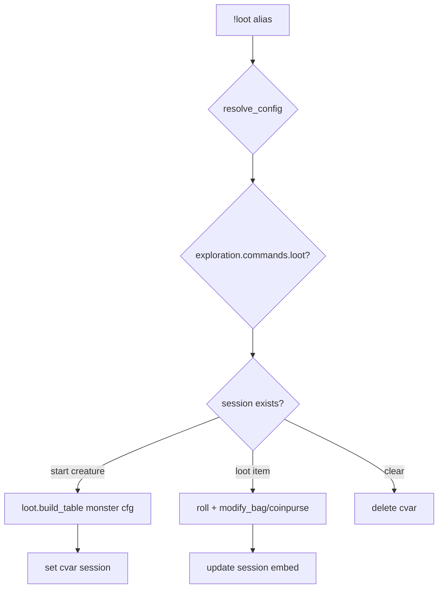

# loot — MVP implementation

**Subsystem:** exploration · **Toggle:** `SUBSYSTEMS.exploration.commands.loot` · **Phase:** 1 (Tier C)

Two-phase loot session: select creature → loot items with skill checks. State stored in character cvar `"looting"` (generic: use `bags.loot_session_code`).

## Player-facing behaviour

```
!loot <creature>           # start session — build loot table from monster
!loot <item> [bonuses]     # attempt one lootable entry
!loot clear                # end session
!loot                      # show current session (when active)
```

- **Help:** three-phase usage.
- **Start:** derive lootables from monster type (westmarch uses Investigation/Arcana/Religion/Nature checks + gold bands by CR).
- **Loot item:** roll configured skill vs lootable DC; on success add to bag or coinpurse.
- **Session:** JSON cvar until cleared or empty.

## westmarch reference

| Artifact | Path |
|----------|------|
| Alias | `westmarch/src/aliases/misc/loot.alias` |
| Alias tests | `westmarch/src/aliases/misc/loot.alias-test` |
| Monsters | `monsters.gvar` — type_str, CR for loot generation |

Loot generation logic is **inline in alias** (~100 lines) — extract to **`loot.gvar`** for generic.

## Generic architecture



### Engine vs config split

| Data | Owner |
|------|-------|
| Loot table rules by type/CR | **Engine** `loot.gvar` initially; tunable via config `LOOT_RULES` later |
| Monster catalogue | **Config** |
| Session cvar key | **Engine** `bags` |

## Prerequisites

- [hunt.md](hunt.md) or standalone — needs monsters config
- **`bags.modify_bag`**, coinpurse

## Implementation checklist

- [ ] Extract **`loot.gvar`** — `build_lootables(monster, config)`, type→skill mapping
- [ ] **`loot.alias`** — loader, toggle, session state machine
- [ ] Namespaced loot session cvar
- [ ] **`loot.alias-test`** — help, start session, loot item smoke (multi-step may need varfile state)
- [ ] Optional config overrides for GP ranges by CR

## Exit criteria

Start → loot → clear flow; toggle off; CI green.

## Related

- [hunt.md](hunt.md) — prior port
- [README.md](README.md) — exploration subsystem
