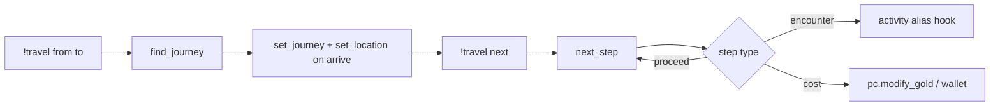

# journeys.gvar

**Path:** `src/gvars/world/journeys.gvar` · **Phase:** 1 (Tier C)

Character **travel state** (location, active journey, visit counts) and **route planning** — including shortest-path search over config **`paths`**. Ports westmarch `areas/journeys.gvar` + **`get_shortest_path`** from `paths.gvar`.

## API

### Routing *(uses [paths.md](paths.md) for edge lookup and cost)*

```py
def find_journey(config, from_id, to_id, horse=False, boat=False):
    """
    Shortest route between location ids (Dijkstra over config paths).
    Returns (found: bool, legs: list[path_dict]).
    """

def display_journey(config, legs, mode="detailed", horse=False, boat=False, prefix="!",
                    progress=None):
    """Multi-leg route embed text; progress = { path_index, step_index } for strikethrough."""
```

### Character cvars

```py
def get_location(ch, config):
    """Current place — { id, name, visited, … } resolved against config locations."""

def set_location(ch, location_dict):
    """Update current location cvar."""

def get_journey(ch):
    """Active journey — { from, to, paths, path_index, step_index, horse, boat, … } or empty."""

def set_journey(ch, journey_dict):
    """Persist journey cvar."""

def next_step(ch, config):
    """
    Advance journey step; run encounter/cost hooks; return (ok, messages).
    Called from !travel and optionally from !enc when a step expects an activity.
    """
```

Cvar keys — module constants (generic prefix, e.g. `wg_journey`, `wg_location`); see [pc.md](pc.md) for sheet mutation on cost steps.

## Shortest journey (`find_journey`)

Moved from **paths.gvar** — Dijkstra-style expansion over location **ids**:

1. Seed costs at **`from_id`**; repeatedly relax outgoing edges via **`paths.get_edges_from`** + **`paths.get_path_cost`**.
2. Track **`via`** chain of path dicts per node.
3. Return ordered **legs** when **`to_id`** is settled, or **`found=False`**.

Endpoints must be config **`locations`** ids — resolve display names with [locations.md](locations.md) first.

```py
using(paths = env.gvars.paths, journeys = env.gvars.journeys)

found, legs = journeys.find_journey(cfg, "river_town", "oakwood", horse=True)
```

## Journey lifecycle



**Policies** ([data-shapes.md](../data-shapes.md#server-policies)): when **`policies.travel.apply_path_costs`** or **`consume_rations`** is on, **`next_step`** deducts via [pc.md](pc.md). Rations use **`policies.travel.rations_item`** (default **`"Rations"`**) with **`pc.modify_bag`**.

## Not in this module

- Single-edge lookup, step resolution, per-leg **`display_path`** → [paths.md](paths.md)
- Config **`paths`** / **`locations`** data → owner config gvar

## westmarch reference

| westmarch | Generic |
|-----------|---------|
| `get_shortest_path` in paths.gvar | **`journeys.find_journey`** |
| `journeys.gvar` cvars | **`get_journey` / `get_location` / `next_step`** |
| `describe_journey` in alias | **`journeys.display_journey`** |

## Related

- [paths.md](paths.md) · [locations.md](locations.md)
- [aliases/travel/travel.md](../aliases/travel/travel.md)
- [aliases/exploration/enc.md](../aliases/exploration/enc.md) — location biome when **`enc_biome_source: location`**
