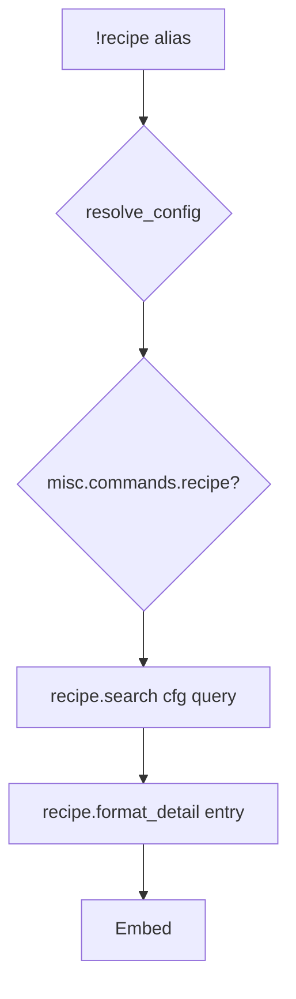

# recipe — MVP implementation

**Subsystem:** misc · **Toggle:** `SUBSYSTEMS.misc.commands.recipe` · **Phase:** 1 (Tier H)

**Greenfield** — read-only recipe browser. Complements [crafting/](../crafting/README.md) commands without consuming materials or downtime.

## Player-facing behaviour *(MVP outline)*

```
!recipe <query>              # search recipes by name
!recipe ingredient <item>    # recipes using an ingredient (optional subcommand)
!recipe <name>               # show one recipe — ingredients, downtime, DC hints
```

- **Search:** across craft items, potions, magic items from config catalogues (same as **`items.gvar`** pools).
- **Display:** ingredients, workdays/materials (craft bands), rarity (brew/enchant), prerequisites from catalogue metadata.
- **Read-only** — no rolls, no bag changes.

## westmarch reference

None. Recipe data lives implicitly in item catalogues + hard-coded DC tables in crafting aliases — generic consolidates view logic.

## Generic architecture



### Engine: `recipe.gvar`

| Function | Responsibility |
|----------|----------------|
| `search(config, query, mode)` | Name/tag/ingredient filter |
| `format_recipe(config, entry, kind)` | craft \| potion \| magic item layout |
| `merge_catalogues(config)` | ITEMS + POTIONS + MAGIC_ITEMS |

Reuse **`CRAFT_PRICE_BANDS`**, **`CRAFT_RARITY_DC`** from config ([crafting/README.md](../crafting/README.md)).

## Prerequisites

- [crafting/craft.md](../crafting/craft.md) — catalogues + config tables in place
- Config loader

## Implementation checklist

- [ ] **`recipe.gvar`** — search + format (no roll/bag)
- [ ] **`recipe.alias`** — loader, misc toggle, help
- [ ] **`recipe.alias-test`** — search hit, no match, detail view
- [ ] Cross-link from crafting help (“use `!recipe` to browse”)

## Tier H exit criteria (quest + recipe)

| Criterion | Status |
|-----------|--------|
| Both misc commands independently toggled | Required |
| **recipe** indexes Tier E catalogues | Required |
| **quest** cvar journal round-trip | Required |

## Related

- [quest.md](quest.md) — paired Tier H command
- [README.md](README.md) — misc subsystem
- [crafting/README.md](../crafting/README.md) — catalogue source
