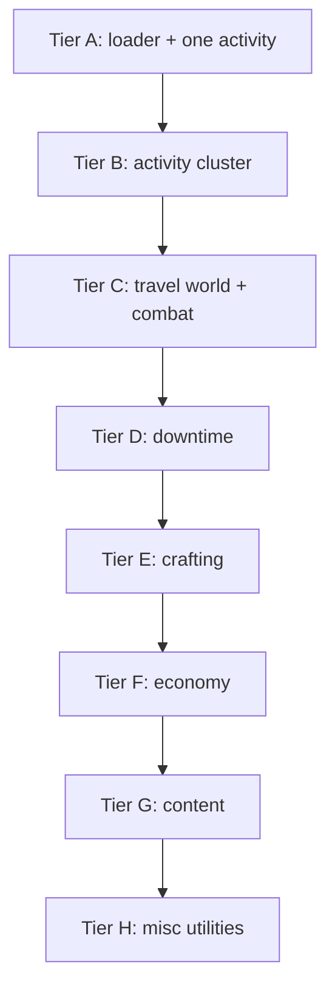
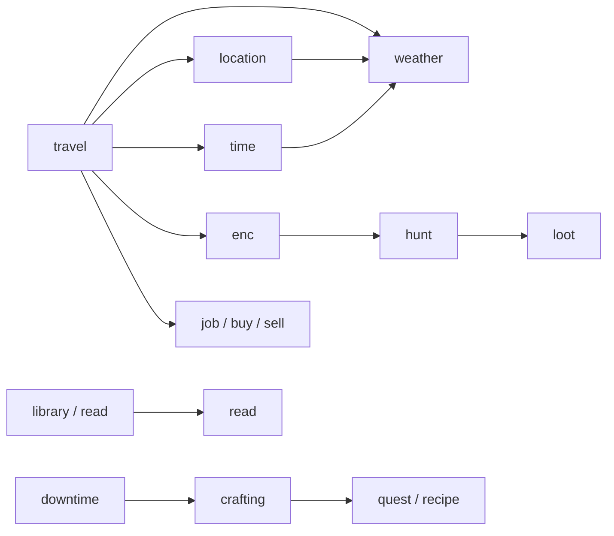

# MVP commands

Scope for the first **configurable westmarch-generic** release: which commands ship in the MVP, how they depend on each other, what moves into server config, and what is explicitly deferred.

See [solution-statement.md](solution-statement.md) for architecture and phases; this doc is the **command-level** cut.

---

## MVP command set

Twenty-three player commands, plus shared engine/config infrastructure.

| Command | Subsystem | Enable via config | Primary config data | Source |
|---------|-----------|-------------------|---------------------|--------|
| **enc** | exploration | `SUBSYSTEMS.exploration.commands.enc` | Area codes, encounter pools (general) | westmarch |
| **forage** | exploration | `…commands.forage` | Same pipeline, `forage` activity | westmarch |
| **fish** | exploration | `…commands.fish` | Same pipeline, `fish` activity | westmarch |
| **mine** | exploration | `…commands.mine` | Same pipeline, `mine` activity | westmarch |
| **lumber** | exploration | `…commands.lumber` | Same pipeline, `lumber` activity | westmarch |
| **hunt** | exploration | `…commands.hunt` | Monster catalogue | westmarch |
| **loot** | exploration | `…commands.loot` | Monster loot tables | westmarch |
| **travel** | travel | `SUBSYSTEMS.travel.commands.travel` | Areas, paths, journeys | westmarch |
| **location** | travel | `…commands.location` | Areas, default location, display metadata | **new** |
| **time** | travel | `…commands.time` | In-world calendar/clock, epoch, display format | **new** |
| **weather** | travel | `…commands.weather` | Weather by region/location, seasons | **new** |
| **downtime** | character | `SUBSYSTEMS.downtime.enabled` | Labels, cooldowns, optional rates | westmarch |
| **craft** | crafting | `SUBSYSTEMS.crafting.commands.craft` | Item catalogue, price/workday tables | westmarch |
| **brew** | crafting | `…commands.brew` | Potion recipes, ingredients | westmarch |
| **enchant** | crafting | `…commands.enchant` | Magic item recipes, ingredients | westmarch |
| **scribe** | crafting | `…commands.scribe` | Spell list, scroll costs (optional overrides) | westmarch |
| **job** | economy | `SUBSYSTEMS.economy.commands.job` | Payout tables, cooldowns, allowed skills | westmarch |
| **buy** | economy | `…commands.buy` | Shops, stock, prices, location gates | **new** |
| **sell** | economy | `…commands.sell` | Buyback rules, shop acceptance, prices | **new** |
| **library** | content | `SUBSYSTEMS.content.commands.library` | Book catalogue, topics, comprehension tags | westmarch |
| **read** | content | `…commands.read` | Same book engine; deep-read cooldown policy | westmarch |
| **quest** | misc | `SUBSYSTEMS.misc.commands.quest` | Optional quest categories, labels, permissions | **new** |
| **recipe** | misc | `…commands.recipe` | Recipe catalogues (items, potions, magic items) | **new** |

### Subsystem notes

**Exploration** — **enc**, **forage**, **fish**, **mine**, and **lumber** share one encounter engine (`encounter_lists`, `process_encounters`, biome/area encounter gvars). **hunt** → **loot** is the combat/loot loop (`!enc` before `!hunt` in westmarch).

**Travel** — **travel** handles movement, routes, and journeys. **location** is a read-only status command for current place (subset of bare `!travel` in westmarch). **time** and **weather** read shared **world state** config (clock/calendar and regional weather). Ship **location** with journeys engine; **time** / **weather** once areas config exists. Implementation must not shadow Avrae’s `time()` builtin in Drac2 — use names like `world_clock` / `world_time_txt` in engine code; the player-facing command remains `!time`.

**Crafting** — **craft**, **brew**, **enchant** use **items** config and **downtime**; **scribe** uses **spells** config.

**Economy** — **job** ports from westmarch (skill check → gp). **buy** and **sell** are new shop commands; config defines vendors, inventories, and pricing (likely tied to **travel** location).

**Content** — **library** and **read** share the westmarch book engine (`library.gvar`): topic search + quick skim vs title/author deep read with comprehension, decay, and cooldowns. Book catalogue lives in config (may warrant an extension gvar for large corpora).

**Misc** — **quest** and **recipe** are new player utilities. **quest** surfaces a structured quest log (view active quests, browse entries, add journal notes under a quest). **recipe** searches and displays recipes the character knows or can access from crafting catalogues—complements **craft** / **brew** / **enchant** without replacing them.

---

## Config toggle shape

```py
SCHEMA_VERSION = 1
SERVER_NAME = "My Server"
RULES_EDITION = "2014"  # "2024" for revised rules; omit → infer from Avrae or default 2014

SUBSYSTEMS = {
    "exploration": {
        "enabled": True,
        "commands": {
            "enc": True,
            "forage": True,
            "fish": True,
            "mine": True,
            "lumber": True,
            "hunt": True,
            "loot": True,
        },
    },
    "travel": {
        "enabled": True,
        "commands": {
            "travel": True,
            "location": True,
            "time": True,
            "weather": True,
        },
    },
    "downtime": { "enabled": True },
    "crafting": {
        "enabled": True,
        "commands": {
            "craft": True,
            "brew": True,
            "enchant": True,
            "scribe": True,
        },
    },
    "economy": {
        "enabled": True,
        "commands": {
            "job": True,
            "buy": True,
            "sell": True,
        },
    },
    "content": {
        "enabled": True,
        "commands": {
            "library": True,
            "read": True,
        },
    },
    "misc": {
        "enabled": True,
        "commands": {
            "quest": True,
            "recipe": True,
        },
    },
}
```

When a subsystem `enabled` is `False`, all its commands respect the global off state. When `enabled` is `True`, individual `commands.*` flags control each command ([US-2.4](user-stories.md), [US-3.5](user-stories.md)).

### Rules edition (`RULES_EDITION`)

D&D **2014** vs **2024** rules revision affects crafting DCs, skills, languages, spells, and catalogue filtering. See [solution-statement.md § Rules edition](solution-statement.md#rules-edition-2014-vs-2024).

| Value | When to use |
|-------|-------------|
| `"2014"` | Default; westmarch reference data, SRD/2014 PHB tables |
| `"2024"` | Revised 2024 rules; config tables must match |

Server owners set **one field** on the config gvar. If omitted, the engine may infer from Avrae server settings (when available), else defaults to `"2014"`. No separate westmarch svar for edition.

Affected MVP areas: **crafting** (price/DC tables), **job** (skills), **scribe** (spells), **hunt** / **loot** (monster assumptions), any drac2-tools **languages** integration.

---

## Shared config modules *(MVP)*

| Config module | Replaces / new | Commands |
|---------------|----------------|----------|
| **Rules edition** | *(new)* `RULES_EDITION` | All — via loader; branches crafting, skills, catalogues |
| **Areas & journeys** | `areas`, `paths`, `journeys` | travel, **location**; encounter location context |
| **World clock** | *(new)* `WORLD_CLOCK` | time |
| **Weather** | *(new)* `WEATHER` | weather; keys off location + optional season from time |
| **Encounter registry** | `encounter_lists`, biome gvars, … | enc, forage, fish, mine, lumber |
| **Encounter processing** | `encounter_templates`, `process_encounters` | activity commands |
| **Monsters & loot** | `monsters` (+ shards) | hunt, loot |
| **Items & recipes** | `items`, lists, potions, magic items | craft, brew, enchant, buy, sell |
| **Spells** | `spells`, `spells_list` | scribe |
| **Shops & economy** | *(new)*; job payout tiers from westmarch | job, buy, sell |
| **Books & library** | `library` book catalogue | library, read |
| **Quest journal** | *(new)* optional categories, display labels | quest |
| **Recipe index** | *(shared)* items, potions, magic items catalogues | recipe |
| **Server meta** | `server.gvar` | all — branding, footers, optional policies |

Large catalogues may require **extension gvars** ([solution-statement.md](solution-statement.md) Option C).

---

## Implementation tiers *(within MVP)*



| Tier | Commands | Goal |
|------|----------|------|
| **A** | Config loader + **forage** or **enc** | Prove svar → config → encounter pipeline; spike `resolve_rules_edition` |
| **B** | enc, forage, fish, mine, lumber | Activity cluster |
| **C** | travel, **location**, **time**, **weather**, hunt, loot | World movement, status, combat loop |
| **D** | downtime | Character workdays |
| **E** | craft, brew, scribe, enchant | Crafting; items/spells config — [crafting/](crafting/README.md) |
| **F** | job, **buy**, **sell** | Economy — [economy/](economy/README.md) |
| **G** | **library**, **read** | Content — [content/](content/README.md) |
| **H** | **quest**, **recipe** | Misc — [misc/](misc/README.md) |

**Tier C** — Port **travel** + **journeys** engine first, then **location**, **time**, **weather** (see [travel/](travel/README.md)), then **hunt** + **loot** ([exploration/](exploration/README.md)).

**Tier E** — Port **craft** first, then **brew**, **scribe**, **enchant** — see [crafting/](crafting/README.md). Shared **`crafting.gvar`** + config catalogues; requires Tier D **downtime** docs for player workflow.

**Tier F** — **job** can land before **buy** / **sell** — [economy/](economy/README.md). **buy** and **sell** share shop config; design buy/sell API together.

**Tier G** — Port **library** + **read** together — [content/](content/README.md). Reference: [westmarch library architecture](https://github.com/Sykander/westmarch/blob/main/docs/library/library-architecture.md).

**Tier H** — **quest**, **recipe** — see [misc/](misc/README.md). **recipe** depends on Tier E catalogues; **quest** is mostly cvar storage.

---

## Command dependencies



- **location**, **time**, and **weather** read shared world/place state; **weather** no-arg uses the same location as **enc** area context ([travel/location.md](travel/location.md)).
- **buy** / **sell** may require location or shop context from **travel** / **location** config (configurable per server).
- **read** follows **library** topic discovery (`library` quick skim → `read` deep study).
- **recipe** indexes the same item/potion/magic-item tables as **craft** / **brew** / **enchant**; filter by character-known recipes where applicable.

---

## New commands *(not in westmarch)*

| Command | Intended behaviour (outline) |
|---------|----------------------------|
| **location** | Show current place (name, visits, optional journey summary); read-only — no routing or `travel set` |
| **time** | Show in-world date/time; config defines calendar, start epoch, tick rate, display strings |
| **weather** | Show weather at current (or named) location; config defines regions, tables, season modifiers |
| **buy** | Purchase from configured shop stock at listed prices; debit coinpurse / bags |
| **sell** | Sell items to configured vendors; credit coinpurse; optional buyback rules |
| **quest** | View quest log (active/completed); drill into a quest; add journal entries under a quest; optional nested sub-quests. Player progress stored in character cvars; config may define categories, display names, and who may assign quests |
| **recipe** | Search and browse recipes (craft, brew, enchant) by name, ingredient, or tag; show ingredients, downtime, DCs, and prerequisites. Read-only companion to crafting commands—does not consume materials or start downtime |

Detailed behaviour specs belong in engine implementation and public `docs/config/` as each command is built.

---

## Deferred past MVP

| Command(s) | Reason |
|--------------|--------|
| **dungeon** (+ subcommands) | Separate subsystem; many engine gvars |
| **nexus** (+ brand, moon, star, …) | westmarch-specific Discord structure |
| **runes**, **diary** | Server-specific meta / RP |
| Snippets **-tl**, **-tc** | Combat targeting; after enc/combat stable |

---

## Mapping to solution phases

| Phase | MVP work |
|-------|----------|
| **Phase 0** | Tier A — loader, schema v0, one of enc/forage, tests |
| **Phase 1** | Tiers B–H — full MVP command set (23 commands), template config, setup doc, workshop |
| **Phase 2** | Extract reference westmarch data; parity tests for ported commands |

Post-MVP: dungeons, nexus per [solution-statement.md](solution-statement.md).

---

## Related documents

- [README.md](README.md) — westmarch-statement index
- [exploration/](exploration/README.md) — exploration subsystem
- [travel/](travel/README.md) — travel subsystem
- [downtime/](downtime/README.md) — downtime subsystem
- [crafting/](crafting/README.md) — crafting subsystem
- [economy/](economy/README.md) — economy subsystem
- [content/](content/README.md) — content subsystem
- [misc/](misc/README.md) — misc subsystem
- [solution-statement.md](solution-statement.md) — architecture and implementation plan
- [user-stories.md](user-stories.md) — adoption and config journeys
- [problem-statement.md](problem-statement.md) — why engine vs config
- [review.md](review.md) — critical review of the full doc set
