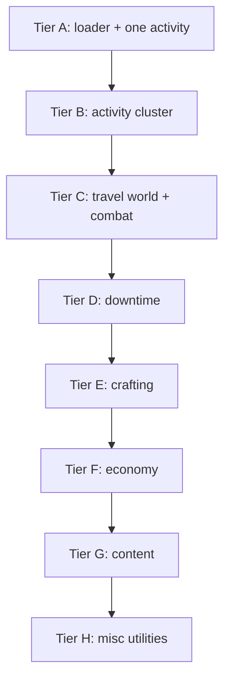
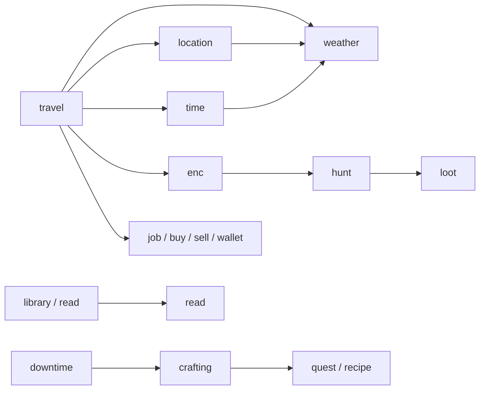

# MVP commands

Scope for the first **configurable westmarch-generic** release: which commands ship in the MVP, how they depend on each other, what moves into server config, and what is explicitly deferred.

See [solution-statement.md](solution-statement.md) for architecture and phases; this doc is the **command-level** cut.

---

## MVP command set

Twenty-five top-level commands (twenty-four player-facing + setup hub **`westmarch`**), plus shared engine/config infrastructure. The hub exposes **`setup`**, **`check`**, and **`show`** subcommands — **Avrae aliasing role-gated**, not in **`subsystems`**.

| Command | Subsystem | Enable via config | Primary config data | Source |
|---------|-----------|-------------------|---------------------|--------|
| **enc** | exploration | `subsystems.exploration.commands.enc` | **`world_data.biomes`**, lazy biome pools | westmarch |
| **forage** | exploration | `…commands.forage` | Same pipeline, `forage` activity | westmarch |
| **fish** | exploration | `…commands.fish` | Same pipeline, `fish` activity | westmarch |
| **mine** | exploration | `…commands.mine` | Same pipeline, `mine` activity | westmarch |
| **lumber** | exploration | `…commands.lumber` | Same pipeline, `lumber` activity | westmarch |
| **hunt** | exploration | `…commands.hunt` | Monster catalogue | westmarch |
| **loot** | exploration | `…commands.loot` | Monster loot tables | westmarch |
| **travel** | travel | `subsystems.travel.commands.travel` | Areas, paths, journeys | westmarch |
| **location** | travel | `…commands.location` | **`world_data.locations`**, default location | **new** |
| **time** | travel | `…commands.time` | **`world_data.calendars`**, epoch, tick rate | **new** |
| **weather** | travel | `…commands.weather` | Weather by region/location, seasons | **new** |
| **downtime** | downtime | `subsystems.downtime.enabled` | Labels, cooldowns, optional rates | westmarch |
| **craft** | crafting | `subsystems.crafting.commands.craft` | Item catalogue, price/workday tables | westmarch |
| **brew** | crafting | `…commands.brew` | Potion recipes, ingredients | westmarch |
| **enchant** | crafting | `…commands.enchant` | Magic item recipes, ingredients | westmarch |
| **scribe** | crafting | `…commands.scribe` | Spell list, scroll costs (optional overrides) | westmarch |
| **job** | economy | `subsystems.economy.commands.job` | Payout tables, cooldowns, allowed skills | westmarch |
| **buy** | economy | `…commands.buy` | Shops, stock, prices, location gates | **new** |
| **sell** | economy | `…commands.sell` | Buyback rules, shop acceptance, prices | **new** |
| **wallet** | economy | `…commands.wallet` | `currencies` — server-defined balances | **new** |
| **library** | content | `subsystems.content.commands.library` | Book catalogue, topics, comprehension tags | westmarch |
| **read** | content | `…commands.read` | Same book engine; deep-read cooldown policy | westmarch |
| **quest** | misc | `subsystems.misc.commands.quest` | Optional quest categories, labels, permissions | **new** |
| **recipe** | misc | `…commands.recipe` | Recipe catalogues (items, potions, magic items) | **new** |
| **westmarch** | admin *(not in config)* | — *(aliasing role-gated)* | Svar wiring, validation rules, display glossary, starter template | **new** — setup hub; subcommands **`setup`**, **`check`**, **`show`** |

### Subsystem notes

**Exploration** — **enc**, **forage**, **fish**, **mine**, and **lumber** share one encounter engine. Subsystem **`config`**: biome source (**`enc_biome_source`**), encounter-kind mix (**`distribution`**, **`distribution_policy`**) — [data-shapes.md § exploration.config](data-shapes.md#explorationconfig). **hunt** → **loot** is the combat/loot loop.

**Travel** — **travel** handles movement, routes, and journeys. **location** reads **`world_data.locations`**. **time** uses **`world_data.calendars`** (unix-derived MVP). **transport** modes (horse, boat, …) gate paths via **`requirements.transport`**. Ship **location** with journeys engine; **time** / **weather** once **`world_data`** exists.

**Crafting** — **craft**, **brew**, **enchant** use **items** config and **downtime**; **scribe** uses **spells** config.

**Economy** — **job** ports from westmarch (skill check → gp). **buy** and **sell** are shop commands. **`!wallet`** is the single command for all **owner-configured currencies** (shards, favour, etc.) — not Avrae gp; no per-currency commands. See [aliases/economy/wallet.md](aliases/economy/wallet.md).

**Content** — **library** and **read** share the westmarch book engine (`library.gvar`). **`!library`** topic behaviour is set in **`subsystems.content.config.library_topic_source`**: **`inferred`**, **`balanced`**, **`manual`**, or **`restricted`** ([data-shapes.md § content.config](data-shapes.md#contentconfig)). **`!read`** searches by title/author only.

**Misc** — **quest** and **recipe** are MVP player utilities. **quest** surfaces a structured quest log (view active quests, browse entries, add notes under a quest). **recipe** searches and displays recipes from crafting catalogues—complements **craft** / **brew** / **enchant** without replacing them. **diary** (freeform RP notes) and **journal** (optional hub: **`!journal quest`** ≡ **`!quest`**, etc.) ship **post-MVP** — see [aliases/misc/journal.md](aliases/misc/journal.md).

**Setup hub** — **`!westmarch`** is for **Avrae engine setup** (svars, config gvar wiring, validation). Requires **`Dragonspeaker`** or **`Server Aliaser`** — Avrae aliasing permissions to edit workshop aliases and server variables; **not** an in-game GM or DM role. Subcommands **`setup`**, **`check`**, **`show`** are always on when the engine is subscribed — **not** toggled via **`subsystems`**. See [aliases/admin/README.md](aliases/admin/README.md).

---

## Config toggle shape

Core schema fields and the full **`subsystems`** tree are documented in [server-config.md](server-config.md). Summary:

```py
subsystems = {
    "exploration": {
        "enabled": False,
        "commands": { "enc": False, ... },
        "config": { "enc_biome_source": "auto", "distribution_policy": "random", "distribution": { "combat": 25, "quest": 25, "gather": 50 } },
    },
    ...
}

# Optional top-level
channel_policy = { ... }
policies = { ... }
```

World data (`locations`, `paths`, encounter pools, catalogues) is **owner-defined** — shapes in [data-shapes.md](data-shapes.md).

When a subsystem `enabled` is `False`, all its commands respect the global off state. When `enabled` is `True`, individual `commands.*` flags control each command ([US-2.4](user-stories.md), [US-3.5a](user-stories.md)). Unset **`westmarch_config`** is separate — [US-3.5](user-stories.md).

**Naming:** subsystem keys match alias folders. Each subsystem may define **`config`** — [data-shapes.md § Subsystem entry](data-shapes.md#subsystem-entry).

**Exploration example:** **`enc_biome_source`** — **`auto`** (default: inferred when travel/locations exist, else manual biome arg), **`argument`**, or **`location`**. Applies to **all** activity commands. **`distribution_policy`** — `random` vs `balanced` (kind history via **[stats.gvar](gvars/stats.md)**). **`distribution`** — percentages summing to 100.

**Rules edition:** optional **`rules_version`** on the config gvar (`"2014"` \| `"2024"`) — aliases call **`config.get_rules_edition()`** (Avrae inference when unset). See [data-shapes.md § rules_version](data-shapes.md#rules_version) and [solution-statement.md § Rules edition](solution-statement.md#rules-edition-2014-vs-2024).

## Shared config modules *(MVP)*

| Config module | Replaces / new | Commands |
|---------------|----------------|----------|
| **`world_data`** | **`locations`**, **`paths`**, **`transport`**, **`calendars`**, **`biomes`** registry | travel, location, time, enc, activities — [data-shapes § World data](data-shapes.md#world-data) |
| **World clock** | **`world_data.calendars`** | time |
| **Weather** | *(new)* regional tables | weather; keys off location + season from clock |
| **Biome gvars** | **`world_data.biomes.*.gvar_id`** → lazy load [src/gvars/configs/biomes/](../../../../src/gvars/configs/biomes/README.md) | enc, forage, fish, mine, lumber |
| **Encounter processing** | `encounter_templates`, `encounters` | activity commands — [gvars/](gvars/README.md), [data-shapes.md](data-shapes.md) |
| **Monsters & loot** | `monsters` (+ shards) | hunt, loot |
| **Items & recipes** | `items` catalogues + **`recipes`** list | craft, brew, enchant, buy, sell — [recipes.tsv](../../../../assets/recipes.tsv) |
| **Spells** | `spells`, `spells_list` | scribe |
| **Shops & economy** | *(new)* shops; job payouts; **`currencies`** | job, buy, sell, **wallet** |
| **Books & library** | `library` book catalogue | library, read |
| **Quest journal** | *(new)* optional categories, display labels | quest |
| **Recipe index** | **`recipes`** + item/potion/magic catalogues | recipe |
| **Setup hub access** | Avrae aliasing roles in [auth.gvar](gvars/auth.md) (`Dragonspeaker`, `Server Aliaser`) | `!westmarch` hub (`setup`, `check`, `show`) |
| **Display / identity** | *(optional)* base **`display`**; per-subsystem **`display`** + **`command_display`**; **`policies.display.footer_behaviour`** | Help embeds, command embeds, `!westmarch show`, default embed accent |
| **Config metadata** | *(optional)* `config_version`, `rules_version` | Owner versioning; rules override |
| **Language policy** | `policies.languages.allowed` | Setting-valid languages |
| **Channel policy** | *(optional)* `channel_policy` | [auth `is_allowed()`](gvars/auth.md) |
| **Server policies** | *(optional)* `policies` | All — enforcement vs manual house rules ([data-shapes.md](data-shapes.md#server-policies)) |

Rules edition and embed branding: **`config.get_rules_edition()`** and **`display.get_display()`** — [display.gvar](gvars/display.md), [data-shapes § Embed display inheritance](data-shapes.md#embed-display-inheritance).

Large catalogues may require **extension gvars** ([solution-statement.md](solution-statement.md) Option C).

## Engine gvars *(workshop modules)*

| Module | Doc | Used by |
|--------|-----|---------|
| **config** | [gvars/config.md](gvars/config.md) | All aliases |
| **display** | [gvars/display.md](gvars/display.md) | All aliases that build embeds — `get_display()` |
| **`check_config`** | [gvars/check_config.md](gvars/check_config.md) | `!westmarch check` |
| **biomes** | [gvars/biomes.md](gvars/biomes.md) | Lazy-load biome pools |
| **auth** | [gvars/auth.md](gvars/auth.md) | All aliases |
| **pc** | [gvars/pc.md](gvars/pc.md) | Sheet mutations, wallet, downtime |
| **stats** | [gvars/stats.md](gvars/stats.md) | **`add_log()`** — command usage, cooldown timestamps |
| **encounter_templates** | [gvars/encounter_templates.md](gvars/encounter_templates.md) | Activity commands |
| **encounter_lists** | [gvars/encounter_lists.md](gvars/encounter_lists.md) | enc, forage, … |
| **encounters** | [gvars/encounters.md](gvars/encounters.md) | Activity commands |
| **locations** | [gvars/locations.md](gvars/locations.md) | travel, location, weather |
| **paths** | [gvars/paths.md](gvars/paths.md) | Edge lookup — used by journeys |
| **journeys** | [gvars/journeys.md](gvars/journeys.md) | travel, location, enc (location biome) |
| **clock** | [gvars/clock.md](gvars/clock.md) | time, weather (season) |
| **weather** | [gvars/weather.md](gvars/weather.md) | weather |
| **monsters** | [gvars/monsters.md](gvars/monsters.md) | hunt, loot, combat encounters |
| **loot** | [gvars/loot.md](gvars/loot.md) | loot |
| **items** | [gvars/items.md](gvars/items.md) | craft, brew, enchant, buy, sell, recipe |
| **spells** | [gvars/spells.md](gvars/spells.md) | scribe |
| **shops** | [gvars/shops.md](gvars/shops.md) | buy, sell |
| **library** | [gvars/library.md](gvars/library.md) | library, read |
| **quests** | [gvars/quests.md](gvars/quests.md) | quest |
| **recipe** | [gvars/recipe.md](gvars/recipe.md) | recipe |
| **crafting** | — | craft, brew, scribe, enchant |

Index: [gvars/README.md](gvars/README.md).

---

## Implementation tiers *(within MVP)*



| Tier | Commands | Goal |
|------|----------|------|
| **A** | Config loader + **forage** or **enc** | Prove svar → `get_config()` pipeline |
| **A′** | **`westmarch`** hub (`setup`, `check`, `show`) | Admin onboarding/validation/display — [aliases/admin/](aliases/admin/README.md); ship with loader |
| **B** | enc, forage, fish, mine, lumber | Activity cluster |
| **C** | travel, **location**, **time**, **weather**, hunt, loot | World movement, status, combat loop |
| **D** | downtime | Character workdays |
| **E** | craft, brew, scribe, enchant | Crafting; items/spells config — [aliases/crafting/](aliases/crafting/README.md) |
| **F** | job, **buy**, **sell**, **wallet** | Economy — [economy/](economy/README.md) |
| **G** | **library**, **read** | Content — [content/](content/README.md) |
| **H** | **quest**, **recipe** | Misc — [misc/](misc/README.md) |

**Tier A′** — **`!westmarch setup`** / **`check`** / **`show`** alongside Phase 0 loader ([US-1.1](user-stories.md), [US-1.6](user-stories.md), [US-1.7](user-stories.md)).

**Tier C** — Port **travel** + **journeys** engine first, then **location**, **time**, **weather** (see [aliases/travel/](aliases/travel/README.md)), then **hunt** + **loot** ([aliases/exploration/](aliases/exploration/README.md)).

**Tier E** — Port **craft** first, then **brew**, **scribe**, **enchant** — see [crafting/](crafting/README.md). Shared **`crafting.gvar`** + config catalogues; requires Tier D **downtime** docs for player workflow.

**Tier F** — **job** can land before **buy** / **sell** / **wallet** — [economy/](economy/README.md). **wallet** + **`currencies`** config can ship before shops; **buy**/**sell** share shop config and may price in gp or wallet currency ids.

**Tier G** — Port **library** + **read** together — [content/](content/README.md). Reference: [westmarch library architecture](https://github.com/Sykander/westmarch/blob/main/docs/library/library-architecture.md).

**Tier H** — **quest**, **recipe** — see [misc/](misc/README.md). **recipe** depends on Tier E catalogues; **quest** is mostly cvar storage.

---

## Command dependencies



- **location**, **time**, and **weather** read shared world/place state; **weather** no-arg uses the same location as **enc** area context ([travel/location.md](travel/location.md)).
- **buy** / **sell** may require location or shop context from **travel** / **location** config (configurable per server).
- **read** follows **library** topic discovery (`library` quick skim → `read` deep study).
- **recipe** indexes the same item/potion/magic-item tables as **craft** / **brew** / **enchant**; filter by character-known recipes where applicable.

---

## New commands *(not in westmarch)*

| Command | Intended behaviour (outline) |
|---------|----------------------------|
| **location** | Show current place (name, visits, optional journey summary); read-only — no routing or `travel set` |
| **time** | Show in-world date/time; config defines calendar, start epoch, tick rate, display strings |
| **weather** | Show weather at current (or named) location; config defines regions, tables, season modifiers |
| **wallet** | Show balances for all server-configured currencies (`!wallet`, `!wallet <id>`); gp stays on sheet coinpurse |
| **buy** | Purchase from configured shop stock at listed prices; debit coinpurse / wallet / bags |
| **sell** | Sell items to configured vendors; credit coinpurse; optional buyback rules |
| **quest** | View quest log (active/completed); drill into a quest; add journal entries under a quest; optional nested sub-quests. Player progress stored in character cvars; config may define categories, display names, and who may assign quests |
| **recipe** | Search and browse recipes (craft, brew, enchant) by name, ingredient, or tag; show ingredients, downtime, DCs, and prerequisites. Read-only companion to crafting commands—does not consume materials or start downtime |
| **westmarch** | *(admin hub)* **`setup`** — onboarding (gvar create + svar wire); **`check`** — validate; **`show`** — summarize loaded config |

**Not planned:** server-wide **`stats`** / usage analytics; westmarch **`nexus`** (+ brand/moon/star Discord structure); combat targeting snippets **`-tl`** / **`-tc`** — see [aliases/admin/README.md](aliases/admin/README.md).

Detailed behaviour specs belong in engine implementation and public `docs/config/` as each command is built.

---

## Deferred past MVP

| Command(s) | Reason |
|--------------|--------|
| **dungeon** (+ subcommands) | Separate subsystem; many engine gvars |
| **diary** | Freeform personal RP journal (character cvar); distinct from **`!quest`** — [aliases/misc/diary.md](aliases/misc/diary.md) |
| **journal** | Optional misc hub — **`!journal quest`** ≡ **`!quest`**, same for **recipe** / **diary** when enabled; per-command toggles — [aliases/misc/journal.md](aliases/misc/journal.md) |

---

## Mapping to solution phases

| Phase | MVP work |
|-------|----------|
| **Phase 0** | Tier A — loader, minimal config shape, one of enc/forage, tests |
| **Phase 1** | Tiers B–H — full MVP player command set (24 commands), admin commands, template config, setup doc, workshop |
| **Phase 2** | Extract reference westmarch data; parity tests for ported commands |

Post-MVP: **dungeons**, **diary**, **journal** per [solution-statement.md](solution-statement.md).

---

## Related documents

- [README.md](README.md) — westmarch-statement index
- [aliases/exploration/](aliases/exploration/README.md) — exploration subsystem
- [aliases/travel/](aliases/travel/README.md) — travel subsystem
- [aliases/downtime/](aliases/downtime/README.md) — downtime subsystem
- [aliases/crafting/](aliases/crafting/README.md) — crafting subsystem
- [aliases/economy/](aliases/economy/README.md) — economy subsystem
- [aliases/content/](aliases/content/README.md) — content subsystem
- [aliases/misc/](aliases/misc/README.md) — misc subsystem
- [aliases/admin/](aliases/admin/README.md) — `!westmarch` setup hub
- [gvars/](gvars/README.md) — engine modules (config, auth, encounters)
- [solution-statement.md](solution-statement.md) — architecture and implementation plan
- [user-stories.md](user-stories.md) — adoption and config journeys
- [problem-statement.md](problem-statement.md) — why engine vs config
- [review.md](review.md) — critical review of the full doc set
