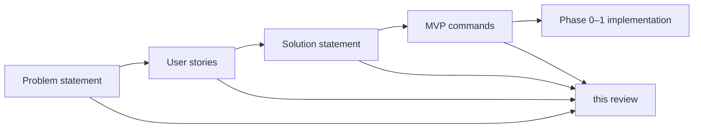

# Review — westmarch-statement

Critical review of the full [westmarch-statement](README.md) document set: [problem-statement.md](problem-statement.md) (**PS**), [user-stories.md](user-stories.md) (**US**), [solution-statement.md](solution-statement.md) (**SS**), and [mvp-commands.md](mvp-commands.md) (**MVP**).

**Reviewed:** May 2026 (MVP: 24 player commands + `westmarch` hub — incl. wallet, location, exploration, travel/world, downtime, crafting, economy, content, misc)  
**Overall verdict:** The plan is **coherent and implementable in principle**, but **scope risk is the main threat**. PS/US/SS align well; MVP has grown ambitious relative to Phase 0–1 capacity. Several cross-doc gaps and one internal SS defect should be fixed before coding beyond the vertical slice.

---

## Review criteria

| Criterion | Question |
|-----------|------------|
| **Completeness** | Does each doc cover what its audience needs? Does the set cover problem → users → solution → scope? |
| **Clarity** | Can a new contributor follow the plan without chat history? |
| **Consistency** | Do PS, US, SS, and MVP agree on terms, scope, and priorities? |
| **Feasibility** | Is Phase 0–1 realistic? Are risks named? |
| **Actionability** | Can implementation trace back to these docs? |

---

## Document map



| Layer | Delivers |
|-------|----------|
| **PS** | Why engine ≠ config; architectural problem |
| **US** | Who, journeys, P0–P3 story IDs |
| **SS** | How: options, decisions, loader, phases, migration |
| **MVP** | What ships first: 24 player commands, tiers A–H, config modules |

---

## Problem statement (PS)

### Strengths

- Clear, repeatable thesis: reuse blocked by embedded server config.
- Four failure modes (fork, edit-in-place, single-server, duplicate effort) are concrete.
- Stakeholder table matches US personas.
- Correctly scopes itself: problem only, not schema or migration detail.
- Names missing contract pieces (schema, svar names, tooling, migration) that SS later addresses.

### Weaknesses & gaps

| Issue | Severity | Notes |
|-------|----------|-------|
| No mention of **rules edition** (2014/2024) | Low | Added in SS/MVP; PS could note “rules-dependent mechanics” as part of config |
| **westmarch end state** still implicit | Medium | SS decision record clarifies; PS could one-line “reference server → config consumer” |
| No **quantified** pain | Low | Optional anecdote; not blocking |
| **buy/sell/time/weather** not foreshadowed | Low | New commands; PS stays correctly generic |

### PS score

| Completeness | Clarity | Fit in set |
|--------------|---------|------------|
| **8/10** | **9/10** | **Strong foundation** — minor refresh optional |

---

## User stories (US)

### Strengths

- Seven journeys cover adopt → configure → operate → maintain → migrate → play → ecosystem.
- Story IDs (US-x.y) enable traceability to SS phases and future issues.
- P0–P3 tiers are usable for planning.
- Non-goals reinforce PS/SS boundaries.

### Weaknesses & gaps

| Issue | Severity | Notes |
|-------|----------|-------|
| **US-3.5 vs US-2.4 vs subsystems.commands.\*** | Medium | US-3.5 says “unset svar for features”; SS/MVP use per-command toggles *inside* config when svar is set. Wording conflates “svar unset” with “command disabled in config” |
| **GM** persona missing; US-3.4 uses GM | Low | Add GM or rename to server owner |
| **No stories for buy/sell/time/weather** | Medium | MVP adds commands without dedicated US rows; US-6.1 partially covers |
| **No rules_edition story** | Low | Could be US-2.x: configure rules revision |
| **US-6.1** mentions dungeons in MVP player outcome | Low | Dungeons deferred past MVP — text overshoots MVP |
| P0 omits **US-4.3** (tests) | Medium | SS Phase 0 includes tests; P0 tier should include US-4.3 or note Phase 0 extends P0 |

### US score

| Completeness | Clarity | Fit in set |
|--------------|---------|------------|
| **7/10** | **8/10** | **Good** — refresh for MVP commands and toggle semantics |

---

## Solution statement (SS)

### Strengths

- Options A–E and R1–R3 show real tradeoffs; decision record is actionable.
- Runtime contract (svar, loader, behaviour semantics) closes review gaps from v1.
- Rules edition (R3) is pragmatic: config + optional Avrae inference + default 2014.
- Migration M1–M3 and tooling table connect to US-5 and US-4.
- Phase 0–3 and vertical port order reference MVP explicitly.

### Weaknesses & gaps

| Issue | Severity | Notes |
|-------|----------|-------|
| **Duplicate config schema block** in § Config gvar schema | **High (doc defect)** | Two nearly identical ` ```py ` blocks; merge into one with `rules_edition` |
| **Phase 1 scope vs capacity** | **High (plan risk)** | Full MVP (22 commands, Tiers B–H) in one phase after thin Phase 0 is aggressive; use 1a–1d tranches |
| **`westmarch_config` svar name** not frozen in US | Low | Consistent in SS/MVP; document in public setup when written |
| **Avrae rules inference** marked TBD | Medium | Honest; Phase 0 spike required — add to Phase 0 table explicitly |
| **Extension gvar contract** underspecified | Medium | Option C chosen but pointer shape (`EXTENSIONS = { "monsters": "uuid" }`?) not sketched |
| **drac2-tools dependency** in P3 US but SS assumes P1 | Medium | `env` refs to drac2-tools likely P0/P1; align US-7.3 tier or SS text |
| **buy/sell** behaviour | Medium | MVP outlines; SS silent on shop/currency model beyond “data in config” |
| Gantt dates **2025-06** | Low | Stale placeholders; update or remove dates |
| Phase 0 omits **rules_edition spike** | Low | MVP Tier A mentions it; SS Phase 0 table should list it |

### SS score

| Completeness | Clarity | Fit in set |
|--------------|---------|------------|
| **8/10** | **8/10** | **Strong** — fix duplicate schema; rebalance Phase 1 scope |

---

## MVP commands (MVP)

### Strengths

- Single table: command → subsystem → toggle → config → westmarch vs new.
- Tiers A–F give implementable sequencing; dependencies diagram is useful.
- Config modules table maps westmarch gvars to generic config (incl. new world clock, weather, shops).
- `rules_edition` integrated; Drac2 `time()` shadowing called out for `!time`.
- Deferred list stays disciplined (dungeons, nexus).
- **content** (library, read) and **misc** (quest, recipe) subsystems added; Tiers G–H.

### Weaknesses & gaps

| Issue | Severity | Notes |
|-------|----------|-------|
| **22 commands in Phase 1** | **High** | Encounter + travel + crafting + economy + library engine + 6 greenfield commands |
| **library / read port** | Medium | westmarch has detailed architecture doc; comprehension engine is non-trivial |
| **quest / recipe greenfield** | Medium | No westmarch reference; quest cvar schema and recipe filter rules TBD |
| **Four new commands** (time, weather, buy, sell) lack behaviour spec | Medium | Outlines only; shop UX (buy item vs browse shop?) undefined |
| **Encounter engine port** is one row but huge | High | Tier B is five aliases but one deep gvar graph (biomes, templates, process_encounters) |
| **Items/monsters catalogues** likely need extension gvars early | Medium | SS risk row says so; MVP should flag Tier E/F blocked until catalogue strategy chosen |
| **Character subsystem** only downtime | Low | Fine for MVP; job uses economy not character |
| US-2.4 example still says “dungeons off” | Low | MVP has no dungeon commands — use exploration/crafting in examples |

### MVP score

| Completeness | Clarity | Fit in set |
|--------------|---------|------------|
| **8/10** | **9/10** | **Good scope doc** — scope itself may be too large for one phase |

---

## Cross-document consistency

### Aligned

| Topic | PS | US | SS | MVP |
|-------|----|----|----|-----|
| Engine vs config | ✓ | ✓ | ✓ | ✓ |
| `westmarch_config` svar | ✓ | ✓ | ✓ | ✓ |
| Subsystem toggles in config | ✓ | ✓ | ✓ | ✓ |
| Phased delivery | ✓ | P0–P3 | Phases 0–3 | Tiers A–F |
| Migration deferred to P2 | ✓ | US-5 P2 | Phase 2 | Phase 2 |
| drac2-tools utilities | ✓ | US-7.3 | Decision record | Config modules |
| Rules edition | — | — | ✓ | ✓ |

### Misalignments

| Topic | Issue | Recommendation |
|-------|--------|----------------|
| **MVP size vs Phase 1** | SS says ship full MVP in Phase 1; Phase 0 is one command | Split Phase 1 or extend timeline; document in SS |
| **US P0 vs Phase 0 tests** | US-4.3 in P1; SS Phase 0 requires tests | Move US-4.3 to P0 or label Phase 0 as “P0+” |
| **Unset vs disabled** | US-3.5 wording | Align US with SS behaviour semantics table |
| **US-6.1 dungeons** | Implies full westmarch | Scope to MVP subsystems or say “configured commands” |
| **PS out of scope** | “Port every command” deferred | MVP ports 22; dungeons/nexus remain post-MVP — clarify in PS summary |

---

## Traceability (plan → stories)

| Plan element | User stories | Gap? |
|--------------|--------------|------|
| Config loader / svar | US-1.3, US-1.4, US-4.2 | — |
| Template config | US-2.3 | — |
| Per-command toggles | US-2.4, US-3.5 | Clarify US-3.5 |
| Rules edition | — | Add US-2.7 or note under US-2.2 |
| MVP 22 commands | US-6.1, US-6.5–6.7 | — |
| Extension gvars | US-2.6 | — |
| Migration | US-5.* | P2 — OK |

---

## Feasibility assessment

### What Phase 0 should prove (minimum)

1. `get_config()` with defaults merge — `config.get_rules_edition()` for edition branches
2. One activity command (forage or enc) against **minimal** fixture config
3. Behaviour semantics for unset svar + disabled subsystem
4. `.alias-test` with mocked svar + `.varfile.json` fixture
5. Spike: Avrae rules edition inference (document result even if “not available”)

**Exit:** CI green; no requirement to port travel or crafting in Phase 0.

### Phase 1 realism check

| Bundle | Commands | Risk |
|--------|----------|------|
| Tier B | 5 activity | Medium — shared engine, large config extract |
| Tier C | travel, time, weather, hunt, loot | **High** — 3 travel + 2 combat; 2 greenfield |
| Tier D | downtime | Low |
| Tier E | 4 crafting | **High** — items/spells catalogues |
| Tier F | job, buy, sell | **High** — 2 greenfield shops |

**Recommendation:** Treat SS Phase 1 as **“first playable server”** not **“all 22 commands.”** Suggested tranches:

- **Phase 1a:** Tiers B + C (exploration + travel + hunt/loot)
- **Phase 1b:** Tiers D + E (downtime + crafting)
- **Phase 1c:** Tier F (economy)
- **Phase 1d:** Tiers G + H (content + misc)

Document tranches in SS or MVP; avoids silent scope creep.

---

## Critical risks (ranked)

1. **MVP breadth** — 22 commands + 6 greenfield + library comprehension engine + full encounter/crafting catalogues.
2. **Gvar size / statement limits** — monsters, items, encounters may force Option C earlier than Phase 2.
3. **Greenfield shop/world commands** — buy/sell/time/weather have no westmarch reference implementation.
4. **Rules edition** — 2024 path undefined in data; drac2-tools languages is 2014-only today.
5. **Migration parity** — reference westmarch extraction untested while MVP scope grows.

---

## Recommended doc fixes (priority)

| Priority | Doc | Fix |
|----------|-----|-----|
| **P0** | SS | Remove duplicate config schema block; add rules-edition + inference to Phase 0 table |
| **P0** | SS / MVP | Split Phase 1 into 1a/1b/1c or mark time/weather/buy/sell as Phase 1 stretch |
| **P1** | US | Clarify US-3.5; add GM persona; narrow US-6.1 to MVP; add stories for rules edition (optional) |
| **P1** | PS | One-line westmarch end state; optional “rules-dependent config” |
| **P2** | SS | Remove or update stale gantt dates; sketch extension gvar pointer shape |
| **P2** | MVP | Expand buy/sell/time/weather behaviour one paragraph each when designing |

---

## Overall assessment

| Document | Completeness | Clarity | Verdict |
|----------|--------------|---------|---------|
| **PS** | 8/10 | 9/10 | **Approve** — stable; minor updates optional |
| **US** | 7/10 | 8/10 | **Approve with refresh** — MVP and toggle semantics |
| **SS** | 8/10 | 8/10 | **Approve after fix** — duplicate schema; Phase 1 scope |
| **MVP** | 8/10 | 9/10 | **Approve** — scope is the product decision, not doc quality |
| **Set together** | 8/10 | 8/10 | **Ready to start Phase 0**; **do not start all 22 commands at once** |

The westmarch-statement set answers **why** (PS), **who and what flows** (US), **how** (SS), and **what first** (MVP). The main critical finding: **documentation quality exceeds Phase 1 capacity unless phasing is tightened.** Implementation should follow Tier A strictly, then negotiate 1a–1d before parallelizing ports.

---

## Related documents

- [README.md](README.md) — index and shorthand
- [problem-statement.md](problem-statement.md)
- [user-stories.md](user-stories.md)
- [solution-statement.md](solution-statement.md)
- [mvp-commands.md](mvp-commands.md)
