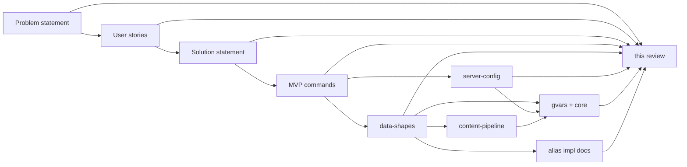
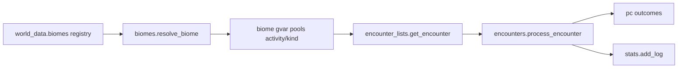

# Review — westmarch-statement

Critical review of the [westmarch-statement](README.md) document set and the **implementation layer** built under it (config shapes, gvars, aliases).

**Reviewed:** May 2026 (pass 4 — full-doc readiness audit; exploration P0 resolved; economy/crafting gaps remain)  
**Overall verdict:** The doc set is **ready to start Phase 0 implementation** (config + auth + display + exploration slice + admin hub). **Exploration architecture is doc-complete** for Tier A. **Block Tier F (economy)** until shop schema + `pc` alignment land; **block Tier E** until `crafting.gvar` is documented. No engine `.gvar` code exists yet — docs lead implementation.

---

## Review criteria

| Criterion | Question |
|-----------|------------|
| **Completeness** | Does each doc cover what its audience needs? Does the set cover problem → users → solution → scope → shapes → modules? |
| **Clarity** | Can a new contributor follow the plan without chat history? |
| **Consistency** | Do PS, US, SS, MVP, data-shapes, server-config, gvars, and aliases agree? |
| **Feasibility** | Is Phase 0–1 realistic? Are risks named? |
| **Actionability** | Can implementation trace back to these docs? |

---

## Document map

| Layer | Delivers |
|-------|----------|
| **PS** | Why engine ≠ config |
| **US** | Journeys, P0–P3 story IDs |
| **SS** | Options, decisions, phases, migration |
| **MVP** | 24 player commands + admin hub, tiers A–H |
| **DS** | Canonical object shapes (encounter, **world_data**, biome pools, policies, recipe, …) |
| **SC** | Config load model, **`world_data`** examples, extension pointers |
| **gvars/** | Engine module API contracts + [core.md](gvars/core.md) vendoring policy |
| **aliases/** | Per-command port notes, checklists, westmarch vs greenfield |
| **CP** | [content-pipeline.md](content-pipeline.md) — TSV → split catalogue shards |

**Read order:** PS → US → SS → MVP → [data-shapes.md](data-shapes.md) → [server-config.md](server-config.md) → [gvars/README.md](gvars/README.md) → subsystem alias README for your tier.

---

## Problem statement (PS)

### Strengths

- Clear thesis; four failure modes; stakeholder table; correct scope boundary.

### Weaknesses & gaps

| Issue | Severity | Notes |
|-------|----------|-------|
| No **rules edition** mention | Low | SS/MVP/config cover it; PS optional one-liner |
| **westmarch end state** implicit | Low | SS decision record states it |
| **Vendored core** not foreshadowed | Low | PS mentions drac2-tools as ecosystem libs, not engine packaging — optional PS refresh |

### PS score: **8/10** completeness · **9/10** clarity — **Approve** (minor refresh optional)

---

## User stories (US)

### Strengths

- Journeys 1–7; US-1.6/1.7 for admin hub; US-6.5–6.7 for wallet/location/recipe; **US-7.3** updated for vendored `core/`.

### Weaknesses & gaps

| Issue | Severity | Notes |
|-------|----------|-------|
| **US-3.5 vs SS behaviour semantics** | — | **Fixed** — split into **US-3.5** (unset svar) and **US-3.5a** (config toggles) |
| **GM persona** | Low | US-3.4 uses GM; personas table has no GM row |
| **US-6.1 dungeons** | Low | MVP has no dungeon commands — narrow to “configured MVP commands” |
| **P0 vs US-4.3** | Medium | SS Phase 0 requires tests; US-4.3 still P1 — align tiers |
| **No story for extension gvar loader** | Low | US-2.6 covers concept; no acceptance story for `extensions.*` resolution |

### US score: **7/10** completeness · **8/10** clarity — **Approve with refresh** (US-3.5 priority)

---

## Solution statement (SS)

### Strengths

- Options A–E; decision record; behaviour semantics table; rules edition section; vendored **`core/`**; engine structure; vertical port order; risks.

### Weaknesses & gaps

| Issue | Severity | Notes |
|-------|----------|-------|
| **Decision record: rules edition row wrong** | **High** | Table says “**Config field** + optional Avrae inference”; body § Rules edition says **not** an owner config field — **`get_rules_edition()`** only. Fix decision record row |
| **Phase 0 scope vs “vertical slice”** | **High** | Phase 0 table lists **full encounter engine** (templates, lists, encounters) + admin hub + **`!westmarch check`** — heavier than “one activity command.” Either shrink Phase 0 deliverables or rename goal to “exploration slice + admin” |
| **`core/` timing** | Medium | Phase 1 lists core ports; Phase 0 aliases need **embeds**, **rolls** immediately — **partial `core/` in Phase 0** |
| **Phase 1 = full MVP** | **High (plan risk)** | 24 player commands in one phase after Phase 0 — still aggressive |
| **Extension gvar contract** | Medium | Option C chosen; **`extensions.monsters`** referenced in [check.md](aliases/admin/check.md) and [items.md](gvars/items.md) but **no canonical shape in data-shapes.md** |
| **Vertical port order** | — | **Fixed** — **wallet** in step 8; after-MVP numbering 11–12 |
| **Gantt 2025-06** | Low | Stale placeholders |
| **Duplicate config schema block** | — | **Resolved** — only one outline block in SS now |

### SS score: **8/10** completeness · **7/10** clarity — **Approve after fix** (rules edition row; Phase 0/1 scope honesty)

---

## MVP commands (MVP)

### Strengths

- Full command table with toggles; tiers A–H; dependency diagram; greenfield outlines; engine gvar index; subsystem `config` for exploration; admin outside **`subsystems`**.

### Weaknesses & gaps

| Issue | Severity | Notes |
|-------|----------|-------|
| **`character` vs `downtime` subsystem key** | ~~High~~ **Fixed** | MVP + downtime.md use **`downtime`** |
| **Phase 1 = Tiers B–H in one phase** | **High** | Same as SS — needs 1a–1d tranches in MVP § Mapping to solution phases |
| **`crafting.gvar` missing from engine table** | Medium | Tier E alias docs depend on it; not in MVP engine gvar table or [gvars/README.md](gvars/README.md) |
| **`core/` missing from engine table** | Medium | [core.md](gvars/core.md) exists; MVP table lists domain gvars only |
| **Greenfield shop UX** | Medium | buy/sell argument forms sketched; **default shop resolution** (location vs explicit id) still TBD across buy.md vs economy README |
| **Encounter engine = one row, huge surface** | High | Tier B is five aliases sharing templates + lists + encounters + distribution + optional location biome |

### MVP score: **8/10** completeness · **8/10** clarity — **Approve** — fix **`character`/`downtime`** before implementation

---

## Data shapes (DS)

### Strengths

- Encounter / `ectx` / outcomes → **`pc`**; exploration.config; policies; location, path, currency, recipe; subsystem entry documents **`commands`** vs downtime single-toggle.
- **`world_data`** — locations, paths, **transport**, calendars, **biome registry** + lazy biome gvar body shape.
- Kind-first encounter selection documented; westmarch d100 explicitly dropped.

### Weaknesses & gaps

| Issue | Severity | Notes |
|-------|----------|-------|
| **No `extensions` top-level shape** | ~~Medium~~ **Fixed** | data-shapes § **`extensions`** |
| **No Shop / stock entry shape** | ~~Medium~~ **Fixed** | data-shapes § **Shop**, **StockEntry** |
| **Biome gvar body not a DS anchor section** | Low | Under world_data — add cross-link from encounter_lists; optional **`BiomePool`** validation checklist |
| **Balanced kind history cvar** | **P1** | Not in DS — see exploration audit |
| **Kind inference table** | **P1** | Partial — formalize in DS or encounter_lists |
| **Roll spec “port in Phase 0”** | Low | Still points at drac2-tools **`rolls`** — update to **`core/rolls`** when vendored |
| **Catalogue row shapes** | Low | [public/assets/README.md](../../../public/assets/README.md) + [content-pipeline.md](content-pipeline.md); link from DS top-level |

### DS score: **7/10** completeness · **8/10** clarity — **Approve with gaps** — shop + extensions before Tier F

---

## Server config (SC)

### Strengths

- Three-layer model (schema / world data / extensions); owner workflow; worked examples (fresh, enc sandbox, location enc, travel+wallet); points at starter.gvar.

### Weaknesses & gaps

| Issue | Severity | Notes |
|-------|----------|-------|
| **World data “TBD per vertical”** | — | **Fixed** — **`world_data`** § in DS (locations, paths, transport, calendars, biome registry) |
| **Inline encounter pools in examples** | — | **Fixed** in SC — **`world_data.biomes`** + lazy gvar bodies |
| **Extension resolution unspecified** | Medium | “Engine loaders resolve them” — which gvar function merges extensions? **`config.get_config()`** vs catalogue modules? |
| **`subsystems.admin` legacy** | Low | [check.md](aliases/admin/check.md) warns — document removal in migration notes |

### SC score: **8/10** completeness · **8/10** clarity — **Approve**

---

## Engine gvars (gvars/ + core.md)

### Strengths

- Index with phases; planned folder layout; **`pc`** write-path contract; **`journeys`** split from paths; **`core/`** vendoring policy; encounter pipeline documented.

### Weaknesses & gaps

| Issue | Severity | Notes |
|-------|----------|-------|
| **`crafting.gvar` undocumented** | **Medium** | Required by Tier E alias docs — add `gvars/crafting.md` or fold into crafting README as official module |
| **`notes` / known-recipes storage** | Medium | [recipe.md](gvars/recipe.md): drac2-tools **notes** vs **pc** — undecided; blocks recipe encounter outcomes |
| **Extension loader** | Medium | [items.md](gvars/items.md), [monsters.md](gvars/monsters.md) mention **`extensions.*`** — no shared **`catalogues.load()`** doc |
| **`biomes.gvar`** + **`engine:configs/biomes/`** resolver | Medium | [biomes.md](gvars/biomes.md) API sketched; **`engine:configs/biomes/<code>`** slug resolution owner not specified (biomes vs config loader) |
| **`display.gvar`** | — | **Added** — [display.md](gvars/display.md); alias pages not yet wired |
| **No code under `src/gvars/` yet** | — | Expected; docs ahead of implementation |

### Gvars score: **7/10** completeness · **8/10** clarity — **Approve with missing modules**

---

## Alias implementation docs (aliases/)

### Strengths

- All MVP subsystems have README + per-command pages; admin hub documented; exploration/travel/crafting have tier sequencing; wallet and location documented as new commands.

### Weaknesses & gaps

| Issue | Severity | Notes |
|-------|----------|-------|
| **`sell.md` vs `pc` / `shops.gvar`** | ~~High~~ **Fixed** | buy/sell use **`shops.gvar`** → **`pc`**; schema in data-shapes |
| **Shop config shape drift** | ~~High~~ **Fixed** | Canonical **`shops`** + **StockEntry** in data-shapes |
| **Tier F exit criteria omit wallet** | Low | [sell.md](aliases/economy/sell.md) “job + buy + sell” — economy README lists four commands |
| **Greenfield depth uneven** | Medium | location/time/weather/quest have outlines; buy/sell more detailed than quest cvar schema |
| **Library comprehension** | Medium | Non-trivial westmarch port; alias doc checklist still has config migration TODO |
| **Exploration alias drift** | ~~High~~ **Fixed** | Alias docs now use **`biomes.resolve_biome`**, **`stats.add_log`**, **`world_data.biomes`** |

### Aliases score: **8.5/10** completeness · **8.5/10** clarity — **Approve** (economy aligned)

---

## Exploration encounters — completeness audit

End-to-end path documented in [enc.md](aliases/exploration/enc.md), [data-shapes.md § World data / exploration.config](data-shapes.md#world-data), [biomes.md](gvars/biomes.md), [encounter_lists.md](gvars/encounter_lists.md), [encounters.md](gvars/encounters.md), [encounter_templates.md](gvars/encounter_templates.md).

### Documented and sufficient for Tier A

| Topic | Where | Notes |
|-------|--------|-------|
| **`resolve_biome` ownership** | biomes.gvar | All activities; **`enc_biome_source`** **`auto`** / **`argument`** / **`location`** |
| **`stats.add_log` single entrypoint** | stats.gvar | Usage + cooldown timestamps + exploration aggregates |
| **No d100 list builder** | DS, encounter_lists, biomes | Kind first → uniform random in **`pools[activity][kind]`** |
| **Lazy biome load** | DS § biome registry, biomes.gvar | Registry on config; bodies in separate gvars |
| **`distribution` / `distribution_policy`** | DS § exploration.config, enc.md | **`random`** vs **`balanced`**; sum-to-100 validation in check |
| **Encounter input / ectx / outcomes** | DS | Callable fields; **`pc`** write path for MVP outcome types |
| **Template factories (MVP subset)** | encounter_templates.md | gather, gold, damage, ambush — enough for smoke slice |
| **Engine preset biome codes** | DS, [src/gvars/configs/biomes/README.md](../../../src/gvars/configs/biomes/README.md) | 19 codes listed; bodies not written yet |
| **Combat scaling policy** | DS § policies.combat | **Deferred** — default off; biomes use fixed **`cr`** |
| **Cross-subsystem checks** | check.md, DS | location enc requires travel + **`world_data.locations`** + biome registry |
| **Phase 0 vs stretch** | enc.md checklist | **`balanced`** mode + quest pools flagged Phase 1 |

### Gaps *(fix or explicitly defer before Tier A)*

| Gap | Severity | Status |
|-----|----------|--------|
| **Biome resolver ownership** | ~~P0~~ | **Resolved** — [biomes.gvar](gvars/biomes.md) **`resolve_biome(activity, args, character, config)`** |
| **Activity commands vs biome arg** | ~~P0~~ | **Resolved** — **`enc_biome_source`** applies to all activities; **`auto`** default; alias docs updated |
| **Alias / README drift** | ~~P0~~ | **Resolved** — exploration README + Tier B clones use **`world_data.biomes`** + **`biomes.gvar`** vocabulary |
| **Cooldown cvar keys** | ~~P1~~ | **Resolved** — [stats.gvar](gvars/stats.md) **`wg_stats`** + **`stats.add_log`**; [pc.md](gvars/pc.md) **`check_cooldown`** reads **`last_used_at`** |
| **`balanced` history cvar shape** | ~~P1~~ | **Resolved** — **`wg_stats[<command>].kinds`** counters in stats.gvar |
| **Kind inference rules** | **P1** | “Infer from template when omitted” — only **`cr > 0` → combat** stated | DS table: inference order |
| **Quest kind without quest pool** | **P1** | Phase 0: quest 0% in starter presets until Tier H |
| **Location-specific encounter overlays** | **P2** | westmarch **`area_encounters`** — intentional drop or post-MVP overlay |
| **Global / cross-biome quest hooks** | **P2** | Biome-local quest buckets only for MVP |
| **Recipe discovery encounters** | **P2** | Defer **`outcome type: recipe`** |
| **Journey `{type: encounter}` steps** | **P1** | No doc for inline roll during travel |
| **Combat encounters in Phase 0** | **P1** | Gather-only fixtures or narrative combat until Tier C |
| **Biome body validation** | **P1** | check_config: validate **`pools`** shape when kind % > 0 |
| **Biome port / generate tooling** | **P2** | **`utils/port-biome.js`** deferred |
| **Weighted pick within kind** | **P2** | Uniform random only for MVP |
| **Per-activity `distribution` override** | **P2** | Shared mix intentional |
| **`display.get_display()` in aliases** | ~~P1~~ | **Resolved** — exploration README + enc.md |
| **`engine:configs/biomes/` resolution** | **P1** | biomes.gvar slug → env UUID map at implementation |

### westmarch features explicitly not ported *(documented)*

| westmarch | generic decision | Doc |
|-----------|------------------|-----|
| d100 **`get_encounter_list`** | Dropped | encounter_lists, DS |
| **`encounters`** mega-pool | Split into **`pools[activity][kind]`** | DS § biome gvar body |
| **`combat_encounters`** global mix-in | Combat only under activity/kind buckets | DS |
| **`area_encounters`** by location name | **Gap** — not yet decided (see table) | — |
| **`quest_encounters.gvar`** global pool | Quest entries in biome **`pools.*.quest`** | partial |

### Phase 0 exploration — minimum doc-complete slice

1. **`world_data.biomes`** with one preset (**`engine:configs/biomes/forest`**) in fixture config  
2. Biome gvar with **`pools.enc.gather`** (+ optional **`.combat`** stub)  
3. **`biomes.resolve_biome`** + **`encounter_lists.get_encounter`**  
4. **`encounters.process_encounter`** with gather + gold outcomes  
5. **`!enc`** with **`distribution: { gather: 100, … }`** or combat deferred  
6. **`display.get_display()`**, **`auth`**, **`stats.add_log`**, **`pc.check_cooldown`** for **`enc`**  
7. **`!westmarch check`** — registry, distribution sum, biome load smoke  

**Stretch (not blockers):** **`balanced`** mode, quest kind, recipe outcomes, journey encounter steps.

### Exploration doc score: **8/10** completeness · **9/10** clarity for architecture · **8/10** for alias-level consistency — **Approve for Tier A implementation**

---

## Cross-document consistency

### Aligned

| Topic | PS | US | SS | MVP | DS | gvars |
|-------|----|----|----|-----|-----|-------|
| Engine vs config | ✓ | ✓ | ✓ | ✓ | ✓ | ✓ |
| `westmarch_config` svar | ✓ | ✓ | ✓ | ✓ | — | ✓ |
| Subsystem toggles in config | ✓ | ✓ | ✓ | ✓ | ✓ | ✓ |
| Admin **not** in `subsystems` | — | ✓ | ✓ | ✓ | ✓ | ✓ |
| **`pc`** single write path | — | — | — | ✓ | ✓ | ✓ |
| Vendored **`core/`** | — | ✓ | ✓ | — | — | ✓ |
| **`world_data` + lazy biomes** | — | — | — | ✓ | ✓ | ✓ |
| **`biomes.gvar`** + **`stats.gvar`** | — | — | — | ✓ | ✓ | ✓ |
| **`display.gvar`** | — | — | ✓ | ✓ | — | ✓ |
| Rules edition on config gvar | — | — | ✓* | ✓ | ✓ | ✓ |
| One engine workshop (E1) | ✓ | ✓ | ✓ | — | — | ✓ |

\*SS decision record matches DS — optional **`rules_version`** on config.

### Misalignments *(remaining)*

| Topic | Where | Issue | Fix |
|-------|--------|-------|-----|
| **Rules edition decision row** | SS decision record vs DS | Decision record says optional **`rules_version`** on config — consistent with DS; no action unless SS body contradicts | Verify SS § Rules edition only |
| **`crafting.gvar`** | crafting aliases | Module doc missing | Add gvars/crafting.md (P1) |
| **Known recipes storage** | recipe.md, encounters | notes vs pc undecided | P2 decision |

### Resolved misalignments *(pass 4b — May 2026)*

| Topic | Fix applied |
|-------|-------------|
| **Downtime subsystem key** | MVP + [downtime.md](aliases/downtime/downtime.md) → **`downtime`** |
| **MVP `rules_version` contradiction** | MVP now documents optional config field + **`get_rules_edition()`** |
| **Shop config shape** | [data-shapes § Shop](data-shapes.md#shop); buy/sell/shops.gvar aligned |
| **Economy `pc` bypass** | buy/sell route through **`shops.gvar`** → **`pc`** |
| **`extensions.*`** | [data-shapes § extensions](data-shapes.md#extensions); server-config §3 updated |
| **Exploration alias drift** | pass 3b |
| **US-3.5** | US-3.5 + US-3.5a split |

---

## Traceability (plan → stories → docs)

| Plan element | Stories | Implementation doc | Gap? |
|--------------|---------|----------------------|------|
| Config loader / svar | US-1.3, 1.4, 4.2 | [config.md](gvars/config.md) | — |
| Admin hub | US-1.6, 1.7, 1.2a | [aliases/admin/](aliases/admin/README.md) | — |
| Per-command toggles | US-2.4, 3.5a | MVP, [auth.md](gvars/auth.md) | — |
| Vendored utilities | US-7.3 | [core.md](gvars/core.md) | — |
| **`pc`** write path | — *(implicit)* | [pc.md](gvars/pc.md) | Optional US-4.x story |
| Encounter pipeline | US-6.1 | enc.md, encounter_* gvars, biomes, stats | — |
| Lazy biome gvars | US-2.6 | DS, biomes.md, SC | **Preset bodies + port tooling** |
| **`display.get_display()`** | US-6.3 | display.md, exploration README | — |
| Extension gvars | US-2.6 | DS § extensions, SC §3, check | — |
| Rules edition | — | SS, config.md | Optional US-2.7 |
| MVP 24 commands | US-6.1, 6.5–6.7 | MVP + aliases/* | — |
| **`crafting.gvar`** | — | crafting aliases | **gvar doc missing** |
| Known recipes / notes | US-6.7 | recipe.md, encounters | **Storage TBD** |

---

## Feasibility assessment

### Phase 0 — realistic minimum

1. **`config.get_config()`** + **`auth.is_allowed()`** + behaviour semantics (unset / invalid / disabled)
2. **Partial `core/`** — at least **embeds**, **rolls**, **strings** (needed by encounter slice)
3. **`pc.gvar`** — minimal mutators if encounter outcomes apply sheet changes in slice
4. Encounter pipeline: **templates + lists + encounters** *or* defer outcomes to keep slice thin
5. One activity command (**enc** or **forage**) + **`!westmarch check`** on starter template
6. Spike: **`get_rules_edition()`** (document Avrae availability)
7. `.alias-test` + CI

**Tension:** SS Phase 0 already lists items 4–5 as full deliverables — treat **outcome application** and **balanced distribution** as Phase 0 stretch, not blockers.

**Exit:** CI green; unset svar safe; one smoke command; admin check on template.

### Phase 1 — use tranches, not one blob

| Tranche | Tiers | Commands | Risk |
|---------|-------|----------|------|
| **1a** | B + C (partial) | Activity cluster + travel + location + hunt + loot | **High** — encounter + journeys |
| **1b** | C (world) + D | time, weather, downtime | Medium — greenfield clock/weather |
| **1c** | E | craft, brew, scribe, enchant | **High** — catalogues + **`crafting.gvar`** |
| **1d** | F | job, wallet, buy, sell | **High** — shop schema + **`shops.gvar`** |
| **1e** | G + H | library, read, quest, recipe | **High** — library engine + greenfield misc |

Document tranches in SS and MVP § Mapping to solution phases.

### Catalogue / extension strategy

| Catalogue | MVP need | Likely approach |
|-----------|----------|-----------------|
| **Biome encounter pools** | Tier A/B | **`world_data.biomes` → lazy gvar**; [src/gvars/configs/biomes/](../../../src/gvars/configs/biomes/README.md) presets; port from westmarch per biome |
| Monsters | Tier C | **`utils/generate-monsters.js`** → letter shards; [content-pipeline.md](content-pipeline.md) |
| Items / potions / magic | Tier E | **`generate-items.js`** → three shards |
| Books | Tier G | **`generate-books.js`** → fiction/real shards |
| Recipes | Tier E/H | **`recipes`** in config; [recipes.tsv](../../../public/assets/recipes.tsv) via **`generate-recipes.js`** |

**Decision needed:** inline vs extension vs build-time merge for **catalogues** (monsters/items/books) — before Tier E reference extraction. **Biomes** decision made: **always separate gvars**, registry on config.

---

## Critical risks (ranked)

1. **Phase 1 breadth** — 24 player commands, 9 greenfield surfaces, library comprehension, full encounter/crafting/catalogue stack.
2. **~~Exploration alias drift~~** — **Resolved** in pass 3b.
3. **~~Contract drift~~** — shop shape + **`pc`** alignment **resolved** (pass 4b); **`crafting.gvar`** doc still open.
4. **~~Underspecified exploration resolver~~** — **Resolved** — **`biomes.resolve_biome`**, **`enc_biome_source: auto`**.
5. **Gvar size limits** — monsters/items/books may force Option C before reference migration (SS Phase 2).
6. **Phase 0 creep** — full encounter engine + admin + validation in “foundation” phase.
7. **Undecided storage** — known recipes, quest journal, shop stock cvars vs config-only.
8. **Rules edition 2024** — data path undefined; **languages** in core is 2014-only.

---

## Recommended doc fixes (priority)

| Priority | Doc | Fix |
|----------|-----|-----|
| **P0** | ~~MVP, downtime alias~~ | **Done** — **`downtime`** subsystem key |
| **P0** | ~~data-shapes.md~~ | **Done** — Shop, StockEntry, **`extensions`** |
| **P0** | ~~buy.md, sell.md, shops.gvar~~ | **Done** — **`shops`** schema + **`pc`** via shops.gvar |
| **P0** | ~~MVP rules_version~~ | **Done** — optional config field documented |
| **P0** | ~~exploration aliases + README~~ | **Done** — **`world_data.biomes`**, **`biomes.resolve_biome`**, **`stats.add_log`** |
| **P0** | ~~encounter_lists / biomes.gvar~~ | **Done** — **`resolve_biome`** on [biomes.gvar](gvars/biomes.md) |
| **P0** | ~~DS + activity aliases~~ | **Done** — **`enc_biome_source`** all activities; **`auto`** default |
| **P1** | ~~pc.md cooldown keys~~ | **Done** — [stats.gvar](gvars/stats.md) + **`pc.check_cooldown`** |
| **P1** | ~~balanced history cvar~~ | **Done** — **`wg_stats[<cmd>].kinds`** |
| **P1** | DS encounter input | Kind inference table |
| **P1** | journeys.md / travel | Journey **`{type: encounter}`** step processing |
| **P1** | ~~enc.md, exploration README~~ | **Done** — **`display.get_display()`** standard opener |
| **P1** | check_config | Biome gvar **`pools`** validation |
| **P1** | US | ~~Rewrite **US-3.5**~~ — done (**US-3.5** + **US-3.5a**); add GM persona or rename; P0 + **US-4.3** |
| **P1** | SS, MVP | Phase **1a–1e** tranches; Phase 0 **partial core/**; honest Phase 0 scope |
| **P1** | gvars/ | **`crafting.gvar`** doc; extension loader note on config or catalogues |
| **P2** | content-pipeline or utils | Biome port guide / **`port-biome.js`** from westmarch |
| **P2** | DS | Location encounter overlay — defer or **`locations[id].encounters`** |
| **P2** | recipe.md, encounters | Decide **notes** vs **pc** for known recipes |
| **P2** | SS | ~~Fix vertical port order (**wallet**)~~ — done; gantt dates |

---

## Resolved since pass 1 (May 2026)

| Item | Status |
|------|--------|
| Duplicate SS config schema block | **Gone** — single outline |
| drac2-tools external workshop dep | **Superseded** — [core.md](gvars/core.md), SS decision record, US-7.3 |
| **`wallet`** / **`location`** commands | Documented in MVP + aliases |
| **`subsystems.*.config`** (exploration) | In data-shapes + starter.gvar |
| **`pc.gvar`** write path | Documented; economy aliases **aligned** via shops.gvar |
| Admin in **`subsystems`** | Removed — role-gated hub only |
| **`journeys`** vs **`paths`** | Split documented |
| **US-3.5 / US-3.5a** | Unset svar vs config toggles |
| **`core/`** in alias/gvar consumer docs | Runtime refs use `env.gvars.*`, not external workshop |
| **`docs/setup.md`** | Public server-owner guide |
| **`src/gvars/README.md`** | Documents planned layout; implementation Phase 0+ |
| **wallet** in SS port order + Tier F exit criteria | sell.md economy cluster |
| **`world_data`** (locations, paths, transport, calendars, biomes) | DS, SC, [world_data.md](gvars/world_data.md) |
| Lazy biome gvars + kind-first selection | DS, biomes.md, encounter_lists — no d100 |
| **`display.gvar`** + embed inheritance | display.md, DS § display, auth opener |
| **`policies.display.footer_behaviour`** | DS, starter.gvar |
| **`policies.combat.scale_encounters_to_level`** (deferred) | DS — schema only |
| [content-pipeline.md](content-pipeline.md) + [utils/README.md](../../../utils/README.md) | TSV → split catalogue shards |
| Engine preset biome list | [src/gvars/configs/biomes/README.md](../../../src/gvars/configs/biomes/README.md) |

---

## Overall assessment

| Document | Completeness | Clarity | Verdict |
|----------|--------------|---------|---------|
| **PS** | 8/10 | 9/10 | **Approve** |
| **US** | 7/10 | 8/10 | **Approve with refresh** |
| **SS** | 8/10 | 8/10 | **Approve** |
| **MVP** | 9/10 | 9/10 | **Approve** |
| **DS** | **9/10** | 8/10 | **Approve** |
| **SC** | **8.5/10** | 8/10 | **Approve** |
| **gvars/** | **8/10** | 8/10 | **Approve** — crafting.gvar doc still P1 |
| **aliases/** | **8.5/10** | 8.5/10 | **Approve** |
| **Exploration slice** | **8/10** | **9/10** | **Ready for Tier A** |
| **Set together** | **8.5/10** | **8.5/10** | **Ready for Phase 0 and Tier F docs** |

The doc set answers **why** (PS), **who** (US), **how** (SS), **what** (MVP), **shapes** (DS/SC), **where to code** (gvars/aliases), and **how to build catalogues** (content-pipeline). Exploration is implementation-ready: **`biomes.resolve_biome`**, **`stats.add_log`**, refreshed alias docs.

---

## Implementation readiness *(pass 4)*

### What exists in the repo today

| Artifact | Status |
|----------|--------|
| **Planning docs** | 72 markdown files — complete index at [README.md](README.md) |
| **Engine gvars** | **Not implemented** — only `env.*.gvar`, `example.gvar` ([src/gvars/README.md](../../../src/gvars/README.md)) |
| **Biome preset bodies** | **Not implemented** — codes listed; no `.gvar` bodies |
| **Catalogue generators** | **Not implemented** — [content-pipeline.md](content-pipeline.md) spec only |
| **Production aliases** | **Not implemented** — example alias-tests only |
| **Tests / CI** | Scaffold exists; no encounter pipeline tests |

Docs lead implementation — expected at this stage.

### Ready to implement now *(Phase 0 / Tier A)*

| Module | Doc | Notes |
|--------|-----|-------|
| config, auth, display, check_config | gvars/*.md | Admin hub + loader |
| pc, stats | pc.md, stats.md | Single write path; cooldown via stats |
| biomes, encounter_* | biomes.md, encounter_lists.md, encounters.md | Gather-only Phase 0 OK |
| enc + westmarch admin | aliases/exploration/enc.md, aliases/admin/* | Pipeline documented end-to-end |
| Partial **core/** | core.md | embeds, rolls, strings minimum |

**Phase 0 exit:** CI green; `!enc` smoke; `!westmarch check` on starter; unset svar safe.

### Not ready — doc gaps block coding

| Tier | Blocker |
|------|---------|
| **E (crafting)** | **`crafting.gvar`** module doc missing |
| **E/H** | Known recipes storage undecided (notes vs pc cvar) |
| **H (quest)** | Quest journal cvar shape thin |
| **C (travel)** | Journey `{type: encounter}` step — hook mentioned, no encounter_lists call path |

**Tier F (economy)** — doc-complete after pass 4b (**Shop**, **`shops.gvar`**, **`pc`** path).

### Defer safely *(documented)*

Kind inference table · **`balanced`** selection math · biome port tooling · combat scaling · quest/recipe outcomes · Phase 1 as tranches 1a–1e

---

## Related documents

- [README.md](README.md) — index
- [problem-statement.md](problem-statement.md)
- [user-stories.md](user-stories.md)
- [solution-statement.md](solution-statement.md)
- [mvp-commands.md](mvp-commands.md)
- [data-shapes.md](data-shapes.md)
- [server-config.md](server-config.md)
- [gvars/README.md](gvars/README.md)
- [gvars/core.md](gvars/core.md)
- [content-pipeline.md](content-pipeline.md)
- [gvars/world_data.md](gvars/world_data.md)
- [gvars/biomes.md](gvars/biomes.md)
- [gvars/stats.md](gvars/stats.md)
- [gvars/display.md](gvars/display.md)
