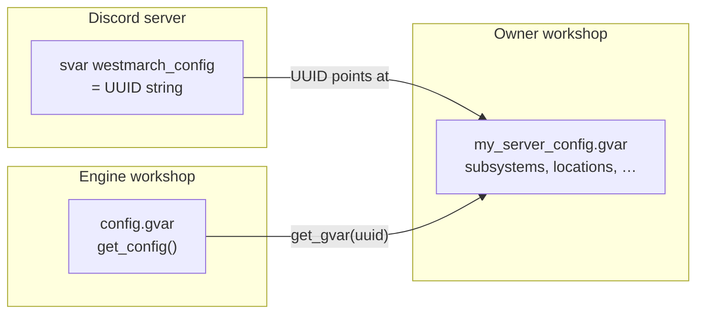

# Server config

How westmarch-generic **stores, loads, and validates** per-server world data and toggles. Command scope lives in [mvp-commands.md](mvp-commands.md); reusable object shapes in [data-shapes.md](data-shapes.md).

---

## Model

One **config gvar** (owner workshop module) + one **svar** pointer on the Discord server.



| Piece | Owner | Writable from aliases? |
|-------|-------|-------------------------|
| **`westmarch_config` svar** | Server admin (Avrae) | No — Drac2 cannot write svars |
| **Config gvar body** | Server owner (workshop editor) | No — aliases read only |
| **Engine gvars** (`config`, `auth`, `encounters`, …) | westmarch-generic workshop | N/A — behaviour, not world data |

Aliases never read the svar directly — they call **`config.get_config()`** ([gvars/config.md](gvars/config.md)).

---

## Owner workflow

1. **Subscribe** to the westmarch-generic engine workshop.
2. **Create** a config gvar — duplicate [templates/config/starter.gvar](../../../../templates/config/starter.gvar) or paste starter body via `!gvar editor` ([aliases/admin/setup.md](aliases/admin/setup.md)).
3. **Set svar** — `!svar westmarch_config <your-gvar-uuid>`.
4. **Edit** toggles and world data in the gvar editor; changes apply on the next command (no engine redeploy).
5. **Verify** — `!westmarch check` (validation) and `!westmarch show` (summary).

**Admin gate:** `!westmarch setup` / `check` / `show` only — config content is maintained in the Avrae workshop, not via bot commands.

---

## Config gvar layers

### 1 — Core schema *(engine defaults fill gaps)*

Always present after **`get_config()`** merges **`DEFAULTS`** ([gvars/config.md](gvars/config.md)):

| Field | Purpose |
|-------|---------|
| `subsystems` | Player-facing subsystems only — exploration, travel, downtime, crafting, economy, content, misc; nested **`config`** per subsystem ([data-shapes.md § Subsystem entry](data-shapes.md#subsystem-entry)) |
| `policies` | House rules — what to enforce vs leave manual ([data-shapes.md § Server policies](data-shapes.md#server-policies)) |
| `admin_roles` | Optional override for GM hub roles |
| `channel_policy` | Optional channel whitelist / RP rules ([gvars/auth.md](gvars/auth.md)) |

Not on the owner config gvar: **`server_name`**, **`rules_edition`**, **`schema_version`** — see [gvars/config.md](gvars/config.md). **`!westmarch check`** validates structure and data for enabled subsystems; engine release notes cover breaking config changes.

Full toggle tree: [mvp-commands.md § Config toggle shape](mvp-commands.md#config-toggle-shape).

### 2 — World data *(owner adds as verticals ship)*

Not invented by defaults — absent until the owner defines them. Shapes documented in [data-shapes.md](data-shapes.md).

| Field | Shape | Commands |
|-------|-------|----------|
| `locations` | `{ id: location, … }` — [locations.gvar](gvars/locations.md) | travel, location, enc, forage, … |
| `paths` | `[ path, … ]` — [paths.gvar](gvars/paths.md) | travel |
| `default_location` | location `id` string | travel, location |
| `currencies` | `{ id: currency_def, … }` | **wallet**; encounter/path/shop prices |
| `recipes` | `[ recipe, … ]` or `{ id: recipe }` — [data-shapes.md § Recipe](data-shapes.md#recipe) | brew, enchant, **recipe**; recipe-tagged encounters |
| Encounter pools | per-biome lists | enc, mine, lumber, forage, fish |
| `world_clock`, `weather`, shops, catalogues, … | TBD per vertical | time, weather, economy, crafting, … |

**Location keys** (`oakwood`, `nexus`, …) are stable **`id`** slugs used in `!enc <id>`, path `from`/`to`, and cvar resolution.

### 3 — Extension gvars *(optional, large tables)*

When a catalogue exceeds gvar size limits, the config module holds **UUID references** to additional owner gvars ([solution-statement.md § Option C](solution-statement.md)). Engine loaders resolve them the same way as the master config.

---

## Examples

Illustrative config gvar bodies — not copy-paste complete modules. Full starter tree: [templates/config/starter.gvar](../../../../templates/config/starter.gvar). Object shapes: [data-shapes.md](data-shapes.md).

### 1 — Fresh server *(core schema only)*

New workshop gvar before any vertical is enabled. Engine **`DEFAULTS`** fill missing **`subsystems`** / **`policies`** keys on load; this is the minimum an owner typically publishes first.

```py
subsystems = {
    "exploration": {"enabled": False, "commands": {"enc": False}, "config": {}},  # … full tree in starter.gvar
    "travel": {"enabled": False, "commands": {}},
    "downtime": {"enabled": False},
    "crafting": {"enabled": False, "commands": {}},
    "economy": {"enabled": False, "commands": {}},
    "content": {"enabled": False, "commands": {}},
    "misc": {"enabled": False, "commands": {}},
}

policies = {
    "time": {"mode": "manual"},
    "travel": {"apply_path_costs": False, "consume_rations": False},
    "downtime": {"mode": "manual"},
    "exploration": {"enforce_cooldowns": True},
    # crafting, inventory — see starter template
}
```

**Commands available:** `!westmarch setup` / `check` / `show` for GMs (role-gated — not in **`subsystems`**). Player aliases respond “not configured” or “feature disabled”.

---

### 2 — Enc sandbox *(Phase 0, westmarch-style biomes)*

Single-biome test table: players pass the biome code to **`!enc`**, like westmarch **`!enc forest`**.

```py
subsystems = {
    "exploration": {
        "enabled": True,
        "commands": {
            "enc": True,
            "forage": False,
            "fish": False,
            "mine": False,
            "lumber": False,
            "hunt": False,
            "loot": False,
        },
        "config": {
            "enc_biome_source": "argument",
            "distribution_policy": "random",
            "distribution": {"combat": 20, "quest": 10, "gather": 70},
        },
    },
    # other subsystems: enabled False — omitted or explicit
}

# Per-biome pools — keys match biome codes players pass to !enc
encounter_pools = {
    "forest": {
        "enc_encounters": [
            {
                "kind": "gather",
                "name": "Berry patch",
                "description": "Make a Survival check to forage.",
                "rolls": [{"type": "check", "name": "Survival", "ability": "wis", "skill": "survival", "dc": "12"}],
                "outcomes": [{"type": "item", "name": "Berries", "total": "1d4", "bag": "Forage"}],
            },
            {
                "kind": "combat",
                "name": "Wolf pack",
                "description": "A snarl from the underbrush…",
                "cr": "1",
                "monsters": ["Wolf"],
            },
        ],
    },
}
```

**Player flow:** `!enc forest` → kind rolled from **`distribution`** → random encounter from **`encounter_pools.forest.enc_encounters`** of that kind.

---

### 3 — Location-based exploration *(travel + inferred biome)*

Hub-and-spoke table: **`!enc`** with no biome argument; engine reads the character’s location and picks the pool from **`locations[id].activities.enc`**.

```py
subsystems = {
    "exploration": {
        "enabled": True,
        "commands": {"enc": True, "forage": False},
        "config": {
            "enc_biome_source": "location",
            "distribution_policy": "balanced",
            "distribution": {"combat": 25, "quest": 25, "gather": 50},
        },
    },
    "travel": {
        "enabled": True,
        "commands": {"travel": True, "location": True, "time": False, "weather": False},
    },
}

default_location = "nexus"

locations = {
    "nexus": {
        "name": "Nexus",
        "description": "The safe starting town.",
    },
    "oakwood": {
        "name": "Oakwood Forest",
        "biome": "forest",
        "activities": {"enc": ["forest"], "forage": ["forest"]},
    },
}

encounter_pools = {
    "forest": {"enc_encounters": []},  # … see example 2 for encounter dict shape
}

policies = {
    "time": {"mode": "manual"},
    "travel": {"apply_path_costs": False, "consume_rations": False},
    "exploration": {"enforce_cooldowns": True},
}
```

**Player flow:** `!travel oakwood` → `!location` shows Oakwood → `!enc` (no args) resolves biome **`forest`** from **`activities.enc`**.

**`!westmarch check`** errors if **`enc_biome_source`** is **`location`** but **`travel.commands.location`** is off or **`locations`** is missing.

---

### 4 — Travel routes + optional costs *(Tier C slice)*

Adds **`paths`** between locations. Costs stay off in **`policies.travel`** until the owner wants automated gp/ration drain.

```py
subsystems = {
    "exploration": {
        "enabled": True,
        "commands": {"enc": True},
        "config": {"enc_biome_source": "location", "distribution_policy": "balanced", "distribution": {"combat": 30, "quest": 20, "gather": 50}},
    },
    "travel": {
        "enabled": True,
        "commands": {"travel": True, "location": True, "time": False, "weather": False},
    },
    "economy": {
        "enabled": True,
        "commands": {"wallet": True, "job": False, "buy": False, "sell": False},
    },
}

default_location = "nexus"

locations = {
    "nexus": {"name": "Nexus"},
    "oakwood": {"name": "Oakwood Forest", "biome": "forest", "activities": {"enc": ["forest"]}},
    "oakwood_east": {"name": "Oakwood — East Trail", "biome": "forest", "activities": {"enc": ["forest"]}},
}

paths = [
    {
        "from": "oakwood",
        "to": "oakwood_east",
        "steps": [
            {"type": "encounter", "biome": "forest"},
            {"type": "proceed", "description": "The trail opens into a clearing."},
        ],
        "requirements": {"horse": True},
        "cost": {"gold": 25, "rations": 2},
    },
]

currencies = {
    "favour": {"name": "Temple Favour", "plural": "Temple Favour"},
}

policies = {
    "travel": {"apply_path_costs": False, "consume_rations": False},
    "exploration": {"enforce_cooldowns": True},
}
```

Set **`apply_path_costs`** / **`consume_rations`** to **`True`** when the journeys engine should deduct **`path.cost`** on travel. **`currencies`** feeds **`!wallet favour`**; gp on paths still uses Avrae coinpurse.

---

## Loading and caching

- **Once per alias invocation** — first `get_config()` reads svar + gvar, applies defaults, caches.
- **Owner edits** between invocations are picked up on the next command; mid-alias svar changes are not supported (same as westmarch assumption).
- **Missing svar** → auth / aliases show “not configured” ([solution-statement.md § Behaviour semantics](solution-statement.md#behaviour-semantics-single-spec)).

---

## Validation

**`!westmarch check`** ([aliases/admin/check.md](aliases/admin/check.md)) — not in `config.gvar`:

| Check | Severity |
|-------|----------|
| Svar unset / bad UUID | Error |
| Missing or malformed `subsystems` | Error |
| Subsystem enabled but required data missing (e.g. travel on, no `locations`) | Error |
| Partial world data, empty pools | Warning |
| Policy / subsystem mismatch (e.g. world_clock mode without clock config) | Warning |
| Unknown keys, deprecated fields | Warning |
| `subsystems.admin` present | Warning | Admin is not configurable — remove |

Shape rules for world objects → [data-shapes.md](data-shapes.md). Toggle and **policy** rules → starter template + [data-shapes.md § Server policies](data-shapes.md#server-policies).

---

## Conventions

- **Top-level keys:** lowercase `snake_case` (`default_location`, `subsystems`, …).
- **Subsystem keys:** match player alias folders (`exploration`, `travel`, …). **`admin`** is not a subsystem — GM hub commands are role-gated only.
- **Command toggle keys:** match alias names (`enc`, `forage`, …) under the owning subsystem’s **`commands`**.
- **Data only** — config is maps, lists, strings, numbers, bools. Engine must not execute config as code ([solution-statement.md § Trust boundaries](solution-statement.md#trust-boundaries)).

---

## Templates and fixtures

| Artifact | Path |
|----------|------|
| Starter config module | [templates/config/starter.gvar](../../../../templates/config/starter.gvar) |
| Reference TSV catalogues | [public/assets/](../../../../public/assets/) — monsters, items, spells, **recipes**, books |
| Alias-test fixture gvars | `.varfile.json` + test workshop copies |
| Reference extraction | westmarch monolith → owner config (Phase 2) |

---

## Related

- [gvars/config.md](gvars/config.md) — loader implementation
- [data-shapes.md](data-shapes.md) — encounter, location, path, …
- [mvp-commands.md](mvp-commands.md) — what each config module feeds
- [aliases/admin/setup.md](aliases/admin/setup.md) — onboarding copy
