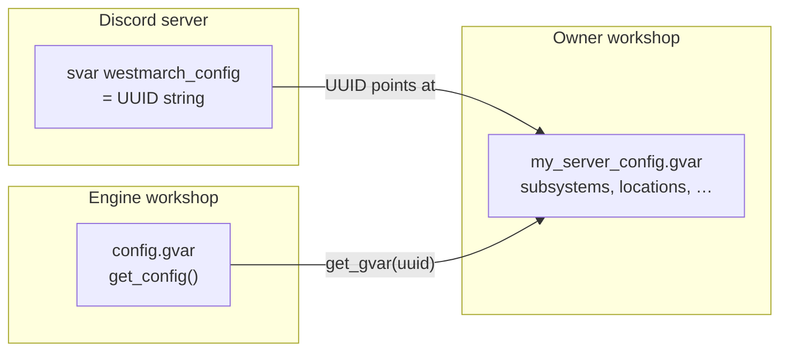

# Server config

How westmarch-generic **stores, loads, and validates** per-server world data and toggles. Command scope lives in [mvp-commands.md](mvp-commands.md); reusable object shapes in [data-shapes.md](data-shapes.md).

---

## Model

One **config gvar** (owner workshop module) + one **svar** pointer on the Discord server.



| Piece | Owner | Writable from aliases? |
|-------|-------|-------------------------|
| **`westmarch_config` svar** | Server admin (Avrae) | No — Drac2 cannot write svars |
| **Config gvar body** | Server owner (workshop editor) | No — aliases read only |
| **Engine gvars** (`config`, `auth`, `encounters`, …) | westmarch-generic workshop | N/A — behaviour, not world data |

Aliases never read the svar directly — they call **`config.get_config()`** ([gvars/config.md](gvars/config.md)).

---

## Owner workflow

1. **Subscribe** to the westmarch-generic engine workshop.
2. **Create** a config gvar — duplicate [src/gvars/configs/starter.gvar](../../../../src/gvars/configs/starter.gvar), a published **example preset** from [gvars/configs.md](gvars/configs.md), or paste starter body via `!gvar editor` ([aliases/admin/setup.md](aliases/admin/setup.md)).
3. **Set svar** — `!svar westmarch_config <your-gvar-uuid>`.
4. **Edit** toggles and world data in the gvar editor; changes apply on the next command (no engine redeploy).
5. **Verify** — use the editor **Check** page for validation and `!westmarch show` for the Discord summary.

**Admin gate:** `!westmarch setup` / `!westmarch show` only — config content is maintained in the Avrae workshop, not via bot commands. Bare `!westmarch` is open so players can see their selected character’s setup status after the server is wired.

---

## Config gvar layers

### 1 — Core schema *(engine defaults fill gaps)*

Always present after **`get_config()`** merges **`DEFAULTS`** ([gvars/config.md](gvars/config.md)):

| Field | Purpose |
|-------|---------|
| `config_version` | Optional owner label for this config module ([data-shapes.md § Top-level config](data-shapes.md#top-level-config-fields)) |
| `rules_version` | Optional **`"2014"` \| `"2024"`** override — else Avrae, else 2014 |
| `display` | Base world branding — `name`, `description`, `image`, `logo`, `footer`, `link`, **`colour`**; subsystem **`display`** + **`command_display`** inherit per [data-shapes § Embed display inheritance](data-shapes.md#embed-display-inheritance) |
| `subsystems` | Player-facing subsystems only — exploration, travel, downtime, crafting, economy, content, misc; optional **`display`** / **`command_display`**; nested **`config`** per subsystem ([data-shapes.md § Subsystem entry](data-shapes.md#subsystem-entry)) |
| `policies` | House rules — downtime mode, cooldown enforcement, repeat encounters, combat HP, … ([data-shapes.md § Server policies](data-shapes.md#server-policies)) |
| `subsystems.*.command_config` | Per-command cooldowns and workday costs ([data-shapes.md § Command config](data-shapes.md#command-config)) |
| `channel_policy` | Optional channel whitelist / RP rules ([gvars/auth.md](gvars/auth.md)) |

The web config editor validates structure and data for enabled subsystems; engine release notes cover breaking config changes.

Full toggle tree: [mvp-commands.md § Config toggle shape](mvp-commands.md#config-toggle-shape).

### 2 — World data *(owner adds as verticals ship)*

Grouped under top-level **`world_data`** on the config gvar. Shapes: [data-shapes.md § World data](data-shapes.md#world-data). Access guide: [gvars/world_data.md](gvars/world_data.md).

| `world_data` key | Shape | Commands |
|------------------|-------|----------|
| **`default_location`** | location **`id`** string | travel, location |
| **`locations`** | `{ id: location, … }` — [locations.gvar](gvars/locations.md) | travel, location, enc (location mode), weather |
| **`paths`** | `[ path, … ]` — [paths.gvar](gvars/paths.md) | travel |
| **`transport`** | `{ id: transport_mode, … }` | travel — horse, boat, spelljammer, … |
| **`calendars`** | `{ id: calendar, … }` — [clock.gvar](gvars/clock.md) | time (when **`policies.time.mode: world_clock`**) |
| **`biomes`** | `{ code: { gvar_id, name }, … }` — [biomes.gvar](gvars/biomes.md) | enc, forage, fish, mine, lumber |
| **`monsters`** | `[ monster, … ]` — [monsters.gvar](gvars/monsters.md) | optional owner overlay for hunt, loot |
| **`items`** | `{ entries, gvar_id, gvar_ids, include_engine }` or list | craft, buy, sell |
| **`books`** | `[ book, … ]` or dict | library, read |
| **`book_gvar_ids`** | `[ gvar_uuid, … ]` | library, read |

**Travel** and **location** require **`locations`** + **`default_location`**. Exploration activities require **`biomes`** registry entries for every biome code used in locations or CLI args. **Hunt** and **loot** use the bundled monster catalogue by default; add **`world_data.monsters`** only for owner-specific creatures or overrides.

Other layer-2 catalogues:

| Field | Shape | Commands |
|-------|-------|----------|
| `currencies` | `{ id: currency_def, … }` | **wallet**; shop/wallet prices — [data-shapes § Currency](data-shapes.md#currency) |
| `shops` | `{ id: shop, … }` | **buy**, **sell** — [data-shapes § Shop](data-shapes.md#shop) |
| `recipes` | `[ recipe, … ]`, `world_data.recipes`, or `extensions.recipes` | brew, enchant, **recipe** |
| `extensions.*` | gvar UUID pointers for large catalogues | monsters, items, recipes, books, spells |

**Location keys** (`oakwood`, `river_town`, …) are stable **`id`** slugs used in path `from`/`to`, cvar resolution, and (argument mode) distinct from biome codes.

### 3 — Extension gvars *(optional, large tables)*

When a catalogue exceeds gvar size limits, the config module holds **UUID references** under top-level **`extensions`** ([data-shapes.md § extensions](data-shapes.md#extensions)). Engine catalogue modules check **`extensions.<key>`** on first load; if set, load owner gvar; else use engine preset shards ([content-pipeline.md](content-pipeline.md)).

### 4 — Example presets *(repo + optional workshop publish)*

Full prefab configs live under **`src/gvars/configs/`** — see [gvars/configs.md](gvars/configs.md). Use them for alias-tests, CI, or as a starting world (duplicate into your workshop, then wire the svar).

| Preset | Setting | Intended Avrae rules |
|--------|---------|----------------------|
| `forgotten_realms_2014.gvar` | Forgotten Realms | 2014 |
| `forgotten_realms_2024.gvar` | Forgotten Realms | 2024 |
| `generic_fantasy_2014.gvar` | Generic fantasy | 2014 |
| `generic_fantasy_2024.gvar` | Generic fantasy | 2024 |
| `spelljammer_2014.gvar` | Spelljammer | 2014 |

Rules edition is **not** stored on the config module — align your Avrae server rules setting with the preset you choose.

---

## Examples

Illustrative config gvar bodies — not copy-paste complete modules. Full starter tree: [src/gvars/configs/starter.gvar](../../../../src/gvars/configs/starter.gvar). Object shapes: [data-shapes.md](data-shapes.md).

### 1 — Fresh server *(core schema only)*

New workshop gvar before any vertical is enabled. Engine **`DEFAULTS`** fill missing **`subsystems`** / **`policies`** keys on load; this is the minimum an owner typically publishes first.

```py
subsystems = {
    "exploration": {"enabled": False, "commands": {"enc": False}, "config": {}},  # … full tree in starter.gvar
    "travel": {"enabled": False, "commands": {}},
    "downtime": {"enabled": False},
    "crafting": {
        "enabled": False,
        "commands": {},
        "config": {
            "recipe_mode": "mixed",
            "require_known_spell": True,
            "catalogues": {
                "items": "engine:catalogues/items",
                "potions": "engine:catalogues/potions",
                "spells": "engine:catalogues/spells",
                "magic_items": "engine:catalogues/magic_items",
                "recipes": None,
            },
            "checks": {"scribe": {"mode": "none", "skill": "arcana", "dc": None}},
            "tool_policy": {"scribe": {"mode": "off", "tools": ["Calligrapher's Supplies"]}},
        },
    },
    "economy": {"enabled": False, "commands": {}},
    "content": {"enabled": False, "commands": {}},
    "misc": {"enabled": False, "commands": {}},
}

policies = {
    "auth": {"require_character": True},
    "time": {"mode": "manual"},
    "travel": {"apply_path_costs": False, "consume_rations": False, "rations_item": "Rations"},
    "downtime": {"mode": "off"},
    "crafting": {
        "resources": {"gold": "manual", "materials": "manual", "items": "manual", "downtime": "check", "spell_slot": "manual"},
    },
    "inventory": {"item_handling": {"mode": "manual", "scrolls_bag": "Scrolls", "potions_bag": "Potions"}},
    "exploration": {"enforce_cooldowns": True, "avoid_repeat_encounters": "off"},
    "quest": {"self_assign": False},
    # economy, combat, content — see starter template
}
```

**Commands available:** `!westmarch setup` / `check` / `show` for GMs (role-gated — not in **`subsystems`**). Player aliases respond “not configured” or “feature disabled”.

---

### 2 — Enc sandbox *(Phase 0, westmarch-style biomes)*

Single-biome test table: players pass the biome code to **`!enc`**, like westmarch **`!enc forest`**.

```py
subsystems = {
    "exploration": {
        "enabled": True,
        "commands": {
            "enc": True,
            "forage": False,
            "fish": False,
            "mine": False,
            "lumber": False,
            "hunt": False,
            "loot": False,
        },
        "config": {
            "enc_biome_source": "auto",
            "distribution_policy": "random",
            "distribution": {"combat": 20, "quest": 10, "gather": 70},
        },
    },
    # other subsystems: enabled False — omitted or explicit
}

world_data = {
    "biomes": {
        "forest": {
            "gvar_id": "engine:configs/biomes/forest",
            "name": "Forest",
        },
    },
}
```

Biome JSON row lists live in the separate biome gvar ([src/gvars/configs/biomes/](../../../../src/gvars/configs/biomes/README.md)), not inline here.

**Player flow:** `!enc forest` → **`distribution`** picks kind → random row tagged **`enc.<kind>`** on the loaded forest biome gvar.

---

### 3 — Location-based exploration *(travel + inferred biome)*

Hub-and-spoke table: **`!enc`** with no biome argument; engine reads the character’s location and picks the pool from **`locations[id].activities.enc`**.

```py
subsystems = {
    "exploration": {
        "enabled": True,
        "commands": {"enc": True, "forage": False},
        "config": {
            "enc_biome_source": "location",
            "distribution_policy": "balanced",
            "distribution": {"combat": 25, "quest": 25, "gather": 50},
        },
    },
    "travel": {
        "enabled": True,
        "commands": {"travel": True, "location": True, "time": False, "weather": False},
    },
}

world_data = {
    "default_location": "river_town",
    "locations": {
        "river_town": {
            "name": "River Town",
            "description": "The safe starting town.",
        },
        "oakwood": {
            "name": "Oakwood Forest",
            "biome": "forest",
            "activities": {"enc": ["forest"], "forage": ["forest"]},
        },
    },
    "paths": [],
    "biomes": {
        "forest": {"gvar_id": "engine:configs/biomes/forest", "name": "Forest"},
    },
}

policies = {
    "time": {"mode": "manual"},
    "travel": {"apply_path_costs": False, "consume_rations": False},
    "exploration": {"enforce_cooldowns": True},
}
```

**Player flow:** `!travel oakwood` → `!location` shows Oakwood → `!enc` (no args) resolves biome **`forest`** from **`activities.enc`**.

The web config editor reports an error if **`enc_biome_source`** is **`location`** but **`travel.commands.location`** is off or **`world_data.locations`** is missing. **`auto`** warns when location prerequisites are partial but does not error — runtime falls back to manual biome args.

---

### 4 — Travel routes + optional costs *(Tier C slice)*

Adds **`paths`** between locations. Costs stay off in **`policies.travel`** until the owner wants automated gp/ration drain.

```py
subsystems = {
    "exploration": {
        "enabled": True,
        "commands": {"enc": True},
        "config": {"enc_biome_source": "location", "distribution_policy": "balanced", "distribution": {"combat": 30, "quest": 20, "gather": 50}},
    },
    "travel": {
        "enabled": True,
        "commands": {"travel": True, "location": True, "time": False, "weather": False},
    },
    "economy": {
        "enabled": True,
        "commands": {"wallet": True, "job": False, "buy": False, "sell": False},
    },
}

world_data = {
    "locations": {
        "river_town": {"name": "River Town"},
        "oakwood": {"name": "Oakwood Forest", "biome": "forest", "activities": {"enc": ["forest"]}},
        "oakwood_east": {"name": "Oakwood — East Trail", "biome": "forest", "activities": {"enc": ["forest"]}},
    },
    "paths": [
        {
            "from": "oakwood",
            "to": "oakwood_east",
            "steps": [
                {"type": "encounter", "biome": "forest"},
                {"type": "proceed", "description": "The trail opens into a clearing."},
            ],
            "requirements": {"transport": "walk"},
        },
        {
            "from": "oakwood",
            "to": "oakwood_east",
            "steps": [
                {"type": "proceed", "description": "Canter along the east trail."},
            ],
            "requirements": {"transport": "horse"},
            "cost": {"gold": 25, "rations": 2},
        },
    ],
    "transport": {
        "walk": {"name": "On foot", "default": True},
        "horse": {"name": "Riding horse"},
    },
    "biomes": {
        "forest": {"gvar_id": "engine:configs/biomes/forest", "name": "Forest"},
    },
}

currencies = {
    "favour": {"name": "Temple Favour", "plural": "Temple Favour"},
}

policies = {
    "travel": {"apply_path_costs": False, "consume_rations": False},
    "exploration": {"enforce_cooldowns": True},
}
```

Set **`apply_path_costs`** / **`consume_rations`** to **`True`** only after the resource-deduction slice lands. The first travel/location slice displays cost steps but does not debit gp, rations, or wallet currencies. **`currencies`** feeds **`!wallet favour`**; gp on paths will use Avrae coinpurse when cost enforcement ships.

---

## Policies and command config *(MVP)*

Three layers — do not conflate:

| Layer | Answers | Example |
|-------|---------|---------|
| **`policies.*`** | Whether to enforce a class of behaviour table-wide | **`downtime.mode: tracked`**, **`exploration.enforce_cooldowns`** |
| **`subsystems.*.config`** | Wiring and subsystem defaults | **`enc_biome_source`**, **`repeat_exclude_window`**, **`monster_images`**, **`show_check_dcs`** |
| **`subsystems.*.command_config`** | Per-command seconds and workday costs | **`enc.cooldown_seconds: 120`**, **`job.workdays_cost: 0`** |

**MVP policy domains** (full keys → [data-shapes.md § Policies MVP checklist](data-shapes.md#policies-mvp-checklist)):

| Domain | MVP keys | Notes |
|--------|----------|-------|
| **auth** | `require_character` | Active Avrae character required for player commands |
| **time** | `mode` | **`world_clock`** needs **`world_data.calendars`** |
| **travel** | `apply_path_costs`, `consume_rations`, `rations_item` | Journey cost + rations item name |
| **downtime** | `mode`, `max_workdays`, `acquisition` | **`tracked`** → enable **`subsystems.downtime`**; the editor reports mismatches |
| **crafting** | `resources`, `item_handling`; legacy `require_downtime_before_roll`, `auto_deduct_*` | Workdays from `recipe_mode`; resource modes are `manual`, `check`, or `deduct` |
| **economy** | `enforce_cooldowns`, `enforce_wallet_caps`, `starting_gold` | Job cooldown; optional wallet caps + one-time gp grant |
| **exploration** | `enforce_cooldowns`, `avoid_repeat_encounters` | Cooldown durations in **`command_config`**; repeat window, hunt/loot art, and DC visibility in **`exploration.config`** |
| **combat** | `roll_monster_hp`, scaling keys *(defer)* | HP rolls vs narrative-only; CR scaling reserved |
| **quest** | `self_assign`, `max_active` | Auto journal from quest encounters |
| **content** | `enforce_library_cooldowns`, `enforce_read_cooldowns` | Library default **120s**; read optional |
| **inventory** | `item_handling`, `track_encumbrance`, `enforce_*`, limits | Crafting can output to manual text or Bags cvars |
| **display**, **languages** | footer, tips, credits; `allowed` | Existing |

**Generic defaults:** downtime **off**, exploration/library cooldowns **120s**, job **28800s**, no repeat filter, roll monster HP **on**, quest self-assign **off**, require character **on**. The reference westmarch server used manual downtime; owners can opt into **`manual`** or **`tracked`** when enabling the downtime subsystem.

---

## Loading and caching
- **Owner edits** between invocations are picked up on the next command; mid-alias svar changes are not supported (same as westmarch assumption).
- **Missing svar** → auth / aliases show “not configured” ([solution-statement.md § Behaviour semantics](solution-statement.md#behaviour-semantics-single-spec)).

---

## Validation

The **Westmarch config editor** is the source of truth for config validation. It checks owner-authored config before export or publish; **`!westmarch show`** only summarizes what the engine loaded and does not report errors.

| Check | Severity |
|-------|----------|
| Svar unset / bad UUID | Error |
| Missing or malformed `subsystems` | Error |
| Subsystem enabled but required **`world_data`** missing (e.g. travel on, no **`locations`**) | Error |
| Biome code in locations with no **`world_data.biomes`** entry | Error |
| **`biomes.*.gvar_id`** unloadable | Error |
| Kind > 0% in **`distribution`** but no matching biome row tag **`activity.kind`** | Warning |
| Legacy flat **`locations`** / **`encounter_pools`** without **`world_data`** | Warning |
| Policy / subsystem mismatch (e.g. world_clock mode without **`world_data.calendars`**) | Warning |
| **`policies.downtime.mode: tracked`** but **`subsystems.downtime.enabled`** false | Error |
| Crafting downtime resource mode **`check`** / **`deduct`** with downtime not tracked | Warning |
| Enabled crafting command with missing or malformed required catalogue source | Error |
| Invalid crafting `recipe_mode`, `require_known_spell`, check mode/DC, or tool policy mode/list | Error |
| Invalid crafting resource or item-output policy mode | Error |
| **`policies.quest.self_assign`** true but **`misc.commands.quest`** off | Error |
| **`policies.inventory.enforce_*`** true | Warning |
| **`policies.combat.scale_encounters_to_level`** true before engine supports scaling | Warning |
| Unknown keys, deprecated fields | Warning |
| `subsystems.admin` present | Warning | Admin is not configurable — remove |

Shape rules for world objects → [data-shapes.md](data-shapes.md). Toggle and **policy** rules → starter template + [data-shapes.md § Server policies](data-shapes.md#server-policies).

---

## Conventions

- **Top-level keys:** lowercase `snake_case` (`default_location`, `subsystems`, …).
- **Subsystem keys:** match player alias folders (`exploration`, `travel`, …). **`admin`** is not a subsystem — setup hub commands are Avrae aliasing role-gated only.
- **Command toggle keys:** match alias names (`enc`, `forage`, …) under the owning subsystem’s **`commands`**.
- **Data only** — config is maps, lists, strings, numbers, bools. Engine must not execute config as code ([solution-statement.md § Trust boundaries](solution-statement.md#trust-boundaries)).

---

## Templates and fixtures

| Artifact | Path |
|----------|------|
| Starter config module | [src/gvars/configs/starter.gvar](../../../../src/gvars/configs/starter.gvar) |
| Reference TSV catalogues | [assets/](../../../../assets/) — **`utils/generate-*`** → [content-pipeline.md](content-pipeline.md) |
| Alias-test fixture gvars | `.varfile.json` + test workshop copies |
| Reference extraction | westmarch monolith → owner config (Phase 2) |

---

## Related

- [gvars/config.md](gvars/config.md) — loader implementation
- [data-shapes.md](data-shapes.md) — encounter, location, path, …
- [mvp-commands.md](mvp-commands.md) — what each config module feeds
- [aliases/admin/setup.md](aliases/admin/setup.md) — onboarding copy
