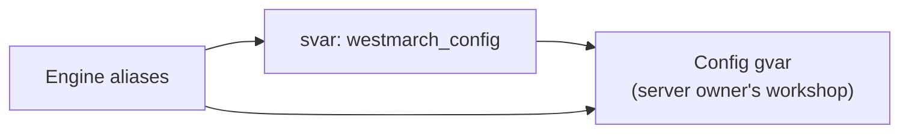
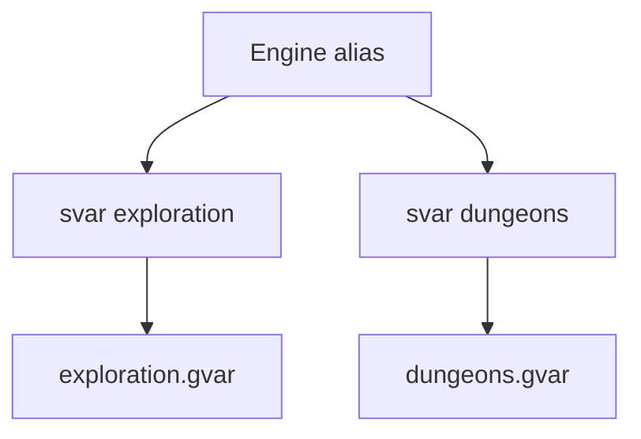
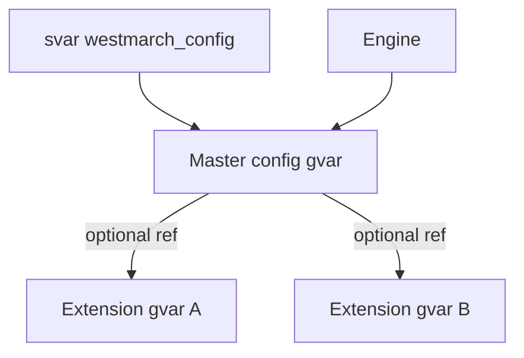
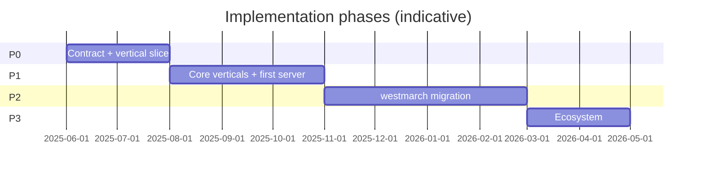

# Solution statement

How we plan to solve the problem in [problem-statement.md](problem-statement.md) and satisfy the journeys in [user-stories.md](user-stories.md).

This is an **outline**, not a full technical spec. Detailed schemas, svar registries, and acceptance tests belong in follow-on docs, code, and CI—not a separate success-criteria document.

---

## Summary

**Separate westmarch into a shared engine workshop and per-server config gvars, connected at runtime through documented svars.**

| Layer | Lives in | Owned by | Changes when |
|-------|----------|----------|--------------|
| **Engine** | westmarch-generic repo → deployed workshop | Engine maintainers | Mechanics, commands, validation, loading contract |
| **Config** | Server owner's workshop gvar(s) | Server owner / content author | Areas, loot, encounters, toggles, flavour |
| **Binding** | Avrae **svars** on each Discord server | Server owner | Pointing the bot at a config gvar UUID |

**Recommended shape:** one **master config gvar** per server (Option A below), with optional **extension gvars** for large or seasonal content (hybrid of A + C). One primary svar (`westmarch_config` or similar) holds the master gvar UUID; subsystem behaviour is toggled **inside** config, not via separate svars per feature.

**Recommended delivery:** prove the contract on a **single vertical slice** (one activity command), then port the full **[MVP command set](mvp-commands.md)** (23 commands: exploration, travel/world/status, downtime, crafting, economy, content, misc).

---

## Solution principles

1. **Engine never embeds server identity** — No server names, area lists, or loot tables in `src/aliases/` or engine gvars ([US-4.1](user-stories.md)).
2. **Config is data + flags, not behaviour** — Config gvars expose maps, constants, and toggles; aliases implement loops, rolls, and flows ([US-2.1](user-stories.md)).
3. **Svars are the server owner's control plane** — Wiring and swaps happen via svar UUIDs without redeploying aliases ([US-1.4](user-stories.md), [US-3.2](user-stories.md)).
4. **Fail visibly** — Unset svar, invalid config, and disabled subsystem each produce a defined player-facing message ([US-1.3](user-stories.md), [US-2.5](user-stories.md), [US-6.2](user-stories.md)).
5. **One contract, many ports** — Every westmarch vertical uses the same loader, validator, and error helpers ([US-4.2](user-stories.md)).
6. **Phased proof** — Ship a thin vertical before migrating the full westmarch surface ([problem-statement](problem-statement.md) § Out of scope).

---

## Architecture options

### Option A — Single master config gvar *(recommended core)*

One svar → one gvar UUID → one module containing all server config (areas, toggles, strings, tables).



| Pros | Cons |
|------|------|
| Simplest server-owner story ([US-1.2](user-stories.md), [US-1.4](user-stories.md)) | Large configs hit gvar size / statement limits |
| One place to validate schema ([US-2.2](user-stories.md)) | Whole config redeployed when any section changes |
| Easy template + copy ([US-2.3](user-stories.md)) | Multiple authors editing one file can conflict |
| Subsystem on/off via keys inside config ([US-2.4](user-stories.md)) | |

**Best for:** MVP, small–medium servers, first migration from westmarch.

---

### Option B — Per-subsystem svars

Each feature has its own svar and gvar (e.g. `westmarch_exploration` → UUID, `westmarch_dungeons` → UUID).



| Pros | Cons |
|------|------|
| Independent updates per subsystem ([US-2.6](user-stories.md)) | Many svars to document and set ([US-1.2](user-stories.md)) |
| Smaller gvar bodies | Loader duplicated or fragmented across aliases |
| Natural phased migration ([US-5.3](user-stories.md)) | Cross-subsystem data (shared areas, economy) needs linking convention |
| Unset per feature maps cleanly to US-3.5 | Server owner mental model is heavier |

**Best for:** Very large worlds, teams that maintain subsystems separately, or strict phased cutover where only some svars are wired.

---

### Option C — Master config + extension gvars *(recommended extension)*

Master gvar holds identity, global toggles, and **pointers** (UUIDs or `using` ids) to optional extension gvars (seasonal event, mega dungeon pack).



| Pros | Cons |
|------|------|
| Keeps Option A simplicity for adopters | Schema must define extension contract |
| Splits bulk data without many svars | Engine loader must resolve refs |
| Supports [US-3.2](user-stories.md) season swap via master pointer change | Validation spans multiple gvars |

**Best for:** Production servers after MVP; reference westmarch migration if data volume requires it.

---

### Option D — Config gvar ownership models

Where the config gvar lives (orthogonal to A/B/C):

| Model | Description | Pros | Cons |
|-------|-------------|------|------|
| **D1 — Owner workshop** | Server owner creates gvar in their own Avrae workshop | Full control, no trust in third party | Author must understand gvar editing |
| **D2 — Import / duplicate template** | Copy template gvar from docs or shared workshop | Fast start ([US-2.3](user-stories.md)) | Drift from template updates |
| **D3 — Published prefab** | Subscribe to another creator's config gvar ([US-7.1](user-stories.md)) | Ecosystem, shared worlds | Versioning, attribution, trust |

**Recommendation:** Document and support **D1 + D2** in P1; treat **D3** as P3 ecosystem work. Engine only cares about UUID in svar, not ownership model.

---

### Option E — Engine distribution models

How a server gets engine aliases ([US-1.1](user-stories.md)):

| Model | Description | Pros | Cons |
|-------|-------------|------|------|
| **E1 — Public workshop subscription** | Server adds westmarch-generic workshop to Avrae bot | Single deploy benefits all ([US-4.5](user-stories.md)) | Requires published workshop + Avrae subscription UX |
| **E2 — Self-deploy from repo** | Server owner runs `npm run deploy` to their workshop | Full control for power users | Forked workshops, upgrade friction |
| **E3 — Hybrid** | Official workshop for most; repo deploy for contributors | Flexibility | Two support paths |

**Recommendation:** **E1 primary, E3 for maintainers** — engine repo deploys to an official Development/Production workshop; server owners subscribe and set svars. Document E2 for self-hosters without blocking P0 on it.

---

## Decision record *(recommended combination)*

| Decision | Choice | Rationale |
|----------|--------|-----------|
| Config shape | **A + C** | One svar for adopters; extensions when size or seasons demand it |
| Subsystem toggles | **Inside master config** | Avoids Option B complexity for P0–P1; optional per-subsystem svars deferred |
| Config ownership | **D1 + D2** | Template gvar in repo or docs; owner copies to their workshop |
| Engine distribution | **E1 (+ E3)** | Matches publish-avrae pipeline already in repo |
| Shared utilities | **drac2-tools gvars** via `env` | Reuse rolls, embeds, bags, etc. ([US-7.3](user-stories.md)); engine `env` references drac2-tools ids, not westmarch data |
| westmarch long-term | **Reference server becomes first config consumer** | Monolithic westmarch repo enters maintenance; generic engine + extracted config gvar becomes canonical for that community ([US-5.*](user-stories.md)) |
| **Rules edition** | **Config field + optional Avrae inference** | See § Rules edition below; default `"2014"` |

---

## Runtime contract

### Svars (server owner surface)

| Svar | Required | Value | Purpose |
|------|----------|-------|---------|
| `westmarch_config` | For configured play | Gvar UUID string | Master server config module |
| *(future)* | No | | Per-subsystem svars only if Option B adopted later |

**Unset `westmarch_config`:** engine commands respond with **not configured** (see semantics below)—not errors, not westmarch-default world data.

### Config gvar schema (outline)

Master config exposes at minimum:

```py
SCHEMA_VERSION = 1
SERVER_NAME = "..."
RULES_EDITION = "2014"  # or "2024" — see § Rules edition
SUBSYSTEMS = {
    "exploration": { "enabled": True },
    "dungeons": { "enabled": False },
    # ...
}
# Subsystem-specific tables added as verticals port, e.g.:
# AREAS = [...]
# LOOT_TABLES = {...}
# Edition-specific overrides optional, e.g. CRAFT_PRICE_TABLES["2024"] = {...}
```

Exact keys per subsystem documented under `docs/` as each vertical lands ([US-2.2](user-stories.md)). Engine validates `SCHEMA_VERSION` and required keys before use ([US-7.2](user-stories.md) at P2+).

### Rules edition *(2014 vs 2024)*

Many westmarch mechanics depend on **which D&D 5e rules revision** the table uses: skill lists, crafting DC bands, language tables, spell availability, monster/stat assumptions, etc. westmarch reference data is largely **2014-era**; [drac2-tools](https://github.com/Sykander/drac2-tools) **languages** is explicitly 2014-aligned.

Server owners should not need a **second** westmarch-specific toggle if their Avrae server is already configured for 2024—but the engine still needs a **single resolved edition** at runtime for our logic and config lookups.

#### Options considered

| Option | Description | Pros | Cons |
|--------|-------------|------|------|
| **R1 — Explicit config only** | `RULES_EDITION = "2014" \| "2024"` in config gvar | One place; testable; works offline in alias-tests | Owner must set it (or accept default) |
| **R2 — Infer from Avrae only** | Read guild/server rules from Avrae `ctx` or platform svars | No duplicate setting if Avrae exposes it reliably | May be unavailable or inconsistent in Drac2; hard to mock in tests |
| **R3 — Config with optional inference** *(recommended)* | Config field is source of truth; loader may **prefill** from Avrae when field omitted | Best of both; explicit override when inference wrong | Slightly more loader logic |

**Recommendation: R3.**

1. **Config gvar** may set `RULES_EDITION` to `"2014"` or `"2024"`.
2. If **omitted**, config loader tries **Avrae inference** (guild/server rules setting—exact Drac2 surface TBD in Phase 0 spike).
3. If inference fails or is ambiguous, **default `"2014"`** (matches westmarch reference extraction and current drac2-tools assumptions).
4. **No separate westmarch svar** for edition—keep it in the config gvar beside `SERVER_NAME` and `SUBSYSTEMS`.

#### Engine behaviour

- `resolve_rules_edition(config)` — returns `"2014"` or `"2024"`; called once per alias via config loader.
- Edition affects **engine branch points** (DC tables, skill names, validation) and **which config slice** to read when tables are edition-keyed.
- Config authors can structure data as:
  - **Flat + edition field** — one catalogue; engine filters by edition tag on entries, or
  - **Nested by edition** — `CRAFTING["2014"]`, `CRAFTING["2024"]`, or
  - **Separate extension gvars** per edition (only if size demands it).

Prefer **nested or tagged config** over hard-coded edition branches in aliases—server owners swap edition by changing one field, not rewriting commands.

#### What server owners do

| Situation | Action |
|-----------|--------|
| 2014 table / SRD-style | Set `RULES_EDITION = "2014"` or omit (default) |
| 2024 revised rules | Set `RULES_EDITION = "2024"` and use 2024-aligned config tables |
| Avrae server already on 2024 | Omit field **if** inference works; otherwise set explicitly once |

Document in public setup guide: *align `RULES_EDITION` with your Avrae server’s rules setting and your config tables.*

#### Out of scope (for now)

- Auto-migrating 2014 config blobs to 2024
- Supporting both editions simultaneously on one server with per-player choice (table-wide edition only)

### Engine loader (shared gvar module)

Introduce `src/gvars/utils/config/` (or similar) in the engine workshop:

- `resolve_config()` — read svar → `get_gvar(uuid)` → cache for invocation
- `resolve_rules_edition(config)` — `"2014"` \| `"2024"` per § Rules edition
- `require_subsystem(name)` — check `SUBSYSTEMS[name].enabled` and config presence
- `config_status_embed(...)` — standard not-configured / disabled / invalid messages

All ported aliases call the loader; no alias reads svars directly with ad hoc strings ([US-4.2](user-stories.md)).

### Behaviour semantics *(single spec)*

| State | Condition | Player-facing behaviour |
|-------|-----------|-------------------------|
| **Not wired** | `westmarch_config` unset | Short embed: feature not set up; GM must set svar (no stack trace, no partial data) |
| **Invalid config** | Svar set but gvar missing, fails load, or schema check fails | Embed: configuration error; generic for players, optional detail for `help`-style GM hints ([US-2.5](user-stories.md)) |
| **Subsystem disabled** | Config valid but `SUBSYSTEMS.x.enabled == False` | Embed: this feature is disabled on this server ([US-2.4](user-stories.md)) |
| **Not ported yet** | Engine alias exists but vertical not in this release | Treat as disabled or hide from help; document in release notes |
| **Active** | Svar set, config valid, subsystem enabled | Normal command behaviour using config data ([US-6.1](user-stories.md)) |

Help embeds: **structure and flags** from engine; **names and examples** from config where available ([US-1.5](user-stories.md), [US-6.3](user-stories.md)).

### Trust boundaries

- Only Avrae server admins can set svars — assumed platform guarantee.
- Config gvars are **trusted content** authored by the server owner; engine validates shape, not malicious intent.
- Engine must not `eval` or execute arbitrary code from config — **data only** (maps, lists, strings, numbers, bools).

---

## Engine structure

```
westmarch-generic (engine repo)
├── src/aliases/           # Generic commands; load config at runtime
├── src/snippets/          # Generic snippets
├── src/gvars/
│   ├── env.*.gvar         # Engine workshop ids + drac2-tools refs
│   └── utils/
│       ├── config/        # Loader, validation, status embeds
│       └── …              # Other engine-side libraries (not server data)
├── docs/                  # Server-owner + consumer docs (public)
└── docs/internal/         # Design + project docs

Server owner's workshop (outside this repo)
└── westmarch_server_config.gvar   # Copied from template; edited in Avrae
```

**Sourcemaps** list only engine artifacts. Server config gvars are **never** in westmarch-generic sourcemaps ([US-4.4](user-stories.md), review § tooling gap).

---

## Adoption path *(Option E1)*

Steps for a server owner ([US-1.1](user-stories.md), [US-1.2](user-stories.md)):

1. **Subscribe** to the published westmarch-generic Avrae workshop on their bot.
2. **Create** a config gvar in their workshop (copy from template published in docs or example workshop).
3. **Set** svar `westmarch_config` to that gvar's UUID on their Discord server.
4. **Enable** subsystems in config (`SUBSYSTEMS.*.enabled`) as desired.
5. **Set** `RULES_EDITION` if the table uses 2024 rules (otherwise default 2014 applies).
6. **Verify** with a smoke command (e.g. exploration or help) — no engine redeploy needed for content edits ([US-3.1](user-stories.md)).

Document svar name, template link, and smoke commands in public `docs/setup.md` *(to write in Phase 1)*.

---

## westmarch migration strategy

Three viable approaches; **recommended: phased extraction (M2)**.

| Approach | Description | When to use |
|----------|-------------|-------------|
| **M1 — Big bang** | Extract all data to config; switch reference server in one deploy | Small data, high test confidence — risky |
| **M2 — Phased by vertical** *(recommended)* | Port engine vertical + extract matching config; wire svar when ready ([US-5.3](user-stories.md)) | Default; matches user-story P2 |
| **M3 — Parallel run** | Reference server stays on monolithic westmarch until generic parity proven | Long validation period |

**End state:** Monolithic [westmarch](https://github.com/Sykander/westmarch) becomes **read-only reference** for behaviour diff; production reference community runs **generic engine + config gvar**. Extraction scripts or manual passes produce config from existing `src/gvars/utils/*.gvar` data files ([US-5.1](user-stories.md), [US-5.2](user-stories.md)).

**Parity:** Alias-tests against extracted fixtures; spot-check critical paths vs old westmarch ([US-5.4](user-stories.md)).

---

## Tooling and testing

| Concern | Approach | Stories |
|---------|----------|---------|
| Deploy | Existing `publish-avrae` + sourcemaps; engine-only ids | US-4.4, US-4.5 |
| Env generation | `env.*.gvar` lists engine + drac2-tools gvars only | US-4.1 |
| Alias tests | `.alias-test` with `vars.svars.westmarch_config` + fixture config gvar in `.varfile.json` | US-4.3 |
| CI | Sourcemap tests + `avrae-ls --run-tests src` (existing) | US-4.4 |
| Config template | `templates/config/` or documented gvar in examples workshop | US-2.3 |
| Schema docs | Per-subsection under `docs/config/` as verticals ship | US-2.2 |

---

## Implementation plan

### Phase 0 — Foundation *(current → contract proven)*

**Goal:** P0 stories satisfied on a **vertical slice**, not full westmarch.

| Work | Deliverables | Stories |
|------|--------------|---------|
| Config loader gvar + helpers | `config.gvar`, `resolve_config`, status embeds | US-4.2, US-1.3, US-6.2 |
| Svar + schema v0 | `westmarch_config`, `SCHEMA_VERSION`, `SERVER_NAME`, `SUBSYSTEMS` | US-1.4, US-2.2 |
| One ported vertical | One activity command (**forage** or **enc**) — see [mvp-commands.md](mvp-commands.md) Tier A | US-6.1 (partial) |
| Template config gvar | Copy-paste starter in docs / `templates/` | US-2.3 |
| Tests | Loader + vertical alias-tests with mocked svar/config | US-4.3 |
| Public setup doc | Adoption steps | US-1.1, US-1.2 |

**Exit criteria:** Server with svar set runs slice; unset svar safe; CI green; alias-tests cover loader and ported vertical.

---

### Phase 1 — First usable server *(P1)*

**Goal:** One real community (or staging server) runs daily on engine + config with the full [MVP command set](mvp-commands.md).

| Work | Deliverables | Stories |
|------|--------------|---------|
| Port MVP commands | Full set in [mvp-commands.md](mvp-commands.md) — Tiers B–H (23 commands) | US-6.1, US-6.3 |
| Schema expansion | Document required keys per ported vertical | US-2.2, US-2.5 |
| Help from config | Local names in help embeds | US-6.3, US-1.5 |
| drac2-tools wiring | Stable `env` refs to bags, embeds, rolls, etc. | US-7.3 |
| Published workshop | E1 subscription path live | US-1.1, US-4.5 |

---

### Phase 2 — Migration and polish *(P2)*

**Goal:** Reference westmarch data extracted; house rules and toggles in config.

| Work | Deliverables | Stories |
|------|--------------|---------|
| Extract reference config | westmarch → master config gvar | US-5.1, US-5.2 |
| Subsystem phased cutover | M2 per vertical | US-5.3 |
| Parity tests | Old vs new where feasible | US-5.4 |
| Extension gvars (if needed) | Option C for oversized tables | US-2.6 |
| House rules in config | Rates, caps, strings | US-3.4 |
| Internal docs + rules | Engine/config boundary in AGENTS + Cursor | US-4.6 |
| Schema versioning policy | `SCHEMA_VERSION` bump rules | US-7.2 |

---

### Phase 3 — Ecosystem *(P3)*

| Work | Deliverables | Stories |
|------|--------------|---------|
| Prefab configs | Shareable template worlds | US-7.1 |
| Optional per-subsystem svars | Only if master gvar limits hit | US-2.6, Option B |
| Config validation tooling | Optional dev alias or doc lint | US-2.5 extension |

---

### Phase timeline (indicative)



Dates are placeholders; adjust to actual capacity.

---

## Vertical port order *(recommended)*

MVP scope is fixed in [mvp-commands.md](mvp-commands.md). Order within and after MVP:

### MVP (Phase 0–1)

1. **forage** or **enc** — Tier A; proves encounter pipeline
2. **forage, fish, mine, lumber, enc** — Tier B; activity cluster
3. **travel**, **location**, **time**, **weather** — Tier C; [travel/](travel/README.md)
4. **hunt**, **loot** — Tier C; [exploration/](exploration/README.md)
5. **downtime** — Tier D; [downtime/](downtime/README.md)
6. **craft**, **brew**, **scribe**, **enchant** — Tier E; [crafting/](crafting/README.md)
7. **job**, **buy**, **sell** — Tier F; [economy/](economy/README.md)
8. **library**, **read** — Tier G; [content/](content/README.md)
9. **quest**, **recipe** — Tier H; [misc/](misc/README.md)

### After MVP (Phase 2+)

10. **Dungeons** — floor/setup/begin; extension gvars likely
11. **Nexus / remaining** — most westmarch-specific

Reorder if reference server priorities differ; document rationale when changing.

---

## Risks and mitigations

| Risk | Impact | Mitigation |
|------|--------|------------|
| Gvar size / statement limits | Config truncated; runtime errors | Option C extensions; chunk tables (items, monsters); performance probes (drac2-tools patterns) |
| Schema drift on engine upgrade | Server configs break | `SCHEMA_VERSION`, validation, migration notes ([US-7.2](user-stories.md)) |
| Loader inconsistency across aliases | Divergent unset/error behaviour | Single `config` util module; lint/review rule |
| westmarch parity gaps | Player regression on migration | Phased M2 + alias-tests ([US-5.4](user-stories.md)) |
| Adopter confusion (svars) | Low adoption | Setup doc, template, smoke command ([US-1.2](user-stories.md)) |
| Workshop subscription friction | US-1.1 blocked | Document E2 self-deploy fallback |

---

## User story coverage

| Tier | Solution section | Status after Phase 0 |
|------|------------------|----------------------|
| P0 US-1.1–1.4 | Adoption path, svar contract, loader | Partial (1.1 needs published workshop) |
| P0 US-2.1–2.2 | Config gvar + schema outline | Yes (v0 schema) |
| P0 US-4.1–4.2 | Engine structure, loader | Yes |
| P0 US-6.2, US-6.4 | Behaviour semantics | Yes (for ported slice) |
| P1+ | Phases 1–3 | Planned |

---

## Out of scope (unchanged)

- Web UI for config editing
- Hosting server configs in this repo
- Per-player configuration via svars
- Recommending per-server westmarch forks

---

## Next documents

| Document | Purpose |
|----------|---------|
| `docs/setup.md` *(planned, public)* | Server-owner adoption guide from § Adoption path |
| `docs/config/schema.md` *(planned, public)* | Versioned config gvar reference |

---

## Related documents

- [problem-statement.md](problem-statement.md)
- [user-stories.md](user-stories.md)
- [review.md](review.md)
- [mvp-commands.md](mvp-commands.md)
- [README.md](README.md) — westmarch-statement index
- [../../../README.md](../../../README.md) — public project overview
