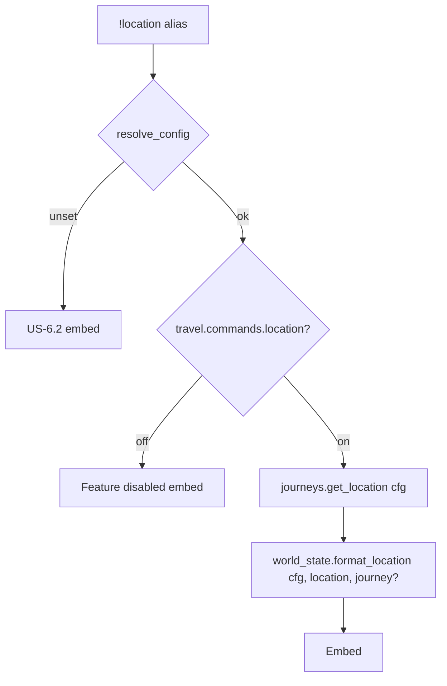

# location — MVP implementation

**Subsystem:** travel · **Toggle:** `SUBSYSTEMS.travel.commands.location` · **Phase:** 1 (Tier C)

**New command** — focused read-only view of the character’s current place. westmarch exposes similar information via bare `!travel` (no args); **location** avoids pulling in routing, journey planning, or GM set subcommands.

## Player-facing behaviour

Show where the character is in the configured world.

```
!location
```

Optional extensions (finalize during implementation):

| Form | Meaning |
|------|---------|
| `!location` | Current location name, visit count, optional one-line flavour from config |
| `!location journey` | Include active journey title + next step hint (compact vs full `!travel`) |

- **Help** (`!location`, `!location help`, `!location ?`): usage only.
- **No cooldown.**
- **No mutations** — does not set location or advance journeys (use `!travel`).

## westmarch reference

No dedicated alias. Behaviour is a subset of **`!travel`** with no arguments:

| Artifact | Path | Reuse |
|----------|------|-------|
| Location state | `westmarch/src/gvars/areas/journeys.gvar` | `get_location()`, `get_journey()` |
| Area display | `westmarch/src/aliases/misc/travel.alias` | `describe_location()`, `describe_journey()` patterns |
| Areas config | `westmarch/src/gvars/areas/areas.gvar` | Config-backed area metadata |

Character cvars (westmarch names → generic engine `bags` constants):

| Cvar | Purpose |
|------|---------|
| `Westmarch_location` | Current `{ name, visited, … }` |
| `Westmarch_journey` | Active journey JSON |
| `Westmarch_locations_data` | Per-name visit aggregates |

Default when unset: starting location from config `DEFAULT_LOCATION` / reference Nexus equivalent.

## Generic architecture



### Engine vs config split

| Data | Owner | Notes |
|------|-------|-------|
| Cvar read/write for location/journey | **Engine** `journeys.gvar` | Port from westmarch; config supplies defaults + area catalogue |
| Display strings, links, flavour | **Config** `AREAS` | Match area `name` keys to journey location |
| `DEFAULT_LOCATION` | **Config** | First-time character fallback |
| Embed layout | **Engine** or alias | Keep thinner than full travel embed |

### Config loader integration

1. `resolve_config()` + `require_command(cfg, "travel", "location")`
2. `journeys.get_location(config=cfg)` — use config default when cvar empty
3. Resolve rich area row from `cfg.AREAS[location.name]` or by `area_code`

## Prerequisites

- Port **`journeys.gvar`** via [travel.md](travel.md) (location cvars at minimum; journey read for optional `journey` flag)
- Template config with **`AREAS`** / **`DEFAULT_LOCATION`**
- Full **travel** UI not required for MVP if journeys module + defaults work

## Implementation checklist

### Minimum shippable

- [ ] Port **`journeys.gvar`** location helpers (config-aware defaults)
- [ ] **`world_state.gvar`** (optional) — `format_location_embed(config, character, include_journey=False)`
- [ ] **`location.alias`** — loader, toggle, help, default embed
- [ ] Template config **`DEFAULT_LOCATION`** + one area display row
- [ ] **`location.alias-test`** — help, no cvar (default), cvar set to fixture location
- [ ] Wire env + sourcemaps under `src/alias../travel/`

### Out of scope (initial)

- Activity table (enc/fish/… codes) — keep on **travel** full view
- `!travel set` / GM location override
- Map links unless config provides them

## Exit criteria

| Criterion | Verification |
|-----------|----------------|
| Character with no location cvar → config default | Alias-test |
| Character with cvar → configured display name | Alias-test |
| Toggle off / unset svar | Alias-test |
| Does not modify cvars on invoke | Alias-test / review |

## Related

- [README.md](README.md) — travel subsystem
- [time.md](time.md) — next in sequence
- [weather.md](weather.md) — uses same location resolution
