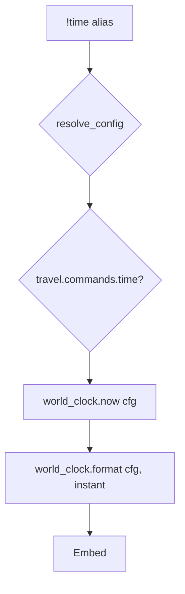

# time — MVP implementation

**Subsystem:** travel · **Toggle:** `SUBSYSTEMS.travel.commands.time` · **Phase:** 1 (Tier C)

**Greenfield** — in-world calendar and clock derived from config. Independent of real-world time except via configured epoch and tick rate.

## Player-facing behaviour

Display the current in-world date and time.

```
!time
```

Optional extensions:

| Form | Meaning |
|------|---------|
| `!time` | Full formatted date/time for “now” |
| `!time date` | Date only (if subcommands added) |

- **Help:** explains calendar names and that time is in-world, not real life.
- **No cooldown.**
- **No character cvar required** — world clock is shared (server time). Per-server config may later add personal offsets; defer.

## westmarch reference

None. No `!time` command in reference westmarch.

Patterns to reuse:

| Pattern | Source |
|---------|--------|
| Discord timestamps | Exploration cooldown embeds `<t:unix:R>` |
| Config loader | Generic `resolve_config()` |

## Generic architecture



### Engine: `world_clock.gvar`

**Critical:** do not define a top-level Drac2 function named `time` — Avrae provides `time()` builtin. Use names like:

| Symbol | Role |
|--------|------|
| `world_now(config)` | Unix seconds → in-world instant |
| `world_instant_from_unix(config, unix)` | Map real epoch to calendar components |
| `world_format(config, instant)` | Produce display string |
| `world_season(config, instant)` | Optional — for **weather** |

Computation sketch:

```text
elapsed = floor(time()) - config.WORLD_CLOCK.epoch_unix
in_world_seconds = elapsed * (seconds_per_in_world_day / 86400)  # or 1:1 real-time default
→ day index → month, day, year, hour, minute
```

Exact formula is a **design choice** documented in config schema; MVP can use 1 in-world day = 1 real day for simplicity.

### Config: `WORLD_CLOCK`

See [README.md](README.md). Server owners set epoch, calendar month names, and display format template.

### Config loader integration

1. `resolve_config()` + `require_command(cfg, "travel", "time")`
2. `world_clock.world_format(cfg, world_clock.world_now(cfg))`

## Prerequisites

- Config loader (Phase 0)
- No dependency on **location** or **travel** for minimal MVP

## Implementation checklist

### Design (before code)

- [ ] Choose tick model: real-time 1:1 vs accelerated vs manual GM advance (MVP: real-time 1:1)
- [ ] Document `WORLD_CLOCK` in public `docs/config/world-clock.md` when stable
- [ ] Spike: confirm no `time` name collision in gvar exports

### Minimum shippable

- [ ] **`world_clock.gvar`** — now, format, season helper
- [ ] **`time.alias`** — loader, toggle, help, embed
- [ ] Template **`WORLD_CLOCK`** fixture with fixed epoch for tests
- [ ] **`time.alias-test`** — help, deterministic date string from fixture epoch
- [ ] Wire env + sourcemaps

### Out of scope (initial)

- GM `!time set` / advance
- Per-character timezone
- Integration with downtime workday counters

## Exit criteria

| Criterion | Verification |
|-----------|----------------|
| Fixed epoch in test config → stable formatted output | Alias-test |
| Toggle off / unset svar | Alias-test |
| No engine symbol named `time` | Code review / grep |

## Related

- [location.md](location.md) — prior in travel sequence
- [weather.md](weather.md) — may call `world_season()`
