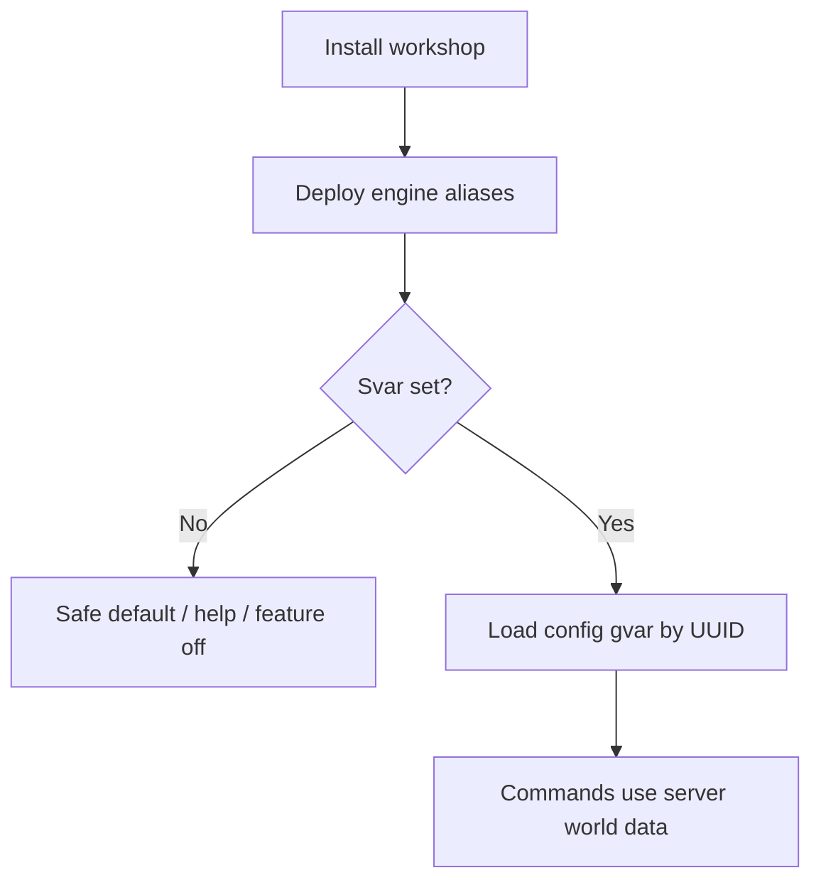

# User stories

Main journeys and use cases for people who **use** westmarch-generic — not exhaustive acceptance criteria, but the flows the project should support.

Stories use the form: **As a** [persona], **I want** [goal], **so that** [benefit].

---

## Personas

| Persona | Role |
|---------|------|
| **Server owner** | Runs the Avrae bot on a Discord server; sets svars, owns workshop access, decides which features are on. |
| **Content author** | Builds or edits world data (areas, loot, encounters, copy) in config gvars; may not touch engine code. |
| **Engine maintainer** | Develops, tests, and deploys the generic workshop in this repo. |
| **Contributor** | Submits fixes or features to the engine without owning a specific server's config. |
| **Player** | Uses `!` commands in Discord; does not configure the bot. Included where the engine's contract affects them. |

---

## Journey 1 — Adopt the engine on a new server

A server wants westmarch-style play without maintaining a fork.

| ID | Story |
|----|--------|
| **US-1.1** | As a **server owner**, I want to install the westmarch-generic workshop on my Avrae bot, **so that** my server gets the standard command set without cloning the westmarch repo. |
| **US-1.2** | As a **server owner**, I want clear documentation on which svars to set and what each one does, **so that** I can enable the ruleset without reading Drac2 source. |
| **US-1.2a** | As a **server owner**, I want **`!westmarch setup`** to walk me through creating a config gvar and setting **`!svar westmarch_config`**, **so that** I can onboard from Discord without hunting external docs first. |
| **US-1.3** | As a **server owner**, I want commands to behave safely when my config svar is **unset**, **so that** I can deploy the engine first and wire up my world later without broken or misleading behaviour. |
| **US-1.4** | As a **server owner**, I want to point a config svar at my workshop gvar UUID, **so that** the engine loads **my** server's setup on the next command without redeploying aliases. |
| **US-1.5** | As a **player**, I want help text and command names to be consistent with other servers running the same engine, **so that** guides and muscle memory transfer across communities. |
| **US-1.6** | As a **server owner**, I want **`!westmarch check`** to validate my svar wiring and config schema, **so that** I can fix misconfiguration before players hit broken commands. |
| **US-1.7** | As a **server owner**, I want **`!westmarch show`** to summarize what the engine loaded and explain each section, **so that** I can confirm my setup without reading raw gvar Python. |

### Journey sketch

---

## Journey 2 — Configure a server's world

A server owner or content author defines what the engine runs against.

| ID | Story |
|----|--------|
| **US-2.1** | As a **content author**, I want server-specific data (areas, loot tables, encounter pools, branding) to live in a **config gvar**, **so that** I never edit engine aliases to change world content. |
| **US-2.2** | As a **server owner**, I want a documented config schema (required keys, optional flags, examples), **so that** I know what my gvar must expose for each subsystem to work. |
| **US-2.3** | As a **content author**, I want to start from a **template config gvar** and replace placeholder values, **so that** I am not authoring structure from scratch. |
| **US-2.4** | As a **server owner**, I want to enable or disable whole subsystems via config (e.g. dungeons off, exploration on), **so that** I can match my campaign without forking commands. |
| **US-2.5** | As a **content author**, I want invalid or incomplete config to produce a clear error or help message in Discord, **so that** I can fix the gvar without silent wrong behaviour. |
| **US-2.6** | As a **server owner**, I want to use **separate config gvars** for distinct concerns if the schema allows (e.g. core world vs. seasonal event), **so that** I can update one module without touching everything. |

---

## Journey 3 — Operate and evolve world content

Day-to-day changes after the server is live.

| ID | Story |
|----|--------|
| **US-3.1** | As a **content author**, I want to add a new exploration area or loot entry by editing my config gvar only, **so that** players see new content without waiting for an engine deploy. |
| **US-3.2** | As a **server owner**, I want to swap my config svar to a different gvar UUID (e.g. new season), **so that** I can run an alternate world or rollback quickly. |
| **US-3.3** | As a **content author**, I want engine commands to read the **current** gvar body after I publish an update, **so that** I do not need to restart the bot or redeploy aliases for data changes. |
| **US-3.4** | As a **GM**, I want house-rule toggles in config (rates, caps, flavour strings), **so that** my table's feel differs from another server on the same engine version. |
| **US-3.5** | As a **server owner**, I want **`westmarch_config` unset** to produce a clear “not configured” response (not crashes or default world data), **so that** I can subscribe to the engine first and wire my config gvar when ready. |
| **US-3.5a** | As a **server owner**, I want to disable subsystems or individual commands via **`subsystems.*.enabled`** and **`commands.*`** in my config gvar (while the svar stays set), **so that** players see “feature disabled” rather than errors and I do not need separate svars per feature. |

---

## Journey 4 — Maintain and improve the engine

People working in this repository.

| ID | Story |
|----|--------|
| **US-4.1** | As an **engine maintainer**, I want server-specific constants absent from `src/aliases/` and shared engine gvars, **so that** one deploy serves all configured servers. |
| **US-4.2** | As an **engine maintainer**, I want a stable **config loading contract** (svar names, gvar shape, error handling), **so that** I can port westmarch verticals without re-deciding integration each time. |
| **US-4.3** | As a **contributor**, I want alias tests that mock config via `.alias-test` metadata (`vars.svars`, gvar fixtures), **so that** I can verify behaviour without a live server config. |
| **US-4.4** | As an **engine maintainer**, I want CI to run sourcemap checks and `avrae-ls` tests before deploy, **so that** engine releases do not break the shared command surface. |
| **US-4.5** | As an **engine maintainer**, I want to ship a bugfix or mechanic change once in this repo, **so that** every server on the engine benefits on the next deploy without merging forks. |
| **US-4.6** | As a **contributor**, I want Cursor rules and internal docs that describe engine vs. config boundaries, **so that** changes stay in the right layer. |

---

## Journey 5 — Migrate from monolithic westmarch

The original westmarch server (or a fork) moves to engine + config.

| ID | Story |
|----|--------|
| **US-5.1** | As an **engine maintainer**, I want a documented migration path from westmarch's inlined data to config gvars, **so that** we can extract content without losing behaviour. |
| **US-5.2** | As a **content author**, I want my existing areas, items, and encounters mapped into the generic config schema, **so that** players see the same world after migration. |
| **US-5.3** | As a **server owner**, I want to migrate subsystem by subsystem (e.g. exploration first, dungeons later), **so that** cutover risk is manageable. |
| **US-5.4** | As an **engine maintainer**, I want parity tests or spot-check alias-tests comparing old and new paths where feasible, **so that** migration does not regress mechanics. |

---

## Journey 6 — Play on a configured server

Player-facing outcomes the engine must support (derived requirements).

| ID | Story |
|----|--------|
| **US-6.1** | As a **player**, I want exploration, travel, crafting, economy, library, and related commands to work when my server has configured them, **so that** I get the westmarch-style loop my GM intended. |
| **US-6.2** | As a **player**, I want a clear message when my GM has not configured a feature, **so that** I know it is off by policy—not broken. |
| **US-6.3** | As a **player**, I want help embeds to describe **my server's** places and options where config supplies names, **so that** help feels local to the campaign. |
| **US-6.4** | As a **player**, I want the same command syntax on any server running this engine, **so that** I only learn one interface. |
| **US-6.5** | As a **player**, I want to search the library and read books with comprehension mechanics, **so that** I can discover lore in-game. |
| **US-6.6** | As a **player**, I want to browse my quest log and add journal entries under active quests, **so that** I can track campaign progress in Discord. |
| **US-6.7** | As a **player**, I want to search recipes I know or can access, **so that** I can plan crafting without memorizing catalogues. |

---

## Journey 7 — Ecosystem and multiple servers (future)

Optional longer-term use cases; not required for bootstrap.

| ID | Story |
|----|--------|
| **US-7.1** | As a **server owner**, I want to import a published config gvar from another creator (with attribution), **so that** I can run a prefab world and tweak it. |
| **US-7.2** | As an **engine maintainer**, I want config schema versioning notes in docs, **so that** older config gvars fail gracefully or migrate when the engine adds fields. |
| **US-7.3** | As a **server owner**, I want the engine to reuse [drac2-tools](https://github.com/Sykander/drac2-tools) implementations **without** subscribing to a second workshop, **so that** shared utilities ship in the westmarch-generic workshop (`src/gvars/core/`) and I only manage one engine subscription. |

---

## Priority tiers (suggested)

Use these when planning epics; not a commitment order.

| Tier | Stories | Rationale |
|------|---------|-----------|
| **P0 — Must have for "generic" to be real** | US-1.1–1.4, US-2.1–2.2, US-4.1–4.2, US-6.2, US-6.4 | Adoption, config contract, engine/config split, safe defaults |
| **P1 — First usable server** | US-1.5, US-2.3–2.5, US-3.1–3.3, US-4.3–4.5, US-6.1, US-6.3 | Templates, live content edits, tests, player-visible config |
| **P2 — Migration & polish** | US-5.*, US-2.6, US-3.4–3.5, US-4.6 | westmarch cutover, subsystem toggles, house rules |
| **P3 — Ecosystem** | US-7.* | Shared configs, schema versioning, cross-workshop patterns |

---

## Non-goals (explicit)

These are **not** user stories we optimize for in the core project:

- **Building a web UI** for editing config (Avrae gvar editor remains the tool).
- **Hosting server configs** in this repo (configs live in each community's workshop).
- **Per-player config** (svars/gvars are server-scoped unless a feature explicitly uses cvars).
- **Forking westmarch per server** as the recommended path—that is the problem we replace.

---

## Related documents

- [problem-statement.md](problem-statement.md) — why these journeys matter
- [review.md](review.md) — critical review of the full westmarch-statement set
- [mvp-commands.md](mvp-commands.md) — MVP command scope and port tiers
- [solution-statement.md](solution-statement.md) — proposed solution and implementation plan
- [../../../README.md](../../../README.md) — public configuration model overview
